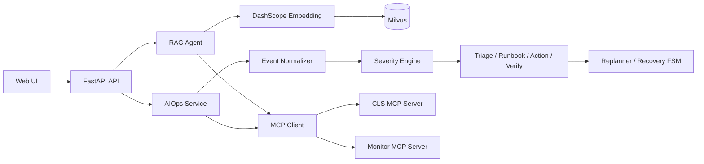

# RailwayOps Agent

基于大语言模型、RAG 和事件驱动工作流的铁路智能运维系统。

系统面向铁路信号与运行安全场景，提供知识库问答、日志与监控信息分析、原始指标诊断、事件分级、处置编排和结果验证等能力，并通过 Web 界面和 FastAPI 接口提供服务。

当前仓库是主应用与 STSRS ML 项目的合并版本：主应用负责 RAG 对话和事件驱动 AIOps，`ml/` 负责铁路通信网络攻击检测的数据工程、模型训练、评估和模型产物管理。

[](https://www.python.org/)
[](https://fastapi.tiangolo.com/)
[](https://langchain-ai.github.io/langgraph/)
[](LICENSE)

## 项目特性

- **铁路智能问答**：基于 LangChain/LangGraph 实现多轮对话、知识检索和流式回答。
- **RAG 知识库**：支持上传 TXT/Markdown 文档，自动切分、向量化并写入 Milvus。
- **事件驱动 AIOps**：将告警或原始监测指标统一为事件，完成归一化、去重、分级和诊断。
- **自动化处置流程**：通过 Triage、Runbook、Action、Verify 和 Replan 协作完成分析与恢复。
- **STSRS 场景支持**：面向铁路信号安全系统提供专用指标和告警接入入口。
- **MCP 工具集成**：通过 MCP 接入日志查询、服务信息、CPU/内存指标和历史工单工具。
- **可观测的处理过程**：AIOps 通过 SSE 返回诊断阶段、工具调用、状态变化和最终报告。
- **Web 操作界面**：提供对话、知识库上传和智能运维分析入口。

## 系统架构



## 技术栈

| 模块 | 技术 |
| --- | --- |
| API 与 Web 服务 | FastAPI、Uvicorn、SSE-Starlette |
| Agent 与工作流 | LangChain、LangGraph、FastMCP |
| 大语言模型 | 阿里云 DashScope OpenAI 兼容接口 |
| 向量检索 | Milvus、PyMilvus、LangChain Milvus |
| 数据与诊断 | Prometheus 兼容指标、规则/模型攻击检测器 |
| 前端 | HTML、CSS、原生 JavaScript |
| 工程工具 | uv、pytest、Ruff、Black、MyPy |

## 快速开始

### 环境要求

- Python `3.11`、`3.12` 或 `3.13`
- Docker Desktop 和 Docker Compose
- DashScope API Key
- Windows 用户可直接使用仓库中的 `start-windows.bat`

### 1. 获取代码并安装依赖

```bash
git clone https://github.com/JohnLee0839/railway-aiops-agent.git
cd railway-aiops-agent

# 推荐使用 uv
uv venv
source .venv/bin/activate       # Windows: .venv\Scripts\activate
uv pip install -e ".[ml,dev]"
```

仅运行主应用时，也可以只安装生产依赖：

```bash
uv pip install -e .
```

也可以使用 `python -m venv .venv` 创建虚拟环境，再执行 `pip install -e .`。

### 2. 创建配置文件

```bash
cp .env.example .env            # Windows PowerShell: Copy-Item .env.example .env
```

至少需要在 `.env` 中设置：

```dotenv
DASHSCOPE_API_KEY=你的 DashScope API Key
DASHSCOPE_MODEL=qwen-max
DASHSCOPE_EMBEDDING_MODEL=text-embedding-v4
```

### 3. 启动 Milvus

```bash
docker compose -f vector-database.yml up -d
```

该 Compose 配置会启动 Milvus Standalone、etcd、MinIO 和 Attu：

- Milvus：`localhost:19530`
- Milvus 健康检查：`http://localhost:9091/healthz`
- Attu 管理界面：`http://localhost:8000`

### 4. 启动应用

Linux/macOS 可分别启动两个 MCP 服务和主服务：

```bash
python mcp_servers/cls_server.py
python mcp_servers/monitor_server.py
python -m uvicorn app.main:app --host 0.0.0.0 --port 9900
```

Windows 推荐使用一键脚本：

```powershell
.\start-windows.bat
```

停止 Windows 服务：

```powershell
.\stop-windows.bat
```

启动成功后访问：

- Web 界面：<http://localhost:9900>
- Swagger API 文档：<http://localhost:9900/docs>
- ReDoc：<http://localhost:9900/redoc>
- 健康检查：<http://localhost:9900/health>

### 5. 导入知识库文档

上传接口支持 `.txt` 和 `.md` 文件，单个文件最大 `10 MB`：

```bash
curl -X POST http://localhost:9900/api/upload \
  -F "file=@aiops-docs/cpu_high_usage.md"
```

也可以批量索引目录：

```bash
curl -X POST "http://localhost:9900/api/index_directory?directory_path=aiops-docs"
```

## API 概览

所有接口均由 FastAPI 自动生成完整请求参数和响应示例，建议优先参考 <http://localhost:9900/docs>。

### 对话与知识库

| 方法 | 路径 | 说明 |
| --- | --- | --- |
| `POST` | `/api/chat` | 普通对话，一次性返回结果 |
| `POST` | `/api/chat_stream` | SSE 流式对话 |
| `POST` | `/api/chat/clear` | 清空指定会话历史 |
| `GET` | `/api/chat/session/{session_id}` | 查询会话历史 |
| `POST` | `/api/upload` | 上传并建立文档向量索引 |
| `POST` | `/api/index_directory` | 批量索引目录中的文档 |

普通对话示例：

```bash
curl -X POST http://localhost:9900/api/chat \
  -H "Content-Type: application/json" \
  -d '{"Id":"session-001","Question":"如何排查铁路信号异常？"}'
```

### AIOps 与事件诊断

| 方法 | 路径 | 说明 |
| --- | --- | --- |
| `POST` | `/api/aiops/incident` | 通用事件驱动诊断，SSE 返回 |
| `POST` | `/api/aiops/stsrs` | STSRS 告警专用入口，SSE 返回 |
| `POST` | `/api/aiops/metrics` | 原始监测指标诊断，SSE 返回 |
| `GET` | `/api/aiops/sse/{thread_id}` | 订阅事件处理过程 |
| `GET` | `/api/aiops/incidents` | 查询事件列表，可按状态过滤 |
| `GET` | `/api/aiops/incidents/{incident_id}` | 查询事件详情 |
| `GET` | `/api/aiops/incidents/{incident_id}/timeline` | 查询事件时间线 |
| `GET` | `/api/aiops/stats` | 查询 AIOps 统计信息 |

原始指标诊断示例：

```bash
curl -N -X POST "http://localhost:9900/api/aiops/metrics?session_id=demo" \
  -H "Content-Type: application/json" \
  -d '{
    "train_id": "T001",
    "signal_id": "S001",
    "timestamp": "2026-01-01T12:00:00",
    "metrics": {
      "speed": 120.0,
      "packet_loss": 0.35,
      "latency": 250.0,
      "signal_status": "RED",
      "overlap_status": "NORMAL"
    }
  }'
```

STSRS 告警示例：

```bash
curl -N -X POST "http://localhost:9900/api/aiops/stsrs?session_id=demo" \
  -H "Content-Type: application/json" \
  -d '{
    "attack_code": "STSRS-1003",
    "description": "检测到 Replay Attack",
    "train_id": "Train-1H66",
    "signal_id": "Signal-YT546",
    "control_center": "ControlCenter-A",
    "region": "North-3",
    "line": "L5"
  }'
```

## 配置说明

`.env.example` 包含完整配置模板。常用配置如下：

| 配置项 | 示例值 | 说明 |
| --- | --- | --- |
| `DASHSCOPE_API_KEY` | 无 | DashScope API Key，必填 |
| `DASHSCOPE_MODEL` | `qwen-max` | 对话模型 |
| `DASHSCOPE_EMBEDDING_MODEL` | `text-embedding-v4` | 文档向量模型 |
| `MILVUS_HOST` | `localhost` | Milvus 地址 |
| `MILVUS_PORT` | `19530` | Milvus 端口 |
| `RAG_TOP_K` | `3` | 每次检索返回的文档片段数 |
| `CHUNK_MAX_SIZE` | `800` | 文档分块大小 |
| `CHUNK_OVERLAP` | `100` | 文档分块重叠长度 |
| `MCP_CLS_URL` | `http://localhost:8003/mcp` | CLS MCP 服务地址 |
| `MCP_MONITOR_URL` | `http://localhost:8004/mcp` | Monitor MCP 服务地址 |
| `PROMETHEUS_BASE_URL` | `http://127.0.0.1:9090` | Prometheus 地址 |
| `ML_ATTACK_DETECTOR_BACKEND` | `zl` | 攻击检测后端：`zl`、`rule` 或 `mock` |

### ML 模型与训练流水线

仓库已包含可用于在线推理的 V0/V1/V2 模型文件和对应 manifest。应用默认使用 `V2` 精简模型，输入特征为 `Distance`、`PacketLoss` 和 `Latency`；模型加载失败时默认回退到规则检测器。

安装训练流水线依赖：

```bash
uv pip install -e ".[ml]"
```

ML 源码位于 `ml/src/stsrs_data_engineering/`，可通过 CLI 依次执行数据校验、对齐、特征工程、训练和评估：

```bash
python ml/scripts/run_schema_validation.py
python ml/scripts/run_key_audit.py
python ml/scripts/run_alignment_audit.py
python ml/scripts/run_field_consistency_audit.py
python ml/scripts/run_label_quality_audit.py
python ml/scripts/run_time_split.py
python ml/scripts/run_feature_engineering.py
python ml/scripts/run_encoded_features.py
python ml/scripts/run_v2_compact_tree.py
```

原始 STSRS 数据集及训练过程产生的 Parquet、报告和日志不随仓库发布。运行训练流水线前，需要按照 `ml/configs/` 中的 schema 和质量规则准备数据；在线服务默认直接使用仓库内 `ml/models/` 与 `ml/metadata/manifests/` 中的 V2 模型产物。

不要将 `.env`、API Key、日志、上传文件或 Milvus 数据目录提交到 Git 仓库；这些路径已在 `.gitignore` 中排除。

## MCP 服务

`mcp_servers/` 提供两个本地 FastMCP 服务，默认使用 Streamable HTTP：

- `cls_server.py`：日志搜索、服务日志查询、日志模式分析。
- `monitor_server.py`：CPU/内存指标、进程列表、服务信息和历史工单查询。

当前服务中的部分数据和处置动作用于本地演示与测试，接入生产环境时需要替换为真实的 CLS、监控平台和运维执行接口。详细说明见 [`mcp_servers/README.md`](mcp_servers/README.md)。

## 开发与测试

常用 Make 目标（Linux/macOS）：

```bash
make install-dev   # 安装开发依赖
make start         # 启动 MCP 和 FastAPI 服务
make stop          # 停止服务
make format        # 格式化代码
make lint          # 运行 Ruff 检查
make test          # 运行测试
make check-all     # 运行完整检查
```

直接运行测试：

```bash
uv run pytest
```

测试覆盖攻击检测器、STSRS 数据融合、事件处理相关核心逻辑。运行测试后会生成 `htmlcov/` 覆盖率报告，该目录不会被提交。

## 项目结构

```text
.
├── app/
│   ├── api/              # FastAPI 路由
│   ├── agents/           # Triage、Runbook、Action、Verify Agent
│   ├── agent/aiops/      # Plan-Execute-Replan Agent
│   ├── core/             # Milvus、事件存储、审计、状态机
│   ├── events/           # 事件归一化、去重、分级和超时管理
│   ├── ml/               # 攻击检测与特征提取
│   ├── models/           # Pydantic 数据模型
│   ├── services/         # RAG、向量索引和 AIOps 服务
│   └── tools/            # 本地工具与模拟动作
├── static/               # Web 前端
├── mcp_servers/          # CLS 和 Monitor MCP 服务
├── aiops-docs/           # 示例运维知识库文档
├── tests/                # 自动化测试
├── vector-database.yml   # Milvus Docker Compose 配置
├── Makefile              # Linux/macOS 管理命令
└── start-windows.bat     # Windows 一键启动脚本
```

## 文档

- [`docs/`](docs/)：项目架构、运行流程和入门说明。
- [`aiops-docs/`](aiops-docs/)：用于 RAG 检索的运维知识库示例。
- [`CHANGELOG_AIOPS.md`](CHANGELOG_AIOPS.md)：AIOps 相关变更记录。
- [`铁路智能运维系统源码详解.md`](铁路智能运维系统源码详解.md)：源码结构和实现说明。

## 免责声明

本项目主要用于技术研究、架构验证和演示。仓库中的模拟监控数据、模拟处置动作和规则检测器不应直接用于真实铁路生产环境。接入生产系统前，请完成权限控制、数据脱敏、人工审批、审计、故障隔离和充分的安全验证。

## 许可证

本项目采用 [MIT License](LICENSE)。
