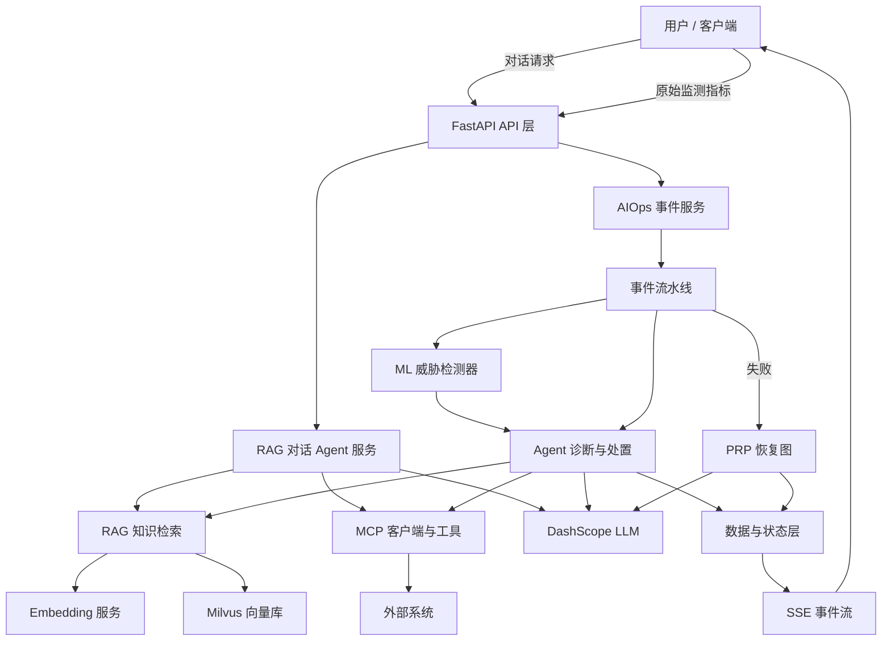

# railways_V.2 项目心智模型

> 适用读者：刚学完 Python、有基础 AI 知识、但第一次接触本项目的开发者。
> 事实依据：当前源码（`app/`、`mcp_servers/`）与 [PROJECT_SOURCE_CODE_WALKTHROUGH.md](./PROJECT_SOURCE_CODE_WALKTHROUGH.md)。
> 原则：以当前源码为唯一事实来源；本文件与旧文档冲突时，以当前源码为准并记录冲突（见第 8 节）。

## 1. 项目是什么

**一句话定位**：`railways_V.2` 是一个铁路信号系统智能运维（AIOps）平台：先用自研 ZL 监督学习模型识别网络威胁，再用 LLM Agent 自动完成诊断、处置、验证和恢复，并额外提供基于知识库的对话助手。

### 1.1 解决什么业务问题

铁路信号通信链路会产生 `Distance`、`PacketLoss`、`Latency` 等实时监测指标，其中可能混有网络安全威胁（DoS、Jamming、Replay Attack）。传统做法依赖人工盯盘和经验判断，发现慢、处置不标准。本系统把“指标 → 威胁识别 → 诊断 → 处置 → 验证 → 恢复”变成一条可自动执行、可审计、可回放的流水线。

### 1.2 谁使用

- 铁路运维 / 值班人员：提交监测指标、订阅 SSE 事件流、查看事件详情与时间线。
- 普通用户：通过对话接口向系统提问（基于知识库的问答）。
- 外部系统 / 集成方：通过 HTTP API 接入（指标、事件、STSRS 数据）。

### 1.3 输入与输出

输入：

- `POST /api/aiops/metrics`：原始监测指标 JSON（当前实现为普通 `dict`，含 `train_id`、`signal_id`、`metrics`、`source_files`、`record_id` 等字段）。
- `POST /api/aiops/incident`、`POST /api/aiops/stsrs`：其他事件 / 数据入口。
- `/api/chat*`：对话文本；`/api/file*`：上传文档。

输出：

- `GET /api/aiops/sse/{thread_id}`：SSE 事件流（事件创建、分级、检测、诊断、计划、动作、验证、完成等阶段事件）。
- 事件列表、事件详情、事件时间线、审计记录。
- 对话接口的流式回答。

### 1.4 最核心的能力

Metric-driven 自动化事件处置闭环。关键事实：**先由 ML 回答 “What happened?”（ZL 模型输出 `AttackPrediction`），再由 LLM Agent 回答 “Why? Impact? How to fix?”**，而不是让 LLM 从零猜测攻击类型。

## 2. 十个一级角色

按“调用方 → 入口 → 服务 → 流水线 → 能力 → 数据 → 输出”组织：

1. 用户 / 客户端：提交指标或提问，订阅 SSE。
2. FastAPI API 层（`app/main.py`、`app/api/*`）：HTTP 入口，请求解析与 SSE 包装。
3. RAG 对话 Agent 服务（`app/services/rag_agent_service.py`）：问答助手，LangGraph Agent（LLM + 工具循环）。
4. AIOps 事件服务（`app/services/aiops_service.py`）：事件处置总控，负责入口、恢复、安全控制。
5. 事件流水线（`app/core/incident_router.py` + `app/events/*`）：主工作流（归一化 → 去重 → 分级 → 检测 → 诊断 → 处置 → 验证 → 重规划）。
6. ML 威胁检测器（`app/ml/*`）：ZL 监督学习模型推理，产出 `AttackPrediction`。
7. Agent 诊断与处置（`app/agents/*`）：Triage / Runbook / ActionOrchestrator / Verifier / Replanner。
8. RAG 知识检索（`app/services/vector_*` + `app/tools/knowledge_tool.py`）：Embedding + Milvus 向量库 + 检索工具。
9. MCP 与工具（`app/agent/mcp_client.py`、`mcp_servers/*`、`app/tools/*`）：外部能力与本地工具。
10. 数据与状态层（`app/core/incident_store.py`、`audit_store.py`、`state_machine.py`、`app/models/*`）：事件、审计、状态、SSE 队列。

外部系统作为上下文：DashScope（LLM + Embedding）、Milvus、Prometheus、MCP Server 进程。

## 3. 模块职责表

### 3.1 一级模块

| 模块 | 一句话理解 | 主要职责 | 输入 | 输出 | 不负责什么 |
| --- | --- | --- | --- | --- | --- |
| FastAPI API 层 | 系统对外唯一 HTTP 入口 | 路由注册、参数 / Query 解析、SSE 包装、转发服务层 | HTTP 请求 | JSON / SSE 响应 | 业务决策、模型推理、持久化 |
| RAG 对话 Agent 服务 | 能检索知识并调用工具的问答助手 | 创建 LangChain Agent、加载本地 + MCP 工具、维护会话（MemorySaver）、流式回答 | 用户问题 | 流式回答 / 会话状态 | 事件处置、向量库本身 |
| AIOps 事件服务 | 事件处置的总控 | 提供 metrics / incident / stsrs 入口；主流水线失败时启动 PRP 恢复图；恢复失败进入安全控制 | 原始指标 / 事件 / STSRS 数据 | SSE 事件流、恢复结果 | 单步业务逻辑（归一化、检测等由流水线内模块完成） |
| 事件流水线 | 事件处置的主工作流 | 归一化 → 去重 → 分级 → ML 检测 → 统一处置流水线 | `raw_event` + source + thread_id | SSE 阶段事件生成器 | LLM 推理细节、动作真实执行 |
| ML 威胁检测器 | 攻击类型分类器 | ZL pickle 加载、特征适配、`predict_proba`、概率归一化、label 映射、fallback 决策 | `RailMetricRecord` | `AttackPrediction` | 解释原因、规划动作、检索知识 |
| Agent 诊断与处置 | 用 LLM 做语义推理的处置层 | Triage（Why / Impact / How）、Runbook（计划）、ActionOrchestrator（执行）、Verifier（验证）、Replanner（重试 / 补偿 / 升级） | Incident + AttackPrediction + KB | 诊断结果、runbook 计划、动作结果、验证结论、重规划决策 | 攻击类型的硬判定（以 ML 预测为主）、SSE 订阅管理 |
| RAG 知识检索 | 给 Agent 提供运维知识 | 文本 Embedding、向量检索、`retrieve_knowledge` 工具 | 查询文本 | 相关 `Document` | 生成回答、判定攻击类型 |
| MCP 与工具 | 扩展 Agent 能力 | MCP 客户端单例 + 重试拦截器；CLS / Monitor server；Prometheus 查询、时间、Mock 动作工具 | Agent 工具调用 | 工具执行结果 | 对话生成、事件编排 |
| 数据与状态层 | 项目的记忆与审计 | IncidentStore 保存事件、AuditStore 保存审计并广播 SSE、StateMachine 约束状态流转 | 事件 / 状态 / 审计条目 | 查询结果、状态变更、SSE 广播 | 业务判定 |

### 3.2 概念边界速查（不要混为一谈）

| 概念 | 当前项目里的实现 | 关键源码位置 |
| --- | --- | --- |
| ML | ZL 监督学习分类器（HistGradientBoostingClassifier），不是 Agent，也不是 LLM | `app/ml/zl_attack_detector.py` |
| LLM | `ChatQwen`（qwen-max），生成式推理，被 Agent 和 PRP 恢复图调用 | `app/agents/*`、`app/agent/aiops/*` |
| Embedding | `DashScopeEmbeddings`（text-embedding-v4），只负责把文本变成向量 | `app/services/vector_embedding_service.py` |
| RAG | 检索增强：向量库 Milvus + `retrieve_knowledge` 工具，本身不生成回答 | `app/tools/knowledge_tool.py`、`app/services/vector_store_manager.py` |
| Agent | 能调用工具的 LLM：RAG 对话 Agent（`create_agent`）与 AIOps 中的 LLM 节点（Triage / Runbook 等） | `app/services/rag_agent_service.py`、`app/agents/*` |
| Workflow | 事件处置主流水线是 Python async pipeline；PRP 恢复是 LangGraph `StateGraph` | `app/core/incident_router.py`、`app/services/aiops_service.py` |
| MCP | 协议层：`MultiServerMCPClient` + CLS / Monitor 两个 server | `app/agent/mcp_client.py`、`mcp_servers/*` |
| Tool | 本地工具（知识检索、Prometheus 查询、时间、Mock 动作）+ MCP 工具 | `app/tools/*` |
| API / Service | FastAPI 路由 + 服务类，组织请求与业务 | `app/api/*`、`app/services/*` |
| 数据层 | IncidentStore / AuditStore / StateMachine / Milvus | `app/core/*`、`app/services/vector_store_manager.py` |

## 4. 一级架构图

说明：

- 实线表示一次请求的主数据 / 控制流。
- `WF -->|失败| REC` 是异常分支：主流水线失败后才进入 PRP 恢复图。
- 对话子系统（CHAT）与事件处置子系统（AIOPS）共用 LLM、RAG、MCP 能力，但业务数据互不相通。

## 5. 一个请求的生命周期

### 5.1 指标请求（核心链路）

1. 客户端 `POST /api/aiops/metrics?session_id=...`，body 为原始指标 `dict`。
2. `app/api/aiops.py` 的 `process_metrics_stream` 调用 `AIOpsService.process_metrics`，并把返回的异步生成器包装成 `EventSourceResponse`（SSE）。
3. `process_metrics` 把 payload 组装为 `raw_event`（`metrics_snapshot`、`train_id`、`signal_id`、`source_files`、`record_id`），随后进入 `process_incident`。
4. `IncidentRouter.route` 主流水线：
   - `EventNormalizer.normalize` 生成 `Incident`；
   - 单条实时 metrics 绕过缓冲去重，其他来源走 `Deduplicator.process`；
   - `SeverityEngine.evaluate` 计算严重级；
   - 存在 `metrics_snapshot` 时，`_build_metric_record` 构造 `RailMetricRecord`，调用 `attack_detector.predict`（由 `create_attack_detector` 按配置创建，默认 `zl` 后端）；`AttackPrediction` 写入 `incident.attack_prediction` 并发出 `INCIDENT_TRIAGED` SSE；
   - `incident_store.create` + `state_machine.transition` 进入 `NEW`；
   - 进入 `_common_pipeline`：TriageAgent → RunbookAgent → ActionOrchestrator → Verifier → Replanner 循环（重试 / 补偿 / 升级）。
5. 每一步通过 `AuditStore.record` 写审计并广播到该 `thread_id` 的 SSE 队列。
6. 若主流水线抛异常，`AIOpsService` 启动 PRP 恢复图（planner → executor → replanner）；恢复仍失败则进入安全控制（回滚 / 人工升级）。
7. 客户端用 `GET /api/aiops/sse/{thread_id}` 订阅完整事件流，也可事后查询事件、时间线、审计。

### 5.2 对话请求

1. 客户端 `POST /api/chat*`。
2. `RagAgentService` 的 Agent（`create_agent` + `MemorySaver`）循环：LLM 决策 → 调用工具。
3. 本地工具包括 `retrieve_knowledge`（惰性初始化 Milvus），它用 `DashScopeEmbeddings` 编码查询、在 Milvus 中检索 SOP 文档，返回给 LLM。
4. MCP 工具（CLS / Monitor）按配置加载，失败时仅降级为本地工具，不阻断对话。
5. 最终流式返回回答。

## 6. 核心 vs 辅助模块

- 核心：FastAPI API 层、AIOps 事件服务、事件流水线、ML 威胁检测器、Agent 诊断与处置、数据与状态层、SSE 输出。
- 辅助 / 能力扩展：RAG 知识检索、MCP 与工具、PRP 恢复图、STSRS 数据适配（`app/data/stsrs_adapter.py`）、文件上传与索引。

## 7. 一句话 / 三句话 / 一分钟版本

### 一句话

`railways_V.2` 是一个铁路信号系统智能运维平台：ZL 监督学习模型先判定网络威胁，LLM Agent 再自动完成诊断、处置、验证和恢复，同时提供基于知识库的对话助手。

### 三句话

1. 它是什么：基于 FastAPI + LangChain / LangGraph 的铁路 AIOps 系统，包含对话问答与事件处置两条独立子系统。
2. 解决什么问题：把铁路通信指标的网络安全威胁检测与运维处置自动化，降低人工盯盘和专家经验依赖。
3. 怎么解决：指标先进 ZL ML 检测器得到 `AttackPrediction`，再进入 Triage → Runbook → Action → Verify → Replan 流水线；RAG 提供运维知识、MCP 提供外部能力，全程 SSE 可订阅、审计可回放。

### 一分钟版本

这个项目可以理解为“会看指标的铁路值班助手”。它对外暴露两组能力：一组是对话问答，用户提问后，一个能调用工具和知识库的 LLM Agent 流式回答；另一组是事件处置，运维把通信指标（Distance、PacketLoss、Latency）发给 `/api/aiops/metrics`，系统先用 ZL 训练好的监督学习模型判断是 Normal、DoS、Jamming 还是 Replay Attack，再把结果交给 TriageAgent 解释影响、RunbookAgent 生成处置计划、ActionOrchestrator 执行动作、Verifier 验证、Replanner 决定重试、补偿还是升级到人工。如果主流程失败，系统还会用 LangGraph 的 Planner-Executor-Replanner 恢复图再尝试一次；再失败就进入回滚和人工升级。整个过程的事件、状态和审计都落在 IncidentStore / AuditStore，并通过 SSE 推给客户端。

## 8. 与既有文档的冲突记录

- `docs/README.md` 提到“两个 IncidentRouter 并存（`agents/incident_router.py` 和 `core/incident_router.py`）”。当前源码中 `app/agents/incident_router.py` 已不存在，生产主流水线只有 `app/core/incident_router.py`，以源码为准。
- `docs/README.md` 的“Agent 数量 5（新链路）+ 3（旧链路节点）”是旧架构口径；当前事实：1 个 RAG 对话 Agent + AIOps 流水线 5 个处置节点 + PRP 恢复图 3 个 LangGraph 节点。
- `docs/README.md` 的“发现的 Bug”列表是历史审查结论；本文件不评估其真伪，仅在后续源码审计确认后再更新。

## 9. 最终检查

- 本文件结论均来自当前 `app/` 源码与 `docs/PROJECT_SOURCE_CODE_WALKTHROUGH.md`，没有按文件名推测架构。
- ML、LLM、Embedding、RAG、Agent、Workflow、MCP、Tool、API / Service、数据层已按当前实现区分。
- 架构图只展示一级模块，不展示类、函数和全部文件。
