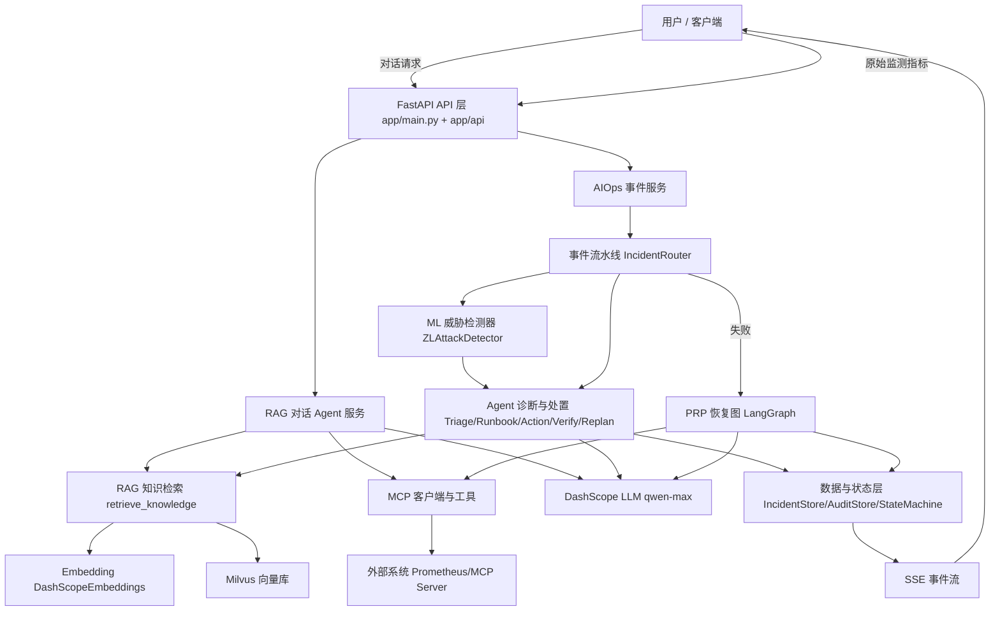
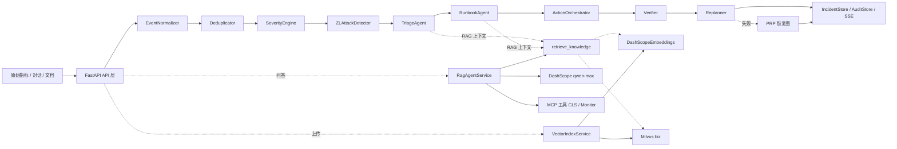
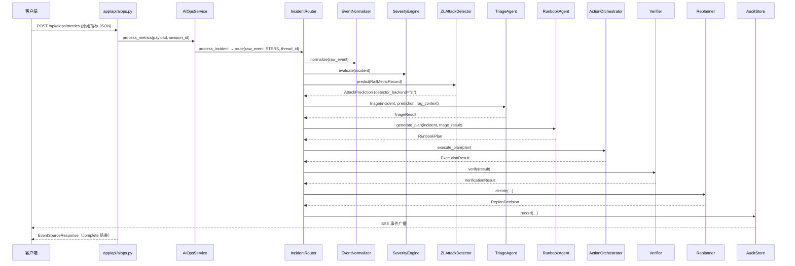

# 《railways_V.2 铁路智能运维系统 · 源码带读白皮书》

> **版本**：第 3 版（2026-08-15），面向初级 Python / AI 开发者重构。
> **阅读顺序**：先理解项目 → 再理解架构 → 再理解运行流程 → 最后深入源码。
> **配套文档**：
> - `docs/PROJECT_MENTAL_MODEL.md`（整体心智模型）
> - `docs/PROJECT_BEGINNER_GUIDE.md`（术语与模块理解指南）
> - `docs/PROJECT_RUNTIME_STORY.md`（真实请求运行故事）
> **旧版备份**：`docs/PROJECT_SOURCE_CODE_WALKTHROUGH.v2.legacy.md`

---

# 第 0 部分 给第一次接触项目的人

## 0.1 五句话认识项目

1. 这是一个**铁路信号系统智能运维（AIOps）平台**。
2. 它接收**原始通信监测指标**（如丢包率、延迟、距离），用**自研 ZL 监督学习模型**判断是不是网络攻击（DoS / Jamming / Replay Attack）。
3. 判断之后，由 **LLM Agent** 解释影响、生成处置计划、执行动作、验证结果，形成一条可审计的处置闭环。
4. 它同时还提供**知识库问答**：用户提问时，Agent 会先检索运维 SOP 文档，再结合大模型回答。
5. 所有过程通过 **SSE 事件流**输出，客户端可以实时看到“事件创建 → 检测 → 诊断 → 计划 → 执行 → 验证 → 解决”。

## 0.2 两个子系统

| 子系统 | 入口 | 一句话 |
|---|---|---|
| RAG 对话 | `/api/chat*` | 面向用户问答，Agent 可调用 Milvus 知识库与 MCP 工具 |
| AIOps 事件处置 | `/api/aiops/*` | 接收指标/告警，完成归一化 → 去重 → 分级 → ML 检测 → 诊断 → 处置 → 验证 → 恢复 |

## 0.3 最重要的一句话架构

```text
输入（指标/告警/对话）
  ↓
FastAPI（app/main.py）
  ├─ RAG 链路: RagAgentService（LangGraph create_agent + 本地工具 + MCP 工具）
  └─ AIOps 链路: AIOpsService
       ├─ 主流水线（事件驱动 Python 管道，不是 LangGraph）:
       │    IncidentRouter.route()
       │      EventNormalizer → Deduplicator → SeverityEngine
       │      → AttackDetector.predict()   ★ ZL 监督学习模型
       │      → TriageAgent → RunbookAgent → ActionOrchestrator
       │      → Verifier → Replanner（重试/补偿/升级循环）
       ├─ 失败恢复: PRP Recovery Engine（LangGraph StateGraph: planner→executor→replanner）
       └─ 兜底:     Safety Control（回滚 + 人工升级）
```

## 0.4 阅读建议

- 完全不熟悉概念：先读 `PROJECT_BEGINNER_GUIDE.md`。
- 想快速理解整体：先读 `PROJECT_MENTAL_MODEL.md`。
- 想看一次真实请求跑完：先读 `PROJECT_RUNTIME_STORY.md`，再读本文第 6 部分。
- 要改代码：直接跳到第 19、20、22 部分。

## 0.5 符号约定

- `文件.py:L123`：源码位置（行号）。
- **L1** = 源码直接证据；**L2** = 调用链推导；**L3** = 架构推断；**L4** = 建议。
- “实测” = 2026-08-14 在本机（numpy 2.4.2 / sklearn 1.9.0 / ZL 产物存在）验证过。

---

# 第 1 部分 一句话理解项目

`railways_V.2` 是一个铁路信号系统智能运维平台：**先由 ZL 监督学习模型回答 “What happened?”（攻击类型），再由 LLM Agent 回答 “Why? Impact? How to fix?”（解释与处置）**，并通过可审计的事件流水线自动完成诊断、计划、执行、验证、恢复，同时提供基于知识库的对话助手。

---

# 第 2 部分 项目解决什么问题

## 2.1 业务问题

铁路信号通信链路会产生 `Distance`、`PacketLoss`、`Latency` 等实时监测指标，其中可能混有网络安全威胁：

- DoS（拒绝服务）
- Jamming（干扰）
- Replay Attack（重放攻击）

传统运维依赖人工盯盘和经验判断，发现慢、处置不标准、过程不可回放。本项目把“指标 → 威胁识别 → 诊断 → 处置 → 验证 → 恢复”变成自动执行、可审计、可回放的流水线。

## 2.2 为什么需要 ML + LLM + Agent 组合

- **ML**：用训练好的模型快速、稳定地回答“这是什么攻击”，带置信度，可审计。
- **LLM**：把预测结果翻译成运维人员能理解的诊断报告、影响评估、处置建议。
- **Agent / Workflow**：LLM 只负责推理，不负责保证流程顺序；Workflow 负责状态、顺序、重试、补偿、升级。
- **RAG**：给 LLM 提供本项目专属的运维 SOP，避免模型凭空猜测。

## 2.3 为什么不是纯 LLM 系统

纯 LLM 诊断不可复现、成本高、无置信度；规则检测器确定性好但能力有限；所以当前设计是：

```text
规则（确定性底座） + ZL ML（概率先验） + LLM（解释与计划） + Workflow（编排与安全）
```

---

# 第 3 部分 用户输入与系统输出

## 3.1 用户是谁

- 铁路运维 / 值班人员：提交监测指标，订阅 SSE 事件流，查看事件详情与时间线。
- 普通用户：通过对话接口提问。
- 外部系统 / 集成方：通过 HTTP API 接入。

## 3.2 输入

| 入口 | 输入 | 说明 |
|---|---|---|
| `POST /api/aiops/metrics` | 原始监测指标 JSON（裸 `dict`） | 核心入口，不要求提供 attack_type |
| `POST /api/aiops/incident` | 事件 JSON（统一/扁平格式） | 通用事件入口 |
| `POST /api/aiops/stsrs` | STSRS 数据 JSON | STSRS 专用入口 |
| `POST /api/chat` / `/api/chat_stream` | 对话文本 | 问答 |
| `POST /api/upload` | 文档文件 | 知识库写入 |

示例（metrics）：

```json
{
  "train_id": "T001",
  "signal_id": "S001",
  "timestamp": "2026-08-15T10:00:00",
  "metrics": {
    "packet_loss": 0.35,
    "latency": 250.0,
    "distance": 1200.0,
    "signal_status": "RED"
  }
}
```

## 3.3 输出

| 输出 | 形态 |
|---|---|
| AIOps 处置过程 | SSE 事件流（`EventSourceResponse`） |
| 对话回答 | SSE token 流或完整 JSON |
| 事件查询 | `GET /api/aiops/incidents`、`/incidents/{id}`、`/incidents/{id}/timeline` |
| 健康检查 | `GET /health` |

SSE 中会依次出现：`incident_created`、`state_changed`、`incident_triaged`（ML 检测）、`plan_generated`、`action_executed`、`verification_finished`、`incident_resolved` / `incident_failed` / `incident_escalated`、`complete`。

## 3.4 全部 API 端点

| 端点 | 文件 | 说明 |
|---|---|---|
| `GET /` | `app/main.py` | 前端首页 |
| `GET /health` | `app/api/health.py` | 健康检查（Milvus 不可用 → 503） |
| `POST /api/chat` | `app/api/chat.py` | 非流式对话 |
| `POST /api/chat_stream` | `app/api/chat.py` | SSE 流式对话 |
| `POST /api/chat/clear` | `app/api/chat.py` | 清空会话 |
| `GET /api/chat/session/{session_id}` | `app/api/chat.py` | 会话历史 |
| `POST /api/upload` | `app/api/file.py` | 上传文档并建索引 |
| `POST /api/index_directory` | `app/api/file.py` | 目录批量索引 |
| `POST /api/aiops/incident` | `app/api/aiops.py` | 通用事件入口（SSE） |
| `POST /api/aiops/stsrs` | `app/api/aiops.py` | STSRS 专用入口（SSE） |
| `POST /api/aiops/metrics` | `app/api/aiops.py` | **原始指标入口（ML 检测主入口，SSE）** |
| `GET /api/aiops/sse/{thread_id}` | `app/api/aiops.py` | 订阅审计事件流 |
| `GET /api/aiops/incidents` | `app/api/aiops.py` | 事件列表 |
| `GET /api/aiops/incidents/{id}` | `app/api/aiops.py` | 事件详情 |
| `GET /api/aiops/incidents/{id}/timeline` | `app/api/aiops.py` | 审计时间线回放 |
| `GET /api/aiops/stats` | `app/api/aiops.py` | 统计 |

> 注意：AIOps 三个 POST 端点接收的是裸 `payload: dict`，没有 Pydantic 请求体校验（见附录 C-12）。

---

# 第 4 部分 整体架构

## 4.1 整体架构图



## 4.2 一级模块

| 模块 | 文件 | 为什么存在 |
|---|---|---|
| API 层 | `app/api/*`、`app/main.py` | 对外暴露 HTTP/SSE |
| 服务层 | `app/services/*` | 业务编排与资源管理 |
| 事件流水线 | `app/core/incident_router.py` + `app/events/*` | 主工作流 |
| ML 模块 | `app/ml/*` | ZL 模型推理 + fallback |
| Agent 模块 | `app/agents/*` | 诊断、计划、执行、验证、重规划 |
| PRP 恢复 | `app/agent/aiops/*` | 失败后的 Plan-Execute-Replan 恢复 |
| MCP | `app/agent/mcp_client.py` + `mcp_servers/*` | 外部工具协议接入 |
| 数据层 | `app/core/incident_store.py`、`audit_store.py`、`state_machine.py` | 状态、审计、SSE |
| 模型定义 | `app/models/*` | Pydantic 数据契约 |
| 工具 | `app/tools/*` | 知识检索、时间、Prometheus、Mock 动作 |

## 4.3 外部依赖

| 依赖 | 用途 |
|---|---|
| DashScope（qwen-max） | LLM |
| DashScope（text-embedding-v4） | Embedding |
| Milvus | 向量库（collection `biz`） |
| Prometheus | 指标告警查询（对话/PRP 工具） |
| MCP Server（CLS 8003 / Monitor 8004） | 日志与监控工具 |

## 4.4 启动流程

1. `python app/main.py` 或 uvicorn 启动 `app.main:app`。
2. `lifespan` 中连接 Milvus（`milvus_manager.connect()`）。
3. 注意：`vector_store_manager` 在模块导入期就会连接 Milvus，因此 Milvus 需要在应用启动前可用。

---

# 第 5 部分 核心模块角色分工

## 5.1 模块职责表

先记住十个角色的边界，不要互相混淆：

| 模块 | 一句话理解 | 主要职责 | 输入 | 输出 | 不负责什么 |
|---|---|---|---|---|---|
| FastAPI API 层 | 系统对外唯一 HTTP 入口 | 路由注册、Query/参数解析、SSE 包装、转发服务层 | HTTP 请求 | JSON / SSE 响应 | 业务决策、模型推理、持久化 |
| RAG 对话 Agent 服务 | 能检索知识并调用工具的问答助手 | 创建 LangChain Agent、加载本地 + MCP 工具、维护会话（MemorySaver）、流式回答 | 用户问题 | 流式回答 / 会话状态 | 事件处置、向量库本身 |
| AIOps 事件服务 | 事件处置的总控 | 提供 metrics / incident / stsrs 入口；主流水线失败时启动 PRP 恢复图；恢复失败进入安全控制 | 原始指标 / 事件 / STSRS 数据 | SSE 事件流、恢复结果 | 单步业务逻辑（归一化、检测等由流水线内模块完成） |
| 事件流水线 | 事件处置的主工作流 | 归一化 → 去重 → 分级 → ML 检测 → 诊断 → 计划 → 执行 → 验证 → 重规划 | `raw_event` + source + thread_id | SSE 阶段事件生成器 | LLM 推理细节、动作真实执行 |
| ML 威胁检测器 | “这是不是攻击、是什么攻击” | ZL 模型加载、特征适配、`predict_proba`、输出 `AttackPrediction`、加载失败时回退规则检测器 | `RailMetricRecord`（含 Distance / PacketLoss / Latency） | `AttackPrediction` | 解释攻击影响、生成处置计划 |
| Agent 诊断与处置 | 流水线里的五个执行节点 | Triage / Runbook 两个 LLM 节点；Action / Verify / Replan 三个确定性节点 | 事件 + 预测 + 上下文 | 诊断、计划、执行结果、验证结果、重规划决定 | 状态流转（由 StateMachine 负责） |
| RAG 知识检索 | 从运维知识库取相关资料 | 查询向量化 → Milvus 检索 → 拼装上下文文本 | 查询问题 / 关键词 | 上下文文本与文档列表 | 生成回答（由 LLM 负责） |
| Embedding | 把文本变成向量 | 把文档和查询编码为 1024 维向量，供相似度检索 | 文本 | 向量 | 存储向量、回答内容 |
| MCP 与工具 | 外部能力和本地工具协议 | 加载 CLS / Monitor MCP 工具、执行本地工具（知识检索、时间、Prometheus 告警） | Agent 工具调用 | 工具结果文本 | 业务流水线编排 |
| 数据与状态层 | 事件、状态、审计的“内存账本” | IncidentStore 存事件、StateMachine 管状态迁移、AuditStore 写审计并广播 SSE | 事件 / 状态变更 / 审计事件 | 状态、审计记录、SSE 广播 | 对外 HTTP、模型推理 |

## 5.2 最容易混在一起的五组角色

1. **ML ≠ LLM**：ML 只做“分类”，把指标映射为 `Normal/DoS/Jamming/Replay Attack`，输出概率；LLM 只做“解释与计划”，不负责攻击分类。
2. **Embedding ≠ LLM**：Embedding 把文本变成向量，不做对话，也不做诊断。
3. **RAG ≠ 模型**：RAG 是“检索 + 拼接上下文”的机制，本身不生成内容；生成内容的是 LLM。
4. **Agent ≠ Workflow**：Agent 是“能根据工具结果决定下一步”的推理单元；Workflow 是“固定顺序 + 状态机 + 重试”的编排结构。当前事件流水线是 Workflow，其中两个节点内部使用了 LLM Agent 式决策。
5. **MCP ≠ 普通函数**：MCP 是外部进程通过统一协议暴露工具的机制；普通本地工具（如 `retrieve_knowledge`）不经过 MCP。

## 5.3 核心与辅助

- 核心：API 层、AIOps 事件服务、事件流水线、ML 威胁检测器、Agent 诊断与处置、数据与状态层、SSE 输出。
- 辅助：RAG 对话（问答子系统）、MCP 与工具、PRP 恢复图、STSRS 数据适配、文件上传与索引。

---

# 第 6 部分 一个真实请求如何运行

本部分是对 `docs/PROJECT_RUNTIME_STORY.md` 的压缩版。想读完整故事请看该文件。

## 6.1 故事：一列车的通信指标出现异常

假设列车 `T001` 与信号设备 `S001` 通信质量下降，值班人员把原始监测指标发给 `POST /api/aiops/metrics`：

```json
{
  "train_id": "T001",
  "signal_id": "S001",
  "timestamp": "2026-08-15T10:00:00",
  "metrics": {
    "speed": 120.0,
    "packet_loss": 0.35,
    "latency": 250.0,
    "distance": 1200.0,
    "renewal_interval": 6000.0,
    "burstiness": 0.8,
    "signal_status": "RED",
    "overlap_status": "NORMAL"
  }
}
```

## 6.2 请求生命周期（白话版）

1. 客户端 POST 原始指标，API 层包装成 SSE 响应。
2. `AIOpsService.process_metrics` 把 payload 组装成 `raw_event`（`metrics_snapshot`、`train_id`、`signal_id` 等），进入统一事件入口 `process_incident`。
3. `IncidentRouter.route` 启动主工作流：`EventNormalizer` 生成 `Incident`；实时单条 metrics 绕过缓冲去重；`SeverityEngine` 计算严重级。
4. 事件带有 `metrics_snapshot` 时，流水线用 `_build_metric_record` 重建 `RailMetricRecord`，调用 `create_attack_detector()` 创建的 ZL 检测器，得到 `AttackPrediction`（attack_type、confidence、probabilities、`detector_backend="zl"`、`fallback_used=false`），写入事件并发 `INCIDENT_TRIAGED` SSE。
5. 事件创建并迁移到 `NEW` 后进入 `_common_pipeline`：`TriageAgent`（LLM + RAG + 规则回退）解释影响，`RunbookAgent` 生成处置计划，`ActionOrchestrator` 执行 Mock 动作，`Verifier` 验证，`Replanner` 决定重试 / 补偿 / 升级 / 解决。
6. 每一步由 `AuditStore.record` 写审计并广播 SSE；最终 `complete` 结束事件流。
7. 如果主流水线失败，`AIOpsService` 启动 PRP 恢复图（`planner → executor → replanner`）；恢复仍失败则进入安全控制（回滚 + 人工升级）。

## 6.3 本案例中哪些模块没有参与

- **MCP**：`POST /api/aiops/metrics` 主链路不使用 MCP。
- **Prometheus 查询工具**：只属于对话 Agent，本链路不调用。
- **PRP 恢复图**：正常路径不参与，只有 `workflow_failed=true` 才启动。
- **Embedding**：本链路本身不直接调用；它通过 `TriageAgent` / `RunbookAgent` 的 RAG 检索间接参与。

## 6.4 正常 / 失败 / Fallback 三种结局

| 路径 | 经过 | 结果 |
|---|---|---|
| 正常 | ML 预测 → Triage → Runbook → 动作成功 → Verifier SUCCESS → Replanner RESOLVE | 状态 `RESOLVED`，SSE `complete`（`workflow_failed=false`） |
| 业务失败 | Verifier / Replanner 判定 FAILED 或 ESCALATED | `complete` 带 `workflow_failed=true`，AIOpsService 尝试 PRP 恢复 |
| Fallback | ML 加载失败 → rule 检测器；LLM 失败 → 规则回退；RAG 无结果 → 空上下文继续 | 流程继续，检测结果标记 `fallback_used` |

---

# 第 7 部分 ML（威胁检测）

## 7.1 白话理解

系统需要判断“当前指标是正常，还是 DoS / Jamming / Replay Attack”。这个过程由训练好的 ZL 模型完成，称为**模型推理（Inference）**：输入三个特征，输出四个类别的概率，取最大概率作为预测攻击类型。

## 7.2 模型事实（实测）

| 项 | 值 |
|---|---|
| 模型 | `HistGradientBoostingClassifier`（ZL V2） |
| pickle 路径 | `D:\STUDY\ZL\models\baseline\v2_compact_top3_hist_gradient_boosting.pkl` |
| manifest | `metadata/manifests/v2_compact_tree_manifest.json` |
| 特征顺序（固定） | `Distance, PacketLoss, Latency` |
| 类别标签映射 | `Normal -> UNKNOWN`、`DoS -> DoS`、`Jamming -> Jamming`、`ReplayAttack -> Replay Attack` |
| 归一化 | V2 无 scaler，不需要额外归一化器 |

## 7.3 推理调用链

```text
create_attack_detector()                 # app/ml/detector_factory.py（默认 zl + rule fallback）
  → ZLAttackDetector.predict(record)
      → _load_artifact()                  # 加载 pickle（首次约 5-7 秒）
      → ZLFeatureAdapter.to_raw_input()   # 提取并固定特征顺序
      → numpy 矩阵
      → predict_proba()                   # 返回四类概率
      → argmax → 标签映射
      → AttackPrediction
```

字段名映射：API / `RailMetricRecord` 使用小写字段（`distance`、`packet_loss`、`latency`），`ZLFeatureAdapter._FIELD_MAP` 会映射为 ZL 模型特征名 `Distance`、`PacketLoss`、`Latency`。所以第 3 部分的示例 JSON 与第 7.2 节的特征顺序指向同一组数据；`to_raw_input(record, required_fields)` 的 `required_fields` 来自 artifact 的 `feature_columns`。

## 7.4 输出契约

`AttackPrediction` 字段：

`attack_type`、`confidence`、`probabilities`、`model_version`、`detector_backend`、`fallback_used`、`fallback_reason`、`inference_ms`、`feature_vector`

关键语义：

- `detector_backend="zl"` 表示真实 ZL 模型；`detector_backend="rule"` + `fallback_used=true` 表示加载失败后的规则回退。
- **fallback 只对加载错误生效**：`AttackDetectorLoadError` → fallback；`AttackDetectorInputError`（输入契约错误）和 `AttackDetectorInferenceError`（推理契约错误）不允许 fallback。
- ML 输出只写入 `incident.attack_prediction`，**最终诊断攻击类型由 LLM `TriageResult` 写回** `Incident.attack_type`；ML 与 RAG 没有直接调用关系。

## 7.5 ML 不负责什么

- 不解释攻击影响（LLM 负责）。
- 不生成处置计划（RunbookAgent 负责）。
- 不判断是否真的恢复（Verifier 负责）。
- 当前 `FeatureExtractor` / `FeatureVector` 未接入 ZL 生产链路，只有测试使用。

源码位置：`app/ml/zl_attack_detector.py`、`app/ml/detector_factory.py`、`app/ml/attack_detector.py`、`app/models/attack_prediction.py`。

---

# 第 8 部分 RAG（知识检索）

## 8.1 白话理解

LLM 不知道项目专属的运维 SOP。RAG 的作用是：**把用户问题或事件关键词转成向量，从 Milvus 里找出相关文档片段，作为上下文塞给 LLM**，让回答有依据。

## 8.2 关键事实

| 项 | 值 |
|---|---|
| 检索入口 | `app/tools/knowledge_tool.py` 的 `retrieve_knowledge` |
| 向量库 | Milvus，collection `biz` |
| Embedding | `DashScopeEmbeddings`，`text-embedding-v4`，1024 维 |
| 检索参数 | `vector_store.as_retriever(search_kwargs={"k": config.rag_top_k})`，`rag_top_k=3` |
| 重排器 | 无 reranker |
| 懒加载 | `retrieve_knowledge` 懒初始化 Milvus，避免模块导入时连接 |

## 8.3 写入路径（知识入库）

```text
POST /api/upload
  → VectorIndexService.index_single_file
  → DocumentSplitterService.split_document
  → vector_store_manager.add_documents
```

分块策略：

- Markdown：`MarkdownHeaderTextSplitter` + `RecursiveCharacterTextSplitter(1600, 100)`（1600 = 配置 `chunk_max_size=800` 的 2 倍），并合并小于 300 字符的小分片。
- `.txt`：直接递归切分，`chunk_size=1600`。

## 8.4 重要认知

- `CaseKB` / `RunbookKB` / `TopologyKB` 只是查询措辞约定，底层是**同一个 `biz` collection**，不是三个独立知识库。
- RAG 无结果时返回 `"没有找到相关信息。"` 与空文档列表，不抛异常，流程继续。
- 当前 RAG 检索只在 `TriageAgent`、`RunbookAgent`（事件链路）和 RAG 对话 Agent（问答链路）中使用。

源码位置：`app/tools/knowledge_tool.py`、`app/services/vector_store_manager.py`、`app/services/document_splitter_service.py`、`app/services/vector_index_service.py`。

---

# 第 9 部分 Embedding

## 9.1 白话理解

Embedding 模型把“一段文字”变成“一组数字向量”，让计算机可以比较两段文字的语义相似度。它既不是聊天模型，也不是数据库。

## 9.2 当前实现

- `DashScopeEmbeddings` 实现 LangChain `Embeddings` 接口。
- 模型：`text-embedding-v4`，输出 1024 维向量。
- 用途：写入知识库时编码文档分片；查询时编码问题，再做 Milvus 相似度检索。

## 9.3 它不是什么

- 不是 LLM：不会生成回答。
- 不是向量数据库：只负责“编码”，存储与检索在 Milvus。
- 当前对话 Agent 本身不直接调用 Embedding；它通过 `retrieve_knowledge` 工具间接使用。

源码位置：`app/services/vector_store_manager.py`（`DashScopeEmbeddings` 初始化）、`app/tools/knowledge_tool.py`。

---

# 第 10 部分 LLM

## 10.1 白话理解

LLM 负责“看懂”业务上下文并用自然语言推理：解释攻击影响、生成处置计划、回答用户问题。它不是工作流控制器，也不是攻击分类器。

## 10.2 当前实现

| 项 | 值 |
|---|---|
| Provider | DashScope |
| 模型 | `ChatQwen`（`langchain_qwq`），`qwen-max` |
| 结构化输出 | `with_structured_output(TriageResult / RunbookPlan / Plan / Act / Response)` |
| 失败回退 | `TriageAgent._fallback_triage` / `RunbookAgent._fallback_plan`（规则回退） |

## 10.3 Prompt 位置

| Prompt | 文件 |
|---|---|
| `TRIAGE_PROMPT` | `app/agents/triage_agent.py` |
| `RUNBOOK_PROMPT` | `app/agents/runbook_agent.py` |
| `planner_prompt` | `app/agent/aiops/planner.py` |
| `replanner_prompt` | `app/agent/aiops/replanner.py` |
| `response_prompt` | `app/agent/aiops/response.py` |

## 10.4 认知纠偏

- `LLMFactory` 是死代码，未使用。
- LLM 最终诊断权：`TriageResult.attack_type` 会写回 `Incident.attack_type`，覆盖或确认 ML 预测的呈现。
- LLM 不保证流程顺序；流程顺序由 Workflow 保证。

---

# 第 11 部分 Agent

## 11.1 白话理解

当前项目里有两种“Agent”：

1. **RAG 对话 Agent**：一个真正的 LangGraph Agent（`create_agent`），能自主决定“先调哪个工具、再根据结果回答”。
2. **事件流水线里的五个处置节点**：`TriageAgent`、`RunbookAgent` 使用 LLM 做推理（带规则回退）；`ActionOrchestrator`、`Verifier`、`Replanner` 是确定性组件，不调用 LLM。

## 11.2 RAG 对话 Agent

- 文件：`app/services/rag_agent_service.py`
- 创建：`create_agent(model, tools, checkpointer=MemorySaver)`
- 工具：本地工具 + MCP 工具
- 会话：`MemorySaver`（进程内存态，重启丢失）

## 11.3 事件流水线的“Agent 节点”

| 节点 | 是否调 LLM | 输入 | 输出 |
|---|---|---|---|
| `TriageAgent.triage` | 是（失败走规则回退） | Incident + AttackPrediction + RAG 上下文 | `TriageResult` |
| `RunbookAgent.generate_plan` | 是（失败走规则回退） | Incident + TriageResult + RAG 上下文 | `RunbookPlan` |
| `ActionOrchestrator.execute_plan` | 否 | `RunbookPlan` | `ExecutionResult` |
| `Verifier.verify` | 否 | 执行结果 | `VerificationResult` |
| `Replanner.decide` | 否 | 验证结果 + 重试轮次 | `ReplanDecision` |

## 11.4 Agent vs Workflow（当前项目的答案）

- **Agent** 解决“需要推理、需要根据工具结果决定下一步”的问题：对话 Agent 会循环调用工具直到能回答。
- **Workflow** 解决“必须按顺序、必须保证状态合法、失败要重试/补偿/升级”的问题：事件流水线按固定顺序推进，并由状态机约束。
- 当前事件流水线本身**不是** Agent 循环，它由多个节点组成；其中两个节点内部用 LLM 推理。

---

# 第 12 部分 Workflow

## 12.1 白话理解

Workflow 是“固定流程 + 状态机 + 重试策略”的骨架。它保证每一步的顺序和合法性，不依赖模型随机发挥。

## 12.2 两条 Workflow

### 主事件流水线（Python async generator，不是 LangGraph）

```text
IncidentRouter.route()
  → EventNormalizer.normalize
  → Deduplicator（实时单条 metrics 旁路去重）
  → SeverityEngine.evaluate
  → create_attack_detector().predict → AttackPrediction
  → incident_store.create + state_machine.transition(NEW)
  → _common_pipeline()
      → TriageAgent → RunbookAgent → ActionOrchestrator → Verifier → Replanner
      → 最多 3 轮重试循环
```

### PRP 恢复图（LangGraph StateGraph）

```text
app/services/aiops_service.py 的 _build_recovery_graph()
  planner → executor → replanner
```

- planner：`app/agent/aiops/planner.py`
- executor：`app/agent/aiops/executor.py`
- replanner：`app/agent/aiops/replanner.py`
- state：`PlanExecuteState`（`app/agent/aiops/state.py`）

主流水线失败（`FAILED` / `ESCALATED`）时，`AIOpsService` 用恢复图再尝试；恢复失败进入 `SafetyControl`（回滚 + 人工升级）。

## 12.3 状态机

`IncidentState` 主要状态：`NEW → TRIAGED → PLANNED → EXECUTING → VERIFIED → RESOLVED`，或 `COMPENSATING / FAILED / ESCALATED`。`RESOLVED` 是软终态（后续发现误报/副作用可回到 `COMPENSATING`），`FAILED` / `ESCALATED` 是严格终态。

## 12.4 确定性组件细节

- `ActionOrchestrator`：`ApprovalGate` 对高风险动作（STOP_TRAIN / BLOCK_SECTION / EMERGENCY_SHUTDOWN）Mock 自动批准；单动作 `TimeoutManager` 15 秒超时、3 次重试、指数退避、熔断。
- `Verifier`：全成功 SUCCESS；escalated → ESCALATE；部分失败且 `retry_cycle < 2` → RETRY；超限 → COMPENSATE；未知 → FAILED。
- `Replanner` 五态：RESOLVE / RETRY / COMPENSATE / ESCALATE / FAIL；`_common_pipeline` 循环最多 3 轮。
- Mock 动作（`app/tools/mock_actions.py`）8 个：`switch_backup_link`、`restart_gateway`、`block_suspicious_source`、`notify_dispatcher`、`generate_ticket`、`verify_network_health`、`rollback_switch_backup_link`、`rollback_block_suspicious_source`。
- 故障注入：FAILURE 60% / TIMEOUT 20% / EXCEPTION 20%（Mock 行为，真实执行需替换）。

## 12.5 审计与 SSE

`AuditStore.record()` 记录审计并广播 SSE；`GET /api/aiops/sse/{thread_id}` 订阅。所有业务状态为进程内存态（重启丢失）。

---

# 第 13 部分 MCP / Tools

## 13.1 白话理解

MCP 是“外部进程通过统一协议暴露工具”的方式，让 Agent 能调用日志分析、监控查询等外部能力；本地工具则直接定义在项目内。

## 13.2 MCP 客户端

- `MultiServerMCPClient` 单例：`app/agent/mcp_client.py`
- 配置 `mcp_servers`：
  - `cls`：streamable-http，`http://localhost:8003/mcp`
  - `monitor`：streamable-http，`http://localhost:8004/mcp`
- `load_mcp_tools_safe`：MCP 加载失败时仅使用本地工具，不阻断对话。

## 13.3 MCP Server

| Server | 文件 | 工具 |
|---|---|---|
| CLS | `mcp_servers/cls_server.py` | `get_current_timestamp`、`get_region_code_by_name`、`get_topic_info_by_name`、`search_topic_by_service_name`、`search_log` |
| Monitor | `mcp_servers/monitor_server.py` | 2 个监控工具 |

> 注意：`mcp_servers/README.md` 的工具清单与源码不符，属于已知文档偏差（见附录 B-7）。

## 13.4 本地工具

`retrieve_knowledge`、`get_current_time`、`query_prometheus_alerts`。

## 13.5 关键边界

- **主流水线（`/api/aiops/metrics`）不使用 MCP**。
- MCP 只用于 RAG 对话 Agent 和 PRP 恢复图。
- 本地工具不经过 MCP；MCP 工具经过 `MultiServerMCPClient` 加载。

---

# 第 14 部分 数据流

## 14.1 数据流图



## 14.2 核心数据对象

| 对象 | 含义 | 产生者 | 消费者 |
|---|---|---|---|
| `raw_event` | 未归一化的事件输入 | API / `AIOpsService` | `IncidentRouter` |
| `Incident` | 归一化后的事件实体（含 `metrics_snapshot`、attack_prediction、attack_type） | `EventNormalizer` | 流水线全部节点 |
| `RailMetricRecord` | 指标记录（Distance / PacketLoss / Latency 等） | `_build_metric_record` | `ZLAttackDetector` |
| `AttackPrediction` | ML 输出 | `AttackDetector` | `TriageAgent` / 事件详情 |
| `TriageResult` | 诊断结果 | `TriageAgent` | `RunbookAgent` |
| `RunbookPlan` | 处置计划 | `RunbookAgent` | `ActionOrchestrator` |
| `ExecutionResult` | 动作执行结果 | `ActionOrchestrator` | `Verifier` |
| `VerificationResult` | 验证结果 | `Verifier` | `Replanner` |
| `ReplanDecision` | 重规划决定 | `Replanner` | `_common_pipeline` / PRP |
| `FailureContext` | 失败上下文 | `IncidentRouter` | `AIOpsService`（触发恢复） |

---

# 第 15 部分 控制流

## 15.1 真实请求时序图（`POST /api/aiops/metrics`）



## 15.2 控制流原则

1. API 层只做转发与 SSE 包装。
2. `AIOpsService` 只做入口、恢复调度与安全控制。
3. `IncidentRouter` 是主工作流的唯一控制者。
4. 每个节点只消费前一个节点的输出，并产生明确的数据契约。
5. 状态迁移只能通过 `StateMachine`，节点本身不直接改状态。
6. 主流水线失败后，控制权交回 `AIOpsService` 进入 PRP 恢复图。

---

# 第 16 部分 异常与失败处理

## 16.1 分层 Fallback 总表

| 失败场景 | 处理 | 是否阻断流程 |
|---|---|---|
| ZL pickle 加载失败 / 依赖失败 | `FallbackAttackDetector` 回退 `RuleBasedAttackDetector`（`fallback_used=true`） | 否 |
| 输入契约错误（缺特征字段等） | `FallbackAttackDetector` 不 fallback 并重新抛出；`IncidentRouter` 捕获后 warning | 事件流程继续，但无 ML 预测 |
| 推理契约错误 | `FallbackAttackDetector` 不 fallback 并重新抛出；`IncidentRouter` 捕获后 warning | 事件流程继续，但无 ML 预测 |
| LLM 调用失败（Triage / Runbook） | `_fallback_triage` / `_fallback_plan` 规则回退 | 否 |
| RAG 无结果 / 检索异常 | 返回 `"没有找到相关信息。"` 空上下文 | 否 |
| MCP 加载失败 | `load_mcp_tools_safe` 仅用本地工具 | 否 |
| 单个 Mock 动作失败 | `TimeoutManager` 15 秒超时、3 次重试、指数退避、熔断 | 否（进入 Verifier 判定） |
| Workflow 判定 FAILED / ESCALATED | `FailureContext` → `AIOpsService._execute_recovery`（PRP 图）→ `_execute_safety_control`（回滚 + 人工升级） | 最终以 complete 结束 |
| 流程本身抛异常 | 捕获后 yield `error` SSE，`process_metrics_stream` 结束 | 是 |

## 16.2 关键语义（不可混淆）

- **模型加载失败 → 允许 fallback**：这是环境/依赖问题，规则检测器是确定性底座。
- **无效输入 / 输入契约错误 → 不允许 fallback**：这不是“模型不可用”，而是调用方数据错误，应当暴露问题而不是掩盖。
- 检测器抛异常不会让整个事件处置中断：`IncidentRouter` 记录 warning 后继续，由 `TriageAgent` 独立诊断。

## 16.3 最终输出

- 业务成功：状态 `RESOLVED`，SSE `complete`（`workflow_failed=false`）。
- 业务失败：状态 `FAILED` / `ESCALATED`，`complete` 带 `workflow_failed=true`，可能带 `recovery_attempted` / `recovery_success`。
- 无法处理的异常：`error` SSE 后结束。

---

# 第 17 部分 模块之间如何协作

## 17.1 协作总览

```text
API → AIOpsService → IncidentRouter（Workflow 控制者）
  → EventNormalizer / Deduplicator / SeverityEngine（数据准备）
  → AttackDetector（ML）
  → TriageAgent / RunbookAgent（LLM + RAG）
  → ActionOrchestrator / Verifier / Replanner（确定性处置）
  → IncidentStore / AuditStore / StateMachine（数据与状态）
  → SSE（输出）
```

## 17.2 关键协作约定

1. **契约驱动**：所有节点通过 Pydantic 模型传递数据（`Incident`、`AttackPrediction`、`TriageResult`、`RunbookPlan` 等）。
2. **ML 与 LLM 分工**：ML 给概率先验，LLM 给解释与最终呈现；LLM 不替代 ML 的特征工程。
3. **RAG 是 LLM 的上下文提供者**：RAG 不生成内容，内容由 LLM 生成。
4. **Workflow 是 Agent 的容器**：Agent 节点在 Workflow 中执行，Workflow 决定是否重试 / 补偿 / 升级。
5. **MCP 是可选能力**：主流水线不依赖 MCP；对话链路缺 MCP 时降级为本地工具。
6. **审计贯穿全流程**：每一步状态和结果写 `AuditStore`，SSE 广播由此驱动。

---

# 第 18 部分 源码级调用链

## 18.1 AIOps 主链路（真实调用关系）

```text
POST /api/aiops/metrics
  → app/api/aiops.py : process_metrics_stream
      → app/services/aiops_service.py : AIOpsService.process_metrics
          → AIOpsService.process_incident
              → app/core/incident_router.py : IncidentRouter.route
                  → app/events/event_normalizer.py : EventNormalizer.normalize
                  → app/events/deduplicator.py : Deduplicator.process（实时单条 metrics 旁路）
                  → app/events/severity_engine.py : SeverityEngine.evaluate
                  → app/ml/detector_factory.py : create_attack_detector()
                  → app/ml/zl_attack_detector.py : ZLAttackDetector.predict
                      → app/ml/zl_attack_detector.py : ZLFeatureAdapter.to_raw_input
                      → sklearn HistGradientBoostingClassifier.predict_proba
                      → app/models/attack_prediction.py : AttackPrediction
                  → app/core/incident_store.py : IncidentStore.create
                  → app/core/state_machine.py : StateMachine.transition(NEW)
                  → IncidentRouter._common_pipeline
                      → app/agents/triage_agent.py : TriageAgent.triage（LLM + RAG + 规则回退）
                      → app/agents/runbook_agent.py : RunbookAgent.generate_plan（LLM + RAG + 规则回退）
                      → app/agents/action_orchestrator.py : ActionOrchestrator.execute_plan
                      → app/agents/verifier.py : Verifier.verify
                      → app/agents/replanner.py : Replanner.decide
                  → app/core/audit_store.py : AuditStore.record（审计 + SSE 广播）
```

失败分支：

```text
主流水线 FAILED / ESCALATED
  → app/services/aiops_service.py : AIOpsService._execute_recovery
      → _build_recovery_graph()（LangGraph StateGraph）
          → app/agent/aiops/planner.py : PlannerNode
          → app/agent/aiops/executor.py : ExecutorNode
          → app/agent/aiops/replanner.py : ReplannerNode
  → 恢复失败 → _execute_safety_control（回滚 + 人工升级）
```

## 18.2 对话链路（真实调用关系）

```text
POST /api/chat / /api/chat_stream
  → app/api/chat.py
      → app/services/rag_agent_service.py : RagAgentService.query_stream
          → create_agent(model, tools, checkpointer=MemorySaver)
              → LangGraph AgentExecutor
                  → LLM（ChatQwen qwen-max）
                  → 本地工具：retrieve_knowledge / get_current_time / query_prometheus_alerts
                  → MCP 工具：load_mcp_tools_safe（CLS / Monitor）
                  → RAG：DashScopeEmbeddings + Milvus biz
  → SSE token 流
```

## 18.3 知识写入链路

```text
POST /api/upload
  → app/api/file.py
      → app/services/vector_index_service.py : VectorIndexService.index_single_file
          → app/services/document_splitter_service.py : DocumentSplitterService.split_document
          → app/services/vector_store_manager.py : VectorStoreManager.add_documents
              → DashScopeEmbeddings.embed_documents
              → Milvus（collection biz）
```

---

# 第 19 部分 源码文件索引

## 19.1 目录总览

```text
railways_V.2/
├─ app/
│  ├─ main.py                 # FastAPI 应用装配、路由挂载、lifespan
│  ├─ config.py               # Pydantic Settings，从 .env 加载
│  ├─ api/                    # HTTP 路由层
│  ├─ services/               # 业务服务层
│  ├─ core/                   # 事件流水线、状态、审计、存储
│  ├─ events/                 # 归一化、去重、严重级
│  ├─ ml/                     # 攻击检测器（ZL + fallback）
│  ├─ agents/                 # Triage / Runbook / Action / Verify / Replan
│  ├─ agent/                  # MCP 客户端与 PRP 恢复图（LangGraph）
│  ├─ models/                 # Pydantic 数据契约
│  ├─ tools/                  # 本地工具与 Mock 动作
│  ├─ data/                   # 数据适配（STSRS 等）
│  └─ static/                 # 前端页面
├─ mcp_servers/               # MCP Server（CLS / Monitor）
├─ tests/                     # 测试
└─ docs/                      # 文档
```

## 19.2 关键文件速查

| 文件 | 一句话职责 |
|---|---|
| `app/main.py` | 应用入口、路由注册、启动时连接 Milvus |
| `app/config.py` | 全局配置（Settings） |
| `app/api/aiops.py` | AIOps HTTP/SSE 入口 |
| `app/api/chat.py` | 对话 HTTP/SSE 入口 |
| `app/api/file.py` | 文件上传与索引 |
| `app/services/aiops_service.py` | AIOps 总控：入口、PRP 恢复、安全控制 |
| `app/services/rag_agent_service.py` | 对话 Agent 服务 |
| `app/core/incident_router.py` | 事件主流水线 |
| `app/core/incident_store.py` | 事件存储（进程内存） |
| `app/core/audit_store.py` | 审计记录 + SSE 广播 |
| `app/core/state_machine.py` | 事件状态迁移 |
| `app/events/event_normalizer.py` | 输入归一化 |
| `app/events/deduplicator.py` | 事件去重 |
| `app/events/severity_engine.py` | 严重级评估 |
| `app/ml/detector_factory.py` | 检测器工厂（默认 zl + rule fallback） |
| `app/ml/zl_attack_detector.py` | ZL 模型推理（含 `ZLFeatureAdapter` 特征适配） |
| `app/ml/attack_detector.py` | 检测器基类与异常定义 |
| `app/models/attack_prediction.py` | `AttackPrediction` 契约 |
| `app/agents/triage_agent.py` | 诊断节点（LLM + RAG） |
| `app/agents/runbook_agent.py` | 计划节点（LLM + RAG） |
| `app/agents/action_orchestrator.py` | 动作执行与审批 |
| `app/agents/verifier.py` | 验证节点 |
| `app/agents/replanner.py` | 重规划节点 |
| `app/agent/aiops/planner.py` | PRP 恢复图 planner |
| `app/agent/aiops/executor.py` | PRP 恢复图 executor |
| `app/agent/aiops/replanner.py` | PRP 恢复图 replanner |
| `app/agent/aiops/state.py` | `PlanExecuteState` |
| `app/agent/mcp_client.py` | `MultiServerMCPClient` |
| `app/tools/knowledge_tool.py` | RAG 检索工具 |
| `app/tools/mock_actions.py` | 8 个 Mock 动作 |
| `app/services/vector_store_manager.py` | Milvus 连接、Embedding、检索器 |
| `app/services/document_splitter_service.py` | 文档分块 |
| `app/services/vector_index_service.py` | 文档建索引 |
| `mcp_servers/cls_server.py` | CLS MCP Server（5 个工具） |
| `mcp_servers/monitor_server.py` | Monitor MCP Server（2 个工具） |

---

# 第 20 部分 配置系统

## 20.1 配置入口

`app/config.py`：`Settings(BaseSettings)`，从 `.env` 加载；实例 `config = Settings()`。

## 20.2 关键配置

| 配置 | 默认值 | 用途 |
|---|---|---|
| `app_name` / `app_version` / `debug` | 应用名 / 版本 / 调试 | 应用元信息 |
| `dashscope_api_key` | 从 `.env` 读取 | LLM 与 Embedding 鉴权 |
| `dashscope_model` | `qwen-max` | LLM 模型 |
| `dashscope_embedding_model` | `text-embedding-v4` | Embedding 模型 |
| `milvus_host` / `milvus_port` | `localhost` / `19530` | 向量库连接 |
| `rag_top_k` | `3` | RAG 检索条数 |
| `chunk_max_size` / `chunk_overlap` | `800` / `100` | 分块参数（注意实际 splitter 用 1600/100） |
| `mcp_cls_transport` / `mcp_cls_url` | `streamable-http` / `http://localhost:8003/mcp` | CLS MCP Server |
| `mcp_monitor_transport` / `mcp_monitor_url` | `streamable-http` / `http://localhost:8004/mcp` | Monitor MCP Server |
| `prometheus_base_url` | Prometheus 地址 | Prometheus 工具 |
| `ml_attack_detector_backend` | `zl` | 检测器后端选择 |
| `zl_model_root` | `../ZL` | ZL 模型根目录 |
| `zl_model_version` | `V2` | ZL 模型版本 |
| `zl_model_path` | `""` | 显式模型路径（空则按版本拼接） |
| `zl_model_manifest_path` | `metadata/manifests/v2_compact_tree_manifest.json` | manifest 路径 |
| `zl_confidence_threshold` | `0.0` | 置信度阈值 |
| `zl_detector_fallback` | `rule` | 加载失败后的回退后端 |
| `mock_failure_rate` | `0.2` | Mock 动作故障注入概率 |
| `dedup_window_seconds` / `dedup_threshold` | `10.0` / `3` | 去重窗口与阈值 |
| `max_retry_cycles` | `3` | 主流水线重试轮数上限 |
| `approval_timeout_minutes` / `default_action_timeout_seconds` | `10` / `30` | 审批 / 动作超时 |
| `circuit_breaker_*` | 熔断参数 | 动作执行熔断 |

## 20.3 配置注意事项

- `.env` 中 API key 为明文，且 CORS 全开放（已知安全风险，见附录 B-11）。
- 部分 AIOps 参数配置后未被代码使用，实际使用硬编码值（见附录 B-4）。
- `vector_store_manager` 在模块导入期就连接 Milvus，启动应用前需保证 Milvus 可用（测试环境除外）。

---

# 第 21 部分 设计思想

## 21.1 分层原则

1. **入口与业务分离**：`app/api/*` 只负责 HTTP，业务在 `app/services/*`，避免路由层堆积逻辑。
2. **契约驱动**：模块间通过 Pydantic 模型传递，降低耦合，便于测试替换（如 Stub 检测器 / Stub Replanner）。
3. **确定性底座 + 概率模型 + LLM 解释**：规则检测器保证基础可用，ZL ML 提供威胁概率，LLM 提供解释和计划。
4. **Workflow 管顺序，Agent 管推理**：状态机与流水线保证顺序与安全，LLM 只在需要推理的节点参与。
5. **Fallback 分层**：环境问题可降级，契约错误不掩盖，业务失败可恢复。
6. **全程可审计**：事件、状态、动作、审计全部通过 SSE 与 AuditStore 暴露，便于回放。

## 21.2 为什么这样设计

- **可解释**：每个决定（ML 概率、LLM 诊断、动作执行、验证结论）都有记录。
- **可替换**：检测器后端、LLM 模型、向量库、MCP Server 都是配置/工厂驱动的。
- **可测试**：核心节点都是纯逻辑类，测试可以用真实 pickle 或 Stub 验证。
- **安全优先**：高风险动作必须走 ApprovalGate；失败进入回滚与人工升级。

---

# 第 22 部分 扩展与修改入口

## 22.1 替换或新增 ML 检测器

1. 新增后端类，实现 `AttackDetector` 接口（`predict(record) -> AttackPrediction`）。
2. 在 `app/ml/detector_factory.py` 的 `create_attack_detector()` 注册。
3. 通过 `ml_attack_detector_backend` 配置切换。
4. 加载失败回退由 `FallbackAttackDetector` 处理，无需改流水线。

## 22.2 新增动作

1. 在 `app/tools/mock_actions.py` 添加动作函数。
2. 在 `ActionOrchestrator` 的动作映射中注册。
3. 在 `RunbookAgent` 的计划 schema / Prompt 中允许输出该动作。
4. 补充回滚动作（如 `rollback_*`）供 SafetyControl 使用。

## 22.3 新增知识来源

1. 通过 `POST /api/upload` 或 `/api/index_directory` 写入 Milvus。
2. 分块策略改 `DocumentSplitterService`。
3. 检索数量改 `rag_top_k`。

## 22.4 新增 MCP Server

1. 在 `mcp_servers/` 添加 server 实现。
2. 在 `app/config.py` 添加 transport / url 配置。
3. 在 `MultiServerMCPClient` 中注册。
4. 注意同步 `mcp_servers/README.md`（当前该文件与源码不符）。

## 22.5 修改 Prompt

- Triage：`app/agents/triage_agent.py` 的 `TRIAGE_PROMPT`。
- Runbook：`app/agents/runbook_agent.py` 的 `RUNBOOK_PROMPT`。
- PRP：`app/agent/aiops/planner.py`、`replanner.py`、`response.py` 中的 prompt。

## 22.6 修改配置

- `.env` 与 `app/config.py` 同步；新增配置后从 `config.Settings()` 读取。

## 22.7 测试入口

```text
tests/test_zl_attack_detector.py      # ZL 模型 + fallback + 输入契约
tests/test_attack_detector.py         # 检测器工厂 / 规则检测器
tests/test_stsrs_fusion.py            # STSRS 数据适配
tests/test_zl_attack_detector.py      # Router 主链路 E2E（使用 StubReplanner，非真实 Replanner）
```

---

# 第 23 部分 新手术语表

| 术语 | 一句话理解 | 本项目中的真实角色 |
|---|---|---|
| ML Model | 从数据学习模式的统计模型 | ZL `HistGradientBoostingClassifier`，输入指标输出攻击类别概率 |
| Embedding Model | 把文本变成向量 | `text-embedding-v4`，1024 维，供 Milvus 相似度检索 |
| LLM | 大规模语言模型，生成自然语言 | `qwen-max`，负责诊断解释、处置计划、问答 |
| Vector Store | 存向量并提供相似度检索的数据库 | Milvus（collection `biz`） |
| RAG | 检索增强生成：先检索资料，再让 LLM 回答 | `retrieve_knowledge` 检索 SOP 文档给 Triage/Runbook/问答 |
| Agent | 能根据工具结果决定下一步的推理单元 | RAG 对话 Agent；Triage / Runbook 节点 |
| Workflow | 固定顺序 + 状态机 + 重试的编排 | `IncidentRouter` 主流水线、PRP 恢复图 |
| Node | 工作流中的一个步骤 | Triage / Runbook / Action / Verify / Replan；PRP 的 planner / executor / replanner |
| State | 工作流共享状态 | `Incident`、`PlanExecuteState`、`IncidentState` |
| Tool | Agent 可调用的函数 | `retrieve_knowledge`、`get_current_time`、`query_prometheus_alerts`、Mock 动作 |
| MCP | 外部进程通过统一协议暴露工具 | CLS / Monitor Server 经 `MultiServerMCPClient` 接入 |
| Orchestrator | 编排多个组件完成目标 | `ActionOrchestrator`（动作执行）、`AIOpsService`（恢复调度） |
| Service | 提供业务能力的中间层 | `AIOpsService`、`RagAgentService`、向量相关 Service |
| Retriever | 从知识库取相关内容的组件 | Milvus `as_retriever(k=3)` |
| Pipeline | 按顺序处理数据的链路 | AIOps 事件流水线、RAG 检索链路 |
| Feature Engineering | 把原始数据加工成模型输入 | `ZLFeatureAdapter`：固定 `Distance, PacketLoss, Latency` |
| Inference | 用训练好的模型做预测 | `ZLAttackDetector.predict` → `predict_proba` |
| Context | 给模型/LLM 的参考信息 | RAG 文档片段、事件快照、拓扑信息 |
| Prompt | 给 LLM 的指令文本 | `TRIAGE_PROMPT`、`RUNBOOK_PROMPT` 等 |
| Model | 可执行推理的参数化函数 | ZL pickle、qwen-max、text-embedding-v4 |
| Provider | 提供外部能力的服务商/进程 | DashScope、Milvus、Prometheus、MCP Server |

---

# 附录 A 测试与验收现状

| 项 | 状态 |
|---|---|
| 单元测试 | `tests/test_zl_attack_detector.py` 10/10 PASS（含真实 ZL pickle smoke） |
| 全量 pytest | 31/31 PASS |
| 真实 ZL pickle | 可加载、`predict_proba` 可执行、概率归一化通过、`detector_backend="zl"`、`fallback_used=false` |
| 真实 Agent E2E | 依赖外部 LLM / RAG / Milvus / MCP；主链路测试使用 `StubReplanner`，不代表真实 Replanner E2E |
| fallback | ML 加载失败 → rule 检测器（PASS） |
| invalid input no-fallback | `AttackDetectorInputError` 不 fallback（PASS） |
| 单指标入口 | `POST /api/aiops/metrics`（PASS） |

> 验收口径必须区分：单元测试通过 ≠ 真实 pickle smoke 通过 ≠ 真实 runtime 加载 ZL 通过 ≠ 真实 Agent Pipeline E2E 通过。

---

# 附录 B 已知问题与风险

以下问题来自旧版白皮书第 16 章及前序源码审计，按严重度整理（仅为记录，未在本轮修改）：

| # | 问题 | 影响 |
|---|---|---|
| B-1 | `LLMFactory` 是死代码 | 阅读误导，无功能影响 |
| B-2 | `FeatureExtractor` / `FeatureVector` 未接入生产 | ZL 用独立 `ZLFeatureAdapter`，双轨存在 |
| B-3 | `trim_messages_middleware` 未接线 | 长会话可能超上下文 |
| B-4 | 8 个 AIOps 配置未被使用，实际用硬编码值 | 配置与行为不一致 |
| B-5 | 前端 `static/app.js:L1181` 调用 `/api/aiops`，后端不存在（404） | 前端功能缺失 |
| B-6 | 指标量纲不一致：STSRS 测试数据 `packet_loss=95.23`（百分数），SeverityEngine 阈值用小数（`>0.5`），API 示例用 `0.35` | 分级可能误判；小数输入可能不在 ZL 训练域 |
| B-7 | `mcp_servers/README.md` 工具清单与源码不符（README 中的 `search_service_logs` / `analyze_log_pattern` / `query_process_list` / `search_historical_tickets` 等在源码中不存在） | 文档误导 |
| B-8 | Pydantic v1 风格 `class Config` + `datetime.utcnow()` 弃用 | 兼容性/弃用告警 |
| B-9 | 业务状态为进程内存态（IncidentStore / AuditStore / MemorySaver） | 重启丢失 |
| B-10 | 审批流 Mock 自动批准，人工审批闭环未实现 | 高风险动作无真实人工审批 |
| B-11 | `.env` 明文 API key + CORS 全开放 | 安全风险 |
| B-12 | AIOps POST 无请求 schema | 输入契约薄弱 |
| B-13 | `should_use_new_link` 死方法 | 死代码 |
| B-14 | SeverityEngine 与 TriageAgent 重复 flatten/conflict 逻辑 | 重复实现 |
| B-15 | `app/agents/__init__.py` lazy accessor 无人使用 | 死代码 |
| B-16 | 旧文档与源码多处不一致（已删 `prometheus_simulator.py`、`agents/incident_router.py`） | 历史文档误导 |
| B-17 | 真实 `Replanner.decide()` 双重状态迁移可能抛 `ValueError`（测试用 StubReplanner 掩盖） | 真实 E2E 风险 |
| B-18 | 恢复成功后从 FAILED/ESCALATED 转 RESOLVED 被 `except ValueError: pass` 吞掉 | 状态可能不更新 |
| B-19 | `recovery_attempt` 从未递增，MAX 检查不可达 | 恢复次数限制失效 |
| B-20 | `Replanner.decide` 迁移审计缺 trace_id/thread_id | 审计不完整 |

## 风险提示

- ZL pickle 反序列化存在供应链安全风险（`pickle.load`）。
- 首次 ZL 推理约 5-7 秒，SSE 中可见延迟。
- manifest 旧路径为绝对路径，迁移环境需校验。
- `Replanner.retry_count` 跨事件累积，可能影响重试判断。
- `asyncio.wait_for` 无法真正中断线程内 sleep，超时是软超时。
- 置信度阈值只改 `attack_type`，不改 `probabilities`。

---

# 附录 C 文档与源码冲突记录

| 旧文档说法 | 当前源码事实 |
|---|---|
| README 提到 `agents/incident_router.py` 与 `core/incident_router.py` 并存 | 前者已不存在，生产主流水线只有 `app/core/incident_router.py` |
| README “Agent 数量 5 + 3” | 当前事实：1 个 RAG 对话 Agent + AIOps 流水线 5 个处置节点 + PRP 恢复图 3 个 LangGraph 节点 |
| `mcp_servers/README.md` 工具清单 | 与 `cls_server.py` / `monitor_server.py` 实际工具不一致 |
| 旧白皮书 v2 整篇 | 已备份为 `docs/PROJECT_SOURCE_CODE_WALKTHROUGH.v2.legacy.md`，本文档为其重构版 |

---

# 附录 D 一句话 / 三句话 / 一分钟版本

## 一句话

`railways_V.2` 是铁路信号系统智能运维平台：ZL 监督学习模型先判定网络威胁，LLM Agent 再自动完成诊断、处置、验证和恢复，同时提供基于知识库的对话助手。

## 三句话

1. 它是什么：基于 FastAPI + LangChain / LangGraph 的铁路 AIOps 系统，包含对话问答与事件处置两条独立子系统。
2. 解决什么问题：把铁路通信指标的网络安全威胁检测与运维处置自动化，降低人工盯盘和专家经验依赖。
3. 怎么解决：指标先进 ZL ML 检测器得到 `AttackPrediction`，再进入 Triage → Runbook → Action → Verify → Replan 流水线；RAG 提供运维知识、MCP 提供外部能力，全程 SSE 可订阅、审计可回放。

## 一分钟版本

这个项目可以理解为“会看指标的铁路值班助手”。对外两组能力：一组是对话问答，用户提问后，一个能调用工具和知识库的 LLM Agent 流式回答；另一组是事件处置，运维把通信指标发给 `/api/aiops/metrics`，系统先用 ZL 训练好的监督学习模型判断是 Normal、DoS、Jamming 还是 Replay Attack，再把结果交给 TriageAgent 解释影响、RunbookAgent 生成处置计划、ActionOrchestrator 执行动作、Verifier 验证、Replanner 决定重试、补偿还是升级到人工。如果主流程失败，系统用 LangGraph 的 Planner-Executor-Replanner 恢复图再尝试一次；再失败进入回滚和人工升级。整个过程的事件、状态和审计都落在 IncidentStore / AuditStore，并通过 SSE 推给客户端。
