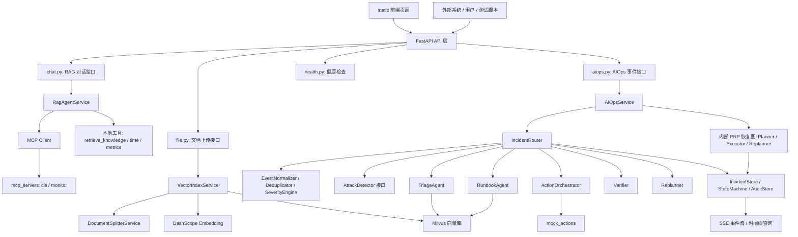
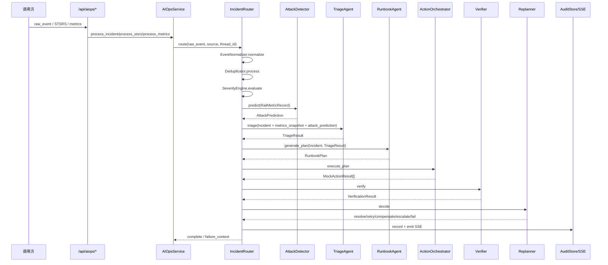
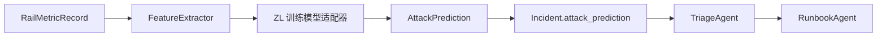
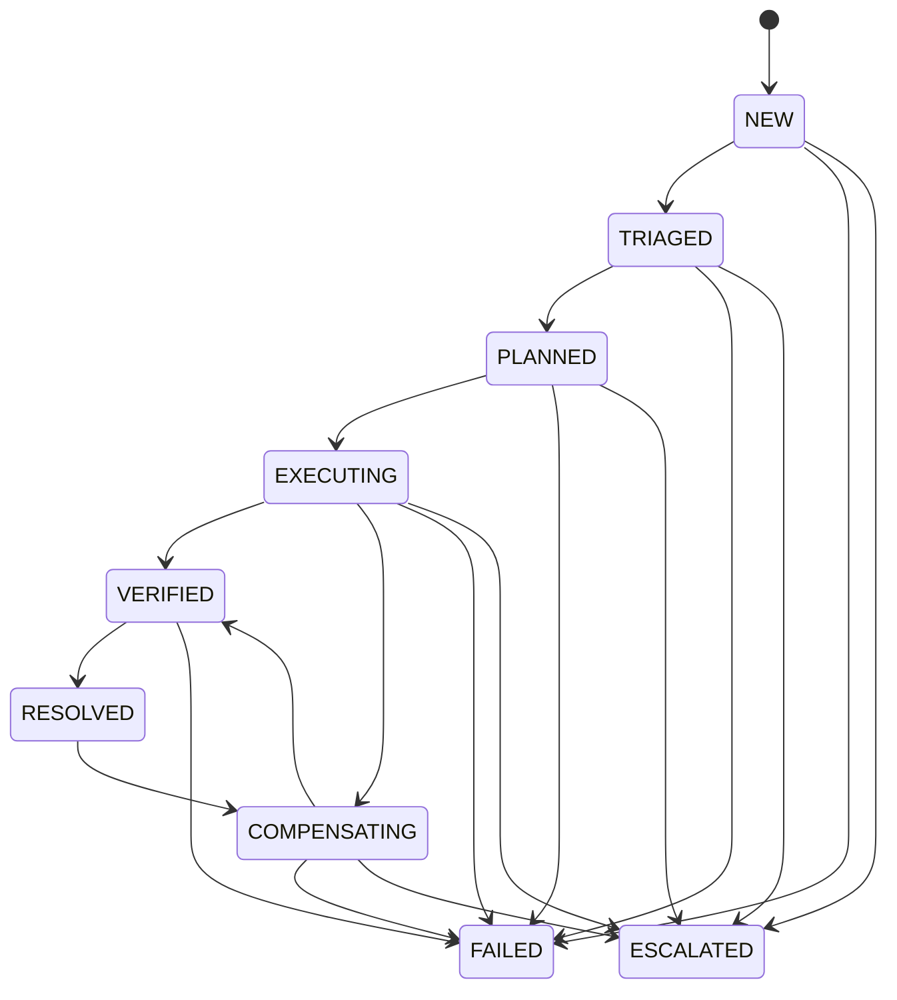
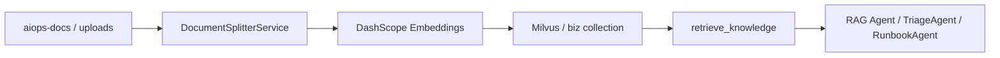
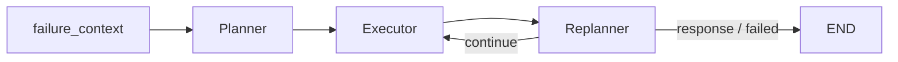

# 第一阶段：railways_V.2 项目架构说明

> 目标：梳理 `railways_V.2` 现有项目架构，明确铁路网络安全威胁检测模型接入 Agent 流水线的边界、数据流和最小改造点。本文档不实现 `ZL` 模型接入，只完成第一阶段架构理解与接入位置识别。

## 1. 项目定位

`railways_V.2` 是一个基于 FastAPI、LangGraph、LangChain、DashScope、Milvus 和 MCP 的铁路智能运维 / 网络安全事件处置系统。项目包含两条核心能力：

1. 通用 RAG 对话能力：面向用户问答、知识库检索和 MCP 工具调用。
2. AIOps 事件处置能力：面向铁路信号 / 网络安全事件，从原始指标或告警输入开始，完成事件归一化、威胁检测、分诊、处置计划、动作执行、验证、重规划、恢复和审计。

对接 `ZL` 文件夹中训练好的威胁检测模型时，主要进入第二条 AIOps 流水线。

## 2. 总体架构

## 3. 目录职责

| 路径 | 职责 |
| --- | --- |
| `app/main.py` | FastAPI 应用入口，注册 API 路由，挂载静态资源，生命周期内连接 / 关闭 Milvus。 |
| `app/config.py` | 全局配置中心，读取 `.env`，管理 DashScope、Milvus、MCP、Prometheus、AIOps 参数。 |
| `app/api/` | HTTP API 层，只负责请求解析、SSE 包装和服务层转发。 |
| `app/services/` | 业务服务层，包含 RAG Agent、AIOps 服务、向量索引 / 检索 / Embedding 管理。 |
| `app/core/` | 核心基础设施，包含 Milvus 客户端、LLM 工厂、事件路由、状态机、事件存储、审计存储。 |
| `app/agents/` | 新版事件驱动多 Agent 流水线：分诊、Runbook、动作编排、验证、重规划。 |
| `app/agent/aiops/` | 旧版 Plan-Execute-Replan LangGraph 流程，目前作为失败后的内部恢复引擎。 |
| `app/ml/` | 监督学习威胁检测接口层，已定义 `AttackDetector` 抽象、Mock 检测器、规则检测器和特征提取器。 |
| `app/data/` | 铁路数据适配层，`STSRSAdapter` 读取并融合多源 STSRS 数据，隐藏训练标签。 |
| `app/events/` | 事件归一化、去重、严重级别评估和超时管理。 |
| `app/tools/` | Agent 工具集合，包括知识库检索、指标查询、时间工具和 Mock 运维动作。 |
| `mcp_servers/` | 本地 MCP 服务端，提供日志查询和监控数据查询能力。 |
| `aiops-docs/` | 运维知识库原始文档，会被切分、向量化并写入 Milvus。 |
| `static/` | 前端静态页面，用于聊天和 AIOps 流式过程展示。 |
| `tests/` | 单元测试，已有 STSRS 融合与 AttackDetector 接口相关测试。 |

## 4. 对外接口架构

| API | 文件 | 作用 |
| --- | --- | --- |
| `POST /api/chat` | `app/api/chat.py` | 非流式 RAG 对话。 |
| `POST /api/chat_stream` | `app/api/chat.py` | SSE 流式 RAG 对话。 |
| `POST /api/upload` | `app/api/file.py` | 上传文档并建立向量索引。 |
| `POST /api/aiops/incident` | `app/api/aiops.py` | 通用事件驱动 AIOps 入口，支持统一格式和旧格式兼容。 |
| `POST /api/aiops/stsrs` | `app/api/aiops.py` | STSRS 专用事件入口。 |
| `POST /api/aiops/metrics` | `app/api/aiops.py` | 原始铁路监测指标入口，是威胁检测模型接入后最自然的调用入口。 |
| `GET /api/aiops/sse/{thread_id}` | `app/api/aiops.py` | 订阅某个任务线程的审计 / 处置事件流。 |
| `GET /api/aiops/incidents` | `app/api/aiops.py` | 查询事件列表。 |
| `GET /api/aiops/incidents/{id}` | `app/api/aiops.py` | 查询事件详情。 |
| `GET /api/aiops/incidents/{id}/timeline` | `app/api/aiops.py` | 回放事件完整时间线。 |

## 5. AIOps 主流水线

当前 AIOps 主链路位于 `app/services/aiops_service.py` 与 `app/core/incident_router.py`。

主流程特点：

- 输入阶段不直接信任 `attack_code` 或 `attack_type`，事件默认进入 `UNKNOWN` 威胁类型。
- 如果事件包含 `metrics_snapshot`，`IncidentRouter` 会构造 `RailMetricRecord` 并调用 `AttackDetector.predict()`。
- `AttackDetector` 只回答“What happened”，即威胁类别、置信度、概率分布。
- `TriageAgent` 结合模型预测、指标异常、TopologyKB、CaseKB 生成解释性分诊结果。
- `RunbookAgent` 基于分诊结论查询 CaseKB、RunbookKB、TopologyKB，生成可执行处置步骤。
- `ActionOrchestrator` 当前只执行 Mock 动作，并通过审批、超时、重试、补偿机制增强流程安全性。
- `Verifier` 和 `Replanner` 决定事件最终进入 resolved、retry、compensate、escalated 或 failed。

## 6. 模型接入相关数据模型

### 6.1 RailMetricRecord

位置：`app/models/metrics.py`

`RailMetricRecord` 是监督学习模型的标准输入，来自 STSRS 多源观测融合或 API 指标输入。关键字段：

| 字段 | 说明 |
| --- | --- |
| `record_id` | 指标记录 ID。 |
| `timestamp` | 监测时间。 |
| `train_id` | 列车编号。 |
| `signal_id` | 信号设备编号。 |
| `metrics` | 通用铁路指标，如速度、距离、信号状态、丢包率、延迟、续期间隔、突发度等。 |
| `source_metrics` | 多源冲突指标，例如控制中心与列车侧看到的 `renewal_interval` 不一致。 |
| `source_files` | 指标来源文件或来源标识。 |

### 6.2 FeatureVector

位置：`app/models/metrics.py`，提取逻辑在 `app/ml/feature_extractor.py`

`FeatureExtractor.extract()` 将 `RailMetricRecord` 转成模型特征，包括：

- 通信指标：`packet_loss`、`latency`、`burstiness`
- 多源冲突特征：`renewal_interval_difference`、`renewal_interval_ratio`
- 信号状态特征：`signal_status`、`overlap_status`、`overlap_count`
- 运行特征：`speed`、`distance`
- 追踪元数据：`train_id`、`signal_id`

### 6.3 AttackPrediction

位置：`app/models/metrics.py`

`AttackPrediction` 是模型标准输出，也是 Agent 流水线消费的预测结果。关键字段：

| 字段 | 说明 |
| --- | --- |
| `attack_type` | 预测威胁类型，例如 `DoS`、`Jamming`、`Replay`、`Spoofing`、`Signal Interference`、`UNKNOWN`。 |
| `confidence` | 预测置信度，范围 `0.0-1.0`。 |
| `probabilities` | 各类别概率分布。 |
| `model_version` | 模型版本，用于审计和回溯。 |
| `feature_vector` | 可选，保存本次预测使用的特征，便于调试与审计。 |

### 6.4 Incident

位置：`app/models/incident.py`

`Incident` 是 Agent 流水线的统一事件对象。模型接入相关字段：

| 字段 | 说明 |
| --- | --- |
| `metrics_snapshot` | 原始指标快照，供检测器与 TriageAgent 使用。 |
| `attack_prediction` | `AttackDetector.predict()` 的结果。 |
| `attack_type` | 最终诊断的威胁类型，初始通常为 `UNKNOWN`，TriageAgent 后可能更新。 |
| `severity` | 严重级别，先由 SeverityEngine 初评，再由 TriageAgent 解释和确认。 |
| `trace_id` | 全链路追踪 ID。 |

## 7. 威胁检测模型接入点

项目已经为真实模型预留了接口，核心位置如下：

现有接入接口：

| 文件 | 当前能力 | 对接 ZL 模型时的作用 |
| --- | --- | --- |
| `app/ml/attack_detector.py` | 定义 `AttackDetector.predict(metrics)` 抽象接口，并提供 `MockAttackDetector`、`RuleBasedAttackDetector`。 | 新增 `ZLAttackDetector`，加载 ZL 已训练模型并返回 `AttackPrediction`。 |
| `app/ml/feature_extractor.py` | 将 `RailMetricRecord` 转为 `FeatureVector`。 | 若 ZL 模型特征顺序 / 编码不同，可在此扩展或新增专用特征适配器。 |
| `app/core/incident_router.py` | `IncidentRouter.__init__(attack_detector=None)` 支持注入检测器，默认使用 `MockAttackDetector`。 | 将默认检测器替换为 `ZLAttackDetector`，或通过工厂 / 配置选择模型。 |
| `app/models/metrics.py` | 定义模型输入输出数据结构。 | 保持系统与模型之间的稳定契约。 |
| `tests/test_attack_detector.py` | 已覆盖特征提取、预测输出和 Incident 携带预测结果。 | 第二阶段应增加 ZL 适配器单测和端到端指标流测试。 |

最小侵入接入路径：

1. 在 `app/ml/attack_detector.py` 中新增 `ZLAttackDetector(AttackDetector)`。
2. 在 `ZLAttackDetector.predict(metrics: RailMetricRecord)` 中调用 `FeatureExtractor.extract()`。
3. 将 `FeatureVector` 转为 ZL 模型要求的输入张量 / DataFrame / ndarray。
4. 调用已训练模型推理，得到类别和概率。
5. 返回 `AttackPrediction`。
6. 在 `IncidentRouter` 初始化时把默认 `MockAttackDetector` 替换为 `ZLAttackDetector`，或通过配置动态选择。

## 8. 事件状态机与审计

事件状态机位于 `app/core/state_machine.py`。主状态流：

审计层位于 `app/core/audit_store.py`：

- 每次状态迁移通过 StateMachine 回调写入 AuditStore。
- Agent 决策、计划、动作、验证、补偿、升级都会写入审计。
- AuditStore 维护全局递增 `event_sequence`。
- 前端或调用方可通过 SSE 实时订阅 `thread_id` 的事件。
- 可通过 timeline API 回放单个 incident 的处置轨迹。

模型接入后建议将以下信息写入 `attack_prediction` 或审计 detail：

- `model_version`
- 特征版本 / 特征顺序版本
- 类别概率分布
- 推理耗时
- 特征向量摘要
- 输入缺失字段情况

## 9. RAG 与知识库架构

RAG 能力服务于两个方向：

1. 通用聊天：`RagAgentService` 使用本地工具与 MCP 工具回答用户问题。
2. AIOps Agent：`TriageAgent` 和 `RunbookAgent` 使用 `retrieve_knowledge` 检索 CaseKB、RunbookKB、TopologyKB。

知识库链路：

向量相关模块：

| 文件 | 职责 |
| --- | --- |
| `app/services/vector_index_service.py` | 文档读取、切分、删除旧索引、写入新索引。 |
| `app/services/document_splitter_service.py` | Markdown / 文本分块。 |
| `app/services/vector_embedding_service.py` | DashScope Embedding 封装。 |
| `app/services/vector_store_manager.py` | LangChain Milvus VectorStore 管理。 |
| `app/services/vector_search_service.py` | 原生 PyMilvus 检索能力。 |
| `app/tools/knowledge_tool.py` | Agent 可调用的知识检索工具。 |

## 10. MCP 与工具层

MCP 客户端位于 `app/agent/mcp_client.py`，通过 `config.mcp_servers` 加载多服务工具，并带有重试拦截器。当前配置：

| MCP 服务 | 默认地址 | 作用 |
| --- | --- | --- |
| `cls` | `http://localhost:8003/mcp` | 日志查询相关工具。 |
| `monitor` | `http://localhost:8004/mcp` | CPU、内存等监控指标查询工具。 |

本地工具位于 `app/tools/`：

- `retrieve_knowledge`：从 Milvus 检索知识。
- `get_current_time`：获取当前时间。
- `query_prometheus_alerts`：查询 Prometheus 告警。
- `mock_actions`：提供当前 AIOps 执行层可调用的 Mock 运维动作。

## 11. 旧版恢复链路

`app/agent/aiops/` 中的 Planner / Executor / Replanner 仍保留，但不再作为公开入口。`AIOpsService` 在主事件驱动流水线失败时，会调用内部 PRP 恢复图：

该链路的定位是恢复兜底：

- 主流水线进入 `FAILED` 或 `ESCALATED` 时生成 `FailureContext`。
- PRP 恢复图尝试基于失败上下文重新规划。
- 如果恢复失败，`AIOpsService` 进入 Safety Control，执行回滚和人工升级。

## 12. 第二阶段接入建议

为了把 `ZL` 文件夹训练好的铁路网络安全威胁检测模型接入 Agent 流水线，建议第二阶段按以下顺序实施：

1. 阅读 `ZL` 模型产物、训练脚本和特征工程，确认模型类型、依赖、输入特征顺序、类别标签映射、归一化器 / 编码器文件。
2. 在 `app/ml/` 新增模型适配器，例如 `zl_attack_detector.py`。
3. 如果 ZL 特征工程与当前 `FeatureVector` 不完全一致，新增 `ZLFeatureAdapter`，避免破坏现有 `FeatureExtractor`。
4. 在配置中新增模型路径、启用开关、类别映射、置信度阈值等参数。
5. 将 `IncidentRouter` 的默认检测器从 `MockAttackDetector` 切换为配置驱动的真实检测器。
6. 增加单元测试：模型加载、特征适配、预测输出格式、缺失字段容错。
7. 增加端到端测试：`POST /api/aiops/metrics` 输入原始指标，验证 `attack_prediction` 进入 TriageAgent，并最终产生完整 SSE 流。

## 13. 当前架构结论

`railways_V.2` 的 AIOps 架构已经具备模型接入所需的主要抽象：`RailMetricRecord` 作为输入契约，`AttackDetector` 作为推理接口，`AttackPrediction` 作为输出契约，`IncidentRouter` 作为流水线注入点，`TriageAgent` 作为模型结果解释和知识增强节点。

因此，接入 `ZL` 已训练模型不需要重写 Agent 流水线。第二阶段的主要工作应集中在 `app/ml` 适配器、配置加载、类别映射、特征对齐和测试验证上。
