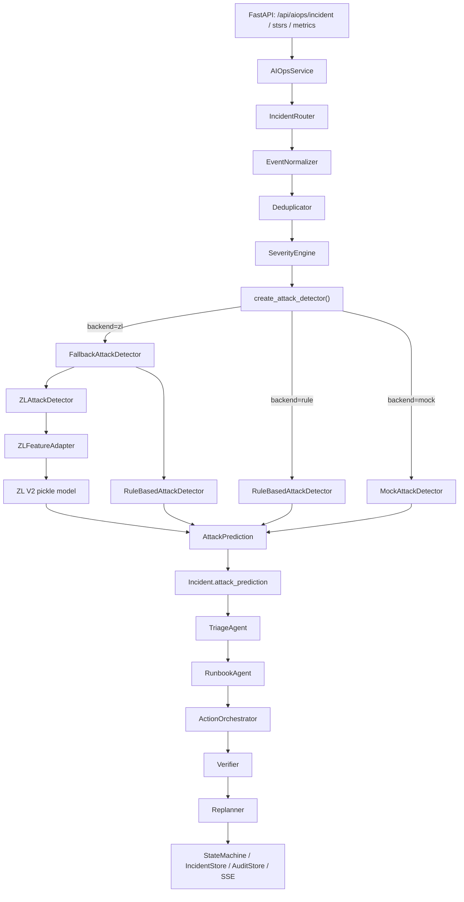
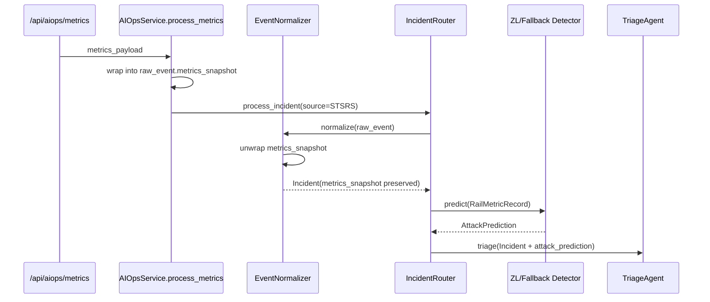

# ZL 模型接入后架构复查报告

> 复查范围：`railways_V.2` 在接入 `D:\STUDY\ZL` 训练好的 STSRS 铁路网络安全威胁检测模型后的代码架构、数据流、模块边界、运行风险和后续建议。

## 1. 复查结论

当前接入方式总体合理：ZL 模型被封装为 `AttackDetector` 的一个后端实现，并通过配置驱动的检测器工厂注入 `IncidentRouter`。Agent 流水线主体没有被模型代码污染，仍保持：

```text
EventNormalizer -> Deduplicator -> SeverityEngine -> AttackDetector
-> TriageAgent -> RunbookAgent -> ActionOrchestrator -> Verifier -> Replanner
```

模型接入后的核心变化是：`AttackDetector` 不再只是 Mock / RuleBased，而是默认尝试 `ZLAttackDetector`，失败时回退到 `RuleBasedAttackDetector`，从而兼顾真实推理与开发环境可用性。

## 2. 接入后总体架构



## 3. 新增 / 调整模块

| 模块 | 文件 | 复查结论 |
| --- | --- | --- |
| ZL 特征适配 | `app/ml/zl_attack_detector.py` | 新增 `ZLFeatureAdapter`，把 `RailMetricRecord` 的小写字段转换为 ZL 模型训练字段，如 `distance -> Distance`、`packet_loss -> PacketLoss`、`latency -> Latency`。 |
| ZL 模型适配 | `app/ml/zl_attack_detector.py` | 新增 `ZLAttackDetector`，加载 ZL pickle payload，执行 `predict_proba` / `decision_function`，输出 `AttackPrediction`。 |
| 检测器工厂 | `app/ml/attack_detector.py` | 新增 `create_attack_detector()`，按配置选择 `zl / rule / mock`。 |
| 回退检测器 | `app/ml/attack_detector.py` | 新增 `FallbackAttackDetector`，ZL 模型文件、依赖或推理失败时回退到规则检测器，并在 `feature_vector` 中记录失败原因。 |
| 配置中心 | `app/config.py` | 新增 `ml_attack_detector_backend`、`zl_model_root`、`zl_model_version`、`zl_model_path`、`zl_model_manifest_path`、`zl_confidence_threshold`、`zl_detector_fallback`。 |
| 路由注入点 | `app/core/incident_router.py` | 默认检测器由 `MockAttackDetector` 改为 `create_attack_detector()`。 |
| 指标归一化 | `app/events/event_normalizer.py` | 修复 `process_metrics()` 包裹的 `metrics_snapshot` 被覆盖为 `None` 的问题；保留 `source_metrics` 和 `source_files`。 |
| 工具加载 | `app/tools/__init__.py` | 改为懒加载 `retrieve_knowledge`，避免导入 `IncidentRouter` 时因 Milvus 未启动直接失败。 |
| Agent 知识检索 | `app/agents/triage_agent.py`、`app/agents/runbook_agent.py` | 知识库工具改为方法级懒加载，只有真正执行 KB 查询时才导入向量库工具。 |
| 测试 | `tests/test_zl_attack_detector.py` | 新增 ZL 适配、预测输出、指标展开、Agent route stub 端到端测试。 |

## 4. 接入后的数据流

### 4.1 `/api/aiops/metrics` 输入



### 4.2 ZL 模型输入输出契约

ZL V2 模型来自 `D:\STUDY\ZL\models\baseline\v2_compact_top3_hist_gradient_boosting.pkl`，训练特征为：

```text
Distance
PacketLoss
Latency
```

`railways_V.2` 内部指标字段为：

```text
distance
packet_loss
latency
```

因此接入层负责字段桥接，不改变 `RailMetricRecord` 的通用结构。

模型标签映射：

| ZL 原始标签 | Agent 流水线标签 |
| --- | --- |
| `Normal` | `UNKNOWN` |
| `DoS` | `DoS` |
| `Jamming` | `Jamming` |
| `ReplayAttack` | `Replay Attack` |

输出统一为 `AttackPrediction`：

```text
attack_type
confidence
probabilities
model_version
feature_vector
```

## 5. 当前架构优点

1. 模型隔离良好  
   训练产物加载、字段映射、标签映射都在 `app/ml/zl_attack_detector.py`，不会污染 Agent 编排逻辑。

2. Agent 流水线稳定  
   `IncidentRouter` 只依赖 `AttackDetector.predict()` 抽象，不关心底层是 ZL、规则还是 Mock。

3. 配置驱动  
   通过 `.env` 可切换：

   ```text
   ML_ATTACK_DETECTOR_BACKEND=zl
   ZL_MODEL_ROOT=../ZL
   ZL_MODEL_VERSION=V2
   ZL_DETECTOR_FALLBACK=rule
   ```

4. 开发环境可运行  
   当前环境缺少 `scikit-learn` 时，`FallbackAttackDetector` 会自动回退到规则检测器，避免 API 启动或事件处理整体中断。

5. 减少导入副作用  
   `app/tools/__init__.py` 和新版 Agent 的知识检索工具已改为懒加载，轻量测试不再强制连接 Milvus。

## 6. 发现的问题与风险

### P1：真实 ZL 模型还未在 railways 虚拟环境中完成依赖验证

当前 `railways_V.2/.venv` 缺少 `scikit-learn`，真实 ZL pickle 模型反序列化会失败，系统会回退到规则检测器。

现状：

```text
ZLAttackDetector -> ImportError: No module named 'sklearn'
FallbackAttackDetector -> RuleBasedAttackDetector
```

已处理：

- `pyproject.toml` 已增加 `numpy` 和 `scikit-learn` 依赖声明。

后续需要：

- 重建或同步 `railways_V.2` 虚拟环境。
- 确认 `scikit-learn` 版本与 ZL 训练模型 pickle 版本兼容。

### P1：ZL 自身虚拟环境路径失效

`D:\STUDY\ZL\.venv` 当前仍指向旧路径 `E:\ZL\STSRS\.uv-python\...`，导致 ZL 自带 smoke test 无法启动。

影响：

- 不能直接用 ZL 项目自己的 `scripts/run_model_service_smoke_test.py` 验证真实模型。

后续需要：

- 在 `D:\STUDY\ZL` 下重建虚拟环境。
- 重新运行 ZL model service smoke test。

### P2：默认去重器会暂存单条事件

`Deduplicator` 默认策略是窗口内达到阈值才输出，单条事件会返回 `None` 并停在 dedup 状态。

影响：

- 如果用户期望每条 `/api/aiops/metrics` 请求都立即进入模型检测和 Agent 处置，则当前去重策略需要调整。

可选方案：

- 新增配置：`dedup_mode=buffer|pass_through|emit_single`
- 对 `metrics` 入口默认直通，对告警风暴入口保留窗口合并。

### P2：规则回退与真实模型的概率语义不同

ZL 模型输出概率分布来自分类器；规则回退输出的是人为设置的弱置信分布。两者都写入 `AttackPrediction`，但解释性语义不同。

后续建议：

- 在 `feature_vector` 或新增 metadata 中加入 `detector_backend`。
- 前端 / 审计展示时区分 `zl`、`rule_fallback`、`mock`。

### P3：pickle 模型路径兼容逻辑可继续收敛

ZL manifest 内部记录的是旧绝对路径 `E:\ZL\STSRS\...`，当前适配器会优先用存在的路径，否则回退到当前 `project_root/models/baseline/{model_name}.pkl`。

现状可用，但建议后续：

- 重新生成 ZL manifest，避免旧绝对路径出现在生产配置中。
- 或在 railways 侧单独配置 `ZL_MODEL_PATH` 指向真实模型文件。

## 7. 验证情况

已完成：

```text
python -m py_compile app/ml/zl_attack_detector.py
python -m py_compile app/ml/attack_detector.py
python -m py_compile app/events/event_normalizer.py
python -m py_compile app/core/incident_router.py
python -m py_compile app/tools/__init__.py
python -m py_compile tests/test_zl_attack_detector.py
```

本地 smoke 验证通过：

- `EventNormalizer` 能保留 `process_metrics()` 的嵌套 `metrics_snapshot`。
- 默认 `zl` 后端缺少 `sklearn` 时能回退到规则检测器。
- `IncidentRouter` 在 stub Agent 下可完整走到 `RESOLVED`，且 `attack_prediction` 已进入事件流。

未完成：

- 未运行正式 `pytest`，因为当前环境没有安装 `pytest`。
- 未加载真实 ZL pickle 模型完成推理，因为当前 `railways_V.2/.venv` 缺少 `scikit-learn`。

## 8. 复查后的目标架构状态

模型接入后，`railways_V.2` 的目标架构可以概括为：

```text
数据输入层
  API / STSRS / Prometheus / MCP / Manual

事件标准化层
  EventNormalizer -> Incident(metrics_snapshot)

事件治理层
  Deduplicator -> SeverityEngine

威胁检测层
  create_attack_detector()
    -> ZLAttackDetector
    -> FallbackAttackDetector
    -> RuleBasedAttackDetector / MockAttackDetector

Agent 诊断与处置层
  TriageAgent -> RunbookAgent -> ActionOrchestrator -> Verifier -> Replanner

状态与审计层
  IncidentStore -> StateMachine -> AuditStore -> SSE / Timeline API

知识与工具层
  retrieve_knowledge(Milvus) / MCP tools / mock_actions
```

## 9. 下一步建议

1. 重建 `railways_V.2` 环境并安装新增依赖。
2. 在真实 ZL 模型可加载后，增加一条真实模型 smoke：

   ```text
   RailMetricRecord -> ZLFeatureAdapter -> ZLAttackDetector -> AttackPrediction
   ```

3. 决定单条 metrics 事件是否应绕过去重缓冲，避免用户手动测试时只能看到 dedup 状态。
4. 为 `AttackPrediction.feature_vector` 增加更稳定的审计字段，例如 `backend`、`fallback_used`、`inference_ms`。
5. 启动 Milvus 后运行完整 AIOps API 测试，确认真实 TriageAgent / RunbookAgent 的 KB 检索链路没有回归。
