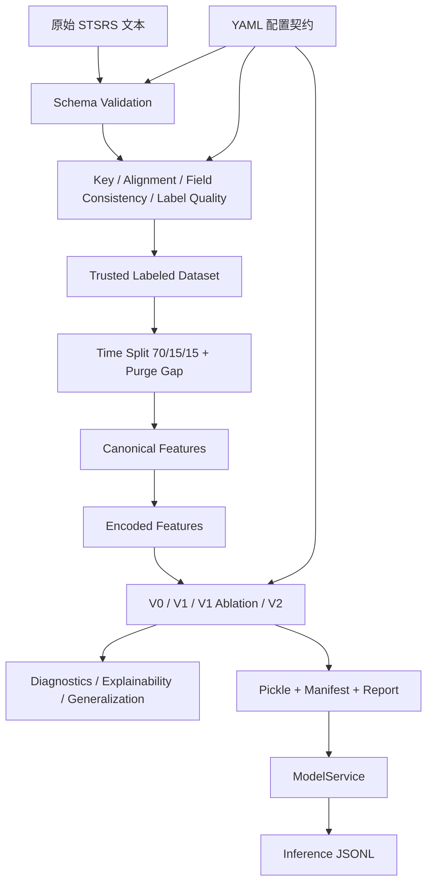

# ZL 项目心智模型

> 适用读者：刚学完 Python、有基础 AI 知识、但第一次接触 ZL 项目的开发者。
> 事实依据：当前源码（`src/stsrs_data_engineering/`、`configs/`、`scripts/`）与既有文档（`docs/STSRS_Technical_Handbook.md`）。
> 原则：以当前源码为唯一事实来源；本文件与旧文档冲突时，以当前源码为准并记录冲突（见第 8 节）。

## 1. 项目是什么

**一句话定位**：`ZL`（内部项目名 STSRS Data Engineering）是一条配置驱动的铁路信号系统网络攻击检测数据流水线：把原始监测文本数据逐步变成“可信、有标签、按时间切分、模型就绪”的数据集，训练并版本化威胁分类模型，最后通过 `ModelService` 提供进程内推理。

### 1.1 解决什么业务问题

铁路信号通信监测会产生大量行级指标（`Distance`、`PacketLoss`、`Latency`、`SignalStatus` 等），并且来自两个数据源（Control Center 与 Train）。直接训练会踩到：主键不唯一、跨表无法对齐、字段取值冲突、标签不规范、训练/验证/测试泄漏。本项目用一套审计流水线先把数据“洗干净、对齐、打标、按时序切分”，再训练可复现、可解释、可部署的模型。

### 1.2 谁使用

- 数据工程师 / 算法研究员：运行 `stsrs-data` CLI 各阶段，阅读 manifests 与 reports。
- ML 工程师 / 服务集成方：调用 `ModelService.predict()`，消费 V2 pickle 或将其接入下游系统。
- 下游系统（如 `railways_V.2`）：消费 ZL V2 模型产物（`models/baseline/v2_compact_top3_hist_gradient_boosting.pkl`）做在线威胁检测。

### 1.3 输入与输出

输入：

- 原始数据：项目根目录的 `STSRS-Control Center.txt`、`STSRS-Train.txt`（当前工作区未保留原文件，`data/staging/*.parquet` 已有产物）。
- 配置：`configs/schema/stsrs_schema.yaml`、`configs/labels/attack_label_mapping.yaml`、`configs/split_policy/time_split.yaml`、`configs/quality_thresholds/data_quality.yaml`、`configs/modeling/*.yaml`、`configs/serving/model_service.yaml`。
- 推理输入：原始字段字典；V2 实际只校验 `Distance, PacketLoss, Latency`，其他字段不参与特征构造。

输出：

- 数据产物：`data/staging`、`data/validated`、`data/serving`、`data/features/canonical`、`data/features/encoded` 下的 Parquet 文件。
- 元数据：`metadata/manifests/*.json`。
- 报告：`reports/**/*.md` 与 CSV（混淆矩阵、重要性、泄漏检查等）。
- 模型：`models/baseline/*.pkl`（V0/V1/消融/V2）。
- 推理：`PredictionResult`（标签、置信度、概率、编码特征），并追加写入 `logs/inference/model_service.jsonl`。

### 1.4 最核心的能力

**Audit first, trust later**：在模型训练之前，先用“契约 + 审计 + 门禁”保证数据可信；训练阶段用“固定采样哈希 + 平衡采样 + 固定随机种子”保证可复现；上线阶段用 `ModelService` 保证线下编码与线上推理一致。

## 2. 十个一级角色

1. 用户 / 操作者：通过 CLI 或脚本触发流水线。
2. 配置契约层（`configs/*.yaml` + `config.py`）：定义字段、标签、切分、阈值、模型参数。
3. 数据入库层（`schema_validation.py`）：原始文本 → 类型化 staging Parquet。
4. 数据审计层（`key_audit.py`、`alignment_audit.py`、`field_consistency.py`、`label_quality.py`）：主键、对齐、字段一致性、标签质量。
5. 可信数据集与切分层（`label_quality.py` 输出 + `time_split.py`）：可信标签数据 → 时序 train/validation/test。
6. 特征工程层（`feature_engineering.py`、`encoded_features.py`）：规范特征 → 模型就绪编码特征。
7. 模型训练层（`baseline_training.py`、`v1_tree_baseline.py`、`v1_ablation.py`、`v2_compact_tree.py`）：V0/V1/消融/V2。
8. 验证分析层（`v1_diagnostics.py`、`v2_diagnostics.py`、`v2_explainability.py`、`v2_generalization.py`）：重要性、泄漏、SHAP、泛化。
9. 推理服务层（`model_service.py`）：模型注册表、特征构造、概率预测、JSONL 日志。
10. 产物与运行入口（`scripts/*.py`、`metadata/`、`reports/`、`models/`、`logs/`）。

## 3. 模块职责表

| 模块 | 一句话理解 | 主要职责 | 输入 | 输出 | 不负责什么 |
| --- | --- | --- | --- | --- | --- |
| `config.py` | 统一配置入口 | 加载 YAML、定义数据集路径、写 JSON | 项目根目录 YAML | 配置 dict、JSON 文件 | 业务逻辑、模型推理 |
| `schema_validation.py` | 原始文本的第一道闸门 | 校验表头/类型/时间戳，写入 staging Parquet | 原始 TXT | `data/staging/*.parquet` + schema manifest | 主键审计、标签处理 |
| `key_audit.py` | 检查主键能不能用 | 统计空键、重复键，输出样本 | staging Parquet | key 样本 + 审计 manifest/report | 跨表对齐 |
| `alignment_audit.py` | 检查两表能否 1:1 对齐 | 找出 trusted / left-only / right-only / ambiguous key | 两个 staging 表 | trusted_alignment_keys + 样本 | 字段一致性 |
| `field_consistency.py` | 同一行两边字段是否一致 | 计算匹配率、冲突列、冲突样本 | trusted keys + staging | conflict 样本 + manifest/report | 标签映射 |
| `label_quality.py` | 标签规范化并构建可信数据集 | 归一化 AttackInfo → AttackLabel，隔离 unknown | 可信对齐行 | `trusted_labeled_dataset.parquet` + unknown 样本 | 特征选择 |
| `time_split.py` | 防泄漏的时序切分 | 按时间 70/15/15 切分，带 purge gap | trusted labeled dataset | `data/serving/{split}/*.parquet` + manifest | 特征生成 |
| `feature_engineering.py` | 选出规范特征 | 按 schema role 白名单投影，质量统计 | serving 三份 Parquet | `data/features/canonical/*` + feature manifest | 编码 |
| `encoded_features.py` | 变成模型能吃的数字 | 数值直通、类别 one-hot、目标 ID | canonical 三份 Parquet | `data/features/encoded/*` + encoded manifest | 训练 |
| 训练模块（V0/V1/消融/V2） | 训练可复现分类器 | 平衡采样、固定 seed、保存 pickle + manifest + 混淆矩阵 | encoded 数据 + 模型 YAML | `models/baseline/*.pkl` + manifests | 在线推理 |
| 验证分析模块 | 证明模型可靠 | V1/V2 diagnostics（permutation importance、泄漏检查，V2 另含类指标对比）、SHAP、泛化 | pickle + manifest + 数据 | `reports/model_training/*` CSV/MD + manifests | 数据清洗 |
| `model_service.py` | 进程内推理服务 | 注册表加载 pickle、构造特征、预测、写 JSONL 日志 | 原始字段 dict | `PredictionResult` / 异常 | HTTP、训练、数据清洗 |

## 4. 一级架构图

## 5. 一个请求的生命周期

### 5.1 训练请求（`v2-compact-tree`）

1. 读取 `configs/modeling/v2_compact_top3_hist_gradient_boosting.yaml`，确认 `selected_feature_columns = [Distance, PacketLoss, Latency]`。
2. 从 V1 / V1 Ablation manifests 读取 reference 模型与 `sample_hash_columns`，保证采样与消融一致。
3. 从 `data/features/encoded/train.parquet` 用哈希 + 每类 20 万行平衡采样，训练 `HistGradientBoostingClassifier`。
4. 在 train/validation/test 上计算指标并写混淆矩阵。
5. 保存 `models/baseline/v2_compact_top3_hist_gradient_boosting.pkl`，写 `metadata/manifests/v2_compact_tree_manifest.json` 与报告。

### 5.2 推理请求（`ModelService.predict`）

1. 用户传入原始字段 dict。
2. `ModelService` 按 `model_service.yaml` 注册表解析版本（默认 `V2`）。
3. `load_model()` 从 manifest 找到 pickle，缓存 `LoadedModelArtifact`。
4. `FeatureBuilder.build_features()` 校验并构造编码特征（V2 只有三个数值特征）。
5. 构造 numpy 矩阵 → 无 scaler 直接进入 `predict_proba` → 概率校验 → argmax 得到标签与置信度。
6. 返回 `PredictionResult`，并把成功/失败日志写入 `logs/inference/model_service.jsonl`。

## 6. 核心 vs 辅助模块

- 核心：配置契约、数据审计、可信数据集、时序切分、特征编码、模型训练、ModelService。
- 辅助 / 验证：V1/V2 diagnostics、SHAP explainability、generalization validation、reports 生成。
- 不负责：模型持久化存储系统、在线 HTTP 网关、实时告警业务逻辑（这些在下游 `railways_V.2` 中）。

## 7. 一句话 / 三句话 / 一分钟版本

### 一句话

`ZL` 是一条可复现、可审计的铁路网络攻击检测数据流水线：从原始监测数据出发，产出可信数据集、编码特征、版本化模型与进程内推理服务。

### 三句话

1. 它是什么：基于 Python + DuckDB + scikit-learn 的离线数据工程与模型训练项目，CLI 入口为 `stsrs-data`。
2. 解决什么问题：让“原始监测数据 → 可信标签数据 → 模型 → 推理”全链路可复现、可审计、可解释。
3. 怎么解决：先做 schema/key/alignment/field/label 五类审计并设置质量门禁，再做防泄漏时序切分、特征编码、固定采样训练，最后用 `ModelService` 统一加载与推理。

### 一分钟版本

`ZL` 可以理解为“铁路信号网络攻击检测模型的数据工厂”。它先把两份原始文本变成可审计的 Parquet，检查主键、跨表对齐、字段冲突和标签质量，只把可信行合成为 `trusted_labeled_dataset.parquet`；然后按时间以 70/15/15 切分，并在边界挖掉 300 秒的缓冲带防止泄漏；接着把规范特征编码成数值特征，训练并对比 V0 线性基线、V1 全特征树模型、V1 消融和 V2 精简模型。V2 最终只用 `Distance, PacketLoss, Latency` 三个特征，validation macro F1 约 0.9987。训练结束后，`ModelService` 通过 `model_service.yaml` 注册表加载任意版本，把原始字段转成特征并输出预测，同时把每次推理写入 JSONL 日志。

## 8. 与既有文档的冲突记录

- `docs/STSRS_Technical_Handbook.md` 与 `docs/STSRS_Intelligent_Ops_System_White_Paper.md` 的整体方向与本文件一致，可作深入阅读；旧白皮书“17 个阶段”的概览口径与当前 CLI 16 个子命令不一致，以 `cli.py` 为准。
- 当前工作区没有 `STSRS-Control Center.txt` / `STSRS-Train.txt` 原始文件；`config.py` 仍把这两个文件作为 raw_path。以当前工作区事实为准：staging Parquet 已存在，可直接从中间阶段继续。
- `metadata/manifests/*.json` 中部分 `model_path` / `report_path` 是旧绝对路径（如 `E:\ZL\STSRS\...`）。`ModelService` 只按项目根拼接 registry 中的 manifest 路径，manifest 内的 `model_path` 是原样使用，因此迁移环境需先修正 manifest 中的 `model_path`。

## 9. 最终检查

- 本文件结论均来自当前 `src/`、`configs/`、`scripts/` 源码与既有文档，没有按文件名推测架构。
- 明确区分：数据工程、特征工程、模型训练、模型验证、模型服务、配置、产物。
- 架构图只展示一级模块，不展示类、函数和全部文件。