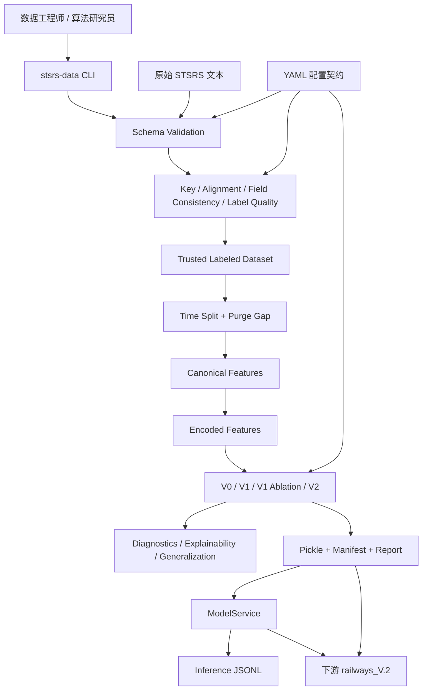
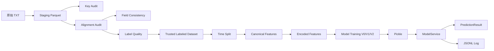
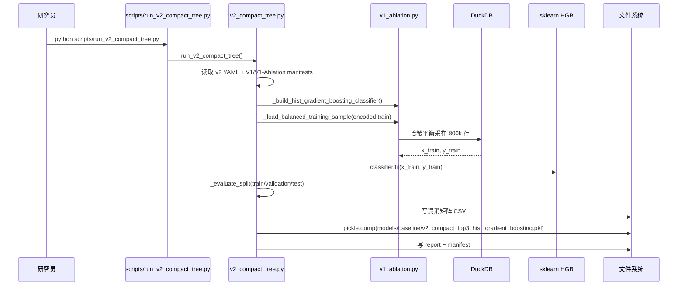
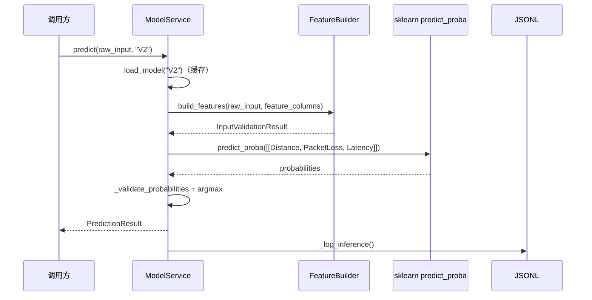

# 《ZL 铁路网络攻击检测模型 · 源码带读白皮书》

> **版本**：第 1 版（2026-08-15），面向初级 Python / AI 开发者重构。
> **阅读顺序**：先理解项目 → 再理解架构 → 再理解运行流程 → 最后深入源码。
> **配套文档**：
> - `docs/PROJECT_MENTAL_MODEL.md`（整体心智模型）
> - `docs/PROJECT_BEGINNER_GUIDE.md`（术语与模块理解指南）
> - `docs/PROJECT_RUNTIME_STORY.md`（真实运行故事）
> **既有文档**：`docs/STSRS_Technical_Handbook.md`、`docs/STSRS_Intelligent_Ops_System_White_Paper.md`

---

# 第 0 部分 给第一次接触项目的人

## 0.1 五句话认识项目

1. ZL 是一个**铁路信号系统网络攻击检测模型的数据工程 + 训练项目**。
2. 它把原始监测文本逐步变成**可信、有标签、按时间切分、模型就绪**的数据集。
3. 它训练并对比多个版本模型，最终交付 **V2 精简树模型**（只用 `Distance, PacketLoss, Latency` 三个特征）。
4. 它通过 `ModelService` 提供进程内推理，输出攻击类别与置信度。
5. 下游系统（如 `railways_V.2`）直接加载 ZL 的 V2 pickle 做在线威胁检测。

## 0.2 最重要的架构一句话

```text
原始文本 → Schema Validation → Key / Alignment / Field Consistency / Label Quality 审计
→ Trusted Labeled Dataset → Time Split → Canonical Features → Encoded Features
→ 模型训练（V0 / V1 / V1 Ablation / V2）→ 验证分析 → Pickle + Manifest + Report
→ ModelService（进程内推理）→ 下游 railways_V.2
```

## 0.3 阅读建议

- 完全不熟悉概念：先读 `PROJECT_BEGINNER_GUIDE.md`。
- 想快速理解整体：先读 `PROJECT_MENTAL_MODEL.md`。
- 想看一次训练和一次推理怎么跑完：先读 `PROJECT_RUNTIME_STORY.md`，再读本文第 6 部分。
- 要改代码：直接跳到第 17-21 部分。

## 0.4 符号约定

- `src/...` 为当前仓库源码位置。
- “实测” = 依据当前 `models/`、`metadata/manifests/`、`data/` 产物核对。

---

# 第 1 部分 一句话理解项目

`ZL` 是一条可复现、可审计的铁路网络攻击检测数据流水线：**先用五类数据审计把原始监测数据变成可信标签数据集，再按时间安全切分、编码特征、训练版本化模型，最后通过 `ModelService` 输出攻击类型与置信度。**

---

# 第 2 部分 项目解决什么问题

## 2.1 业务问题

铁路信号通信链路会产生大量行级监测指标（`Distance`、`PacketLoss`、`Latency`、`SignalStatus` 等），并混有 Normal / DoS / Jamming / Replay Attack 四类状态。原始数据存在四类典型问题：

- 主键不唯一 / 有空键。
- Control Center 与 Train 两张表无法可靠对齐。
- 同一行两边字段不一致。
- 原始标签不规范（如 `"Attack/DoS/DoS"`、`"Suspicious/Replay Attack/Replay Attack"`）。

直接训练会得到不可信、不可复现、有泄漏的模型。

## 2.2 解决思路

```text
Audit first, trust later
  数据契约（schema）
  → 主键审计（key）
  → 跨表对齐（alignment）
  → 字段一致性（field consistency）
  → 标签质量（label quality）
  → 防泄漏时序切分（time split）
  → 特征编码（canonical + encoded）
  → 可复现训练（固定 seed + 平衡采样）
  → 可解释验证（diagnostics + SHAP + generalization）
  → 统一推理（ModelService）
```

## 2.3 为什么不是“拿到数据就训练”

- 数据工程决定模型可信度：标签错、对齐错、泄漏都会让指标虚高。
- 可复现性来自固定 seed、哈希采样与 manifest 记录。
- 可解释性来自消融、permutation importance、SHAP 与泛化验证。

---

# 第 3 部分 用户输入与系统输出

## 3.1 用户是谁

- 数据工程师 / 算法研究员：通过 CLI 跑流水线，阅读 manifests 与 reports。
- ML 工程师 / 集成方：调用 `ModelService` 或消费 pickle。
- 下游系统：`railways_V.2` 加载 V2 pickle。

## 3.2 CLI 命令（输入）

| 命令 | 阶段 |
| --- | --- |
| `stsrs-data schema-to-staging` | 原始文本 → staging |
| `stsrs-data key-audit` | 主键审计 |
| `stsrs-data alignment-audit` | 跨表对齐 |
| `stsrs-data field-consistency-audit` | 字段一致性 |
| `stsrs-data label-quality-audit` | 标签质量 + 可信数据集 |
| `stsrs-data time-split` | 时序切分 |
| `stsrs-data feature-engineering` | 规范特征 |
| `stsrs-data encoded-features` | 编码特征 |
| `stsrs-data baseline-train` | V0 SGD 基线 |
| `stsrs-data v1-tree-baseline` | V1 树基线 |
| `stsrs-data v1-diagnostics` | V1 诊断 |
| `stsrs-data v1-ablation` | V1 消融 |
| `stsrs-data v2-compact-tree` | V2 精简模型 |
| `stsrs-data v2-diagnostics` | V2 诊断 |
| `stsrs-data v2-explainability` | SHAP 可解释性 |
| `stsrs-data v2-generalization` | 泛化验证 |

## 3.3 数据产物（输出）

| 产物 | 路径 |
| --- | --- |
| Staging | `data/staging/*.parquet` |
| 审计样本 | `data/validated/keys/*`、`data/validated/alignment/*`、`data/validated/consistency/*`、`data/validated/labels/*` |
| 可信数据集 | `data/validated/merged/trusted_labeled_dataset.parquet` |
| 时序切分 | `data/serving/{train,validation,test}/*.parquet` |
| 规范特征 | `data/features/canonical/*.parquet` |
| 编码特征 | `data/features/encoded/*.parquet` |
| 模型 | `models/baseline/*.pkl` |
| 元数据 | `metadata/manifests/*.json` |
| 报告 | `reports/**/*.md`、`reports/**/*.csv` |
| 推理日志 | `logs/inference/model_service.jsonl` |

## 3.4 ModelService 输入输出

输入：原始字段字典；V2 实际只校验 `Distance, PacketLoss, Latency`，其他字段不参与特征构造。

输出：`PredictionResult`：

```text
request_id / generated_at / model_version / model_name
predicted_label / predicted_label_id / confidence / probabilities
validated_raw_input / encoded_features / required_raw_fields
```

---

# 第 4 部分 整体架构

## 4.1 整体架构图



## 4.2 一级模块

| 模块 | 文件 | 为什么存在 |
| --- | --- | --- |
| 配置契约 | `config.py` + `configs/*.yaml` | 所有阶段的单一事实来源 |
| 数据入库 | `schema_validation.py` | 原始文本 → 类型化 staging |
| 数据审计 | `key_audit.py` / `alignment_audit.py` / `field_consistency.py` / `label_quality.py` | 保证可信 |
| 切分 | `time_split.py` | 防泄漏时序切分 |
| 特征工程 | `feature_engineering.py` / `encoded_features.py` | 模型就绪输入 |
| 模型训练 | `baseline_training.py` / `v1_tree_baseline.py` / `v1_ablation.py` / `v2_compact_tree.py` | 版本化模型 |
| 验证分析 | `v1_diagnostics.py` / `v2_diagnostics.py` / `v2_explainability.py` / `v2_generalization.py` | 证明模型可靠 |
| 推理服务 | `model_service.py` | 进程内统一推理 |
| 运行入口 | `cli.py` + `scripts/*.py` | 用户触发 |
| 产物 | `data/`、`metadata/`、`reports/`、`models/`、`logs/` | 中间结果与证据 |

## 4.3 外部依赖

| 依赖 | 用途 |
| --- | --- |
| DuckDB | 本地分析引擎，SQL 直接读 Parquet |
| scikit-learn | `SGDClassifier` / `HistGradientBoostingClassifier` / `permutation_importance` / scaler |
| numpy | 数值矩阵与概率计算 |
| SHAP | `TreeExplainer` 可解释性 |
| PyYAML | 配置加载 |

---

# 第 5 部分 核心模块角色分工

| 模块 | 一句话理解 | 主要职责 | 输入 | 输出 | 不负责什么 |
| --- | --- | --- | --- | --- | --- |
| `config.py` | 配置与路径入口 | 加载 YAML、定义 DATASET_SPECS、写 JSON | YAML | dict / JSON | 业务逻辑 |
| `schema_validation.py` | 格式闸门 | 表头/类型/时间戳校验 | 原始 TXT | staging Parquet + manifest | 主键、标签 |
| `key_audit.py` | 主键闸门 | 空键/重复键审计 | staging | 样本 + manifest/report | 跨表关系 |
| `alignment_audit.py` | 对齐闸门 | trusted/left/right/ambiguous key | 两个 staging | trusted keys + 样本 | 字段一致性 |
| `field_consistency.py` | 字段闸门 | 左右字段匹配率与冲突样本 | trusted keys + staging | conflict 样本 + report | 标签映射 |
| `label_quality.py` | 标签闸门 | 归一化标签、隔离 unknown、合成可信集 | trusted 行 | trusted_labeled_dataset + unknown | 特征选择 |
| `time_split.py` | 时序切分 | 70/15/15 + purge gap | trusted 数据集 | serving Parquet + manifest | 特征生成 |
| `feature_engineering.py` | 规范特征 | schema 白名单投影与质量统计 | serving | canonical Parquet + manifest | 编码 |
| `encoded_features.py` | 编码特征 | 数值直通 + 类别 one-hot + 目标 ID | canonical | encoded Parquet + manifest | 训练 |
| 训练模块 | 可复现训练 | 平衡采样、固定 seed、评估、保存 | encoded + YAML | pickle + manifest + CSV | 在线推理 |
| 验证分析 | 可靠性证明 | importance / leakage / SHAP / stability | pickle + manifest | CSV / MD + manifest | 数据清洗 |
| `model_service.py` | 统一推理 | registry 加载、特征构造、预测、日志 | 原始 dict | PredictionResult | HTTP / 训练 |

---

# 第 6 部分 一个真实请求如何运行

## 6.1 训练请求（V2）

1. `run_v2_compact_tree()` 读取模型 YAML 与 V1/V1-Ablation manifests。
2. 从 `data/features/encoded/train.parquet` 哈希平衡采样 80 万行。
3. 训练 `HistGradientBoostingClassifier`（`learning_rate=0.1`、`max_iter=300`、`max_leaf_nodes=31` 等）。
4. 在 train/validation/test 上评估并写混淆矩阵。
5. 保存 pickle、report、manifest。

## 6.2 推理请求（ModelService）

1. 调用方传入原始字段 dict。
2. `ModelService.predict()` 按默认版本 `V2` 加载模型。
3. `FeatureBuilder` 校验并构造 `[Distance, PacketLoss, Latency]` 特征。
4. `predict_proba` → 概率校验 → `argmax` → `PredictionResult`。
5. 写 `logs/inference/model_service.jsonl`。

## 6.3 正常 / 失败 / Fallback 三种结局

| 路径 | 经过 | 结果 |
| --- | --- | --- |
| 正常 | 数据审计通过 → 训练成功 → 推理成功 | pickle + manifest + report + JSONL 日志 |
| 数据失败 | key/alignment/label 审计不通过 | 退出码非 0，不进入下一阶段 |
| 推理失败 | 缺字段 / 版本未知 / 概率不合法 | `ModelService` 写 failure 日志并抛异常；无 fallback |

> 注意：ZL 本身不提供“模型不可用 → 规则 fallback”；fallback 由下游 `railways_V.2` 的 `FallbackAttackDetector` 实现。

---

# 第 7 部分 数据工程流水线

## 7.1 Schema Validation（原始 → staging）

- 文件：`src/stsrs_data_engineering/schema_validation.py`
- 读取 `configs/schema/stsrs_schema.yaml`，校验表头顺序、列数、类型解析成功率和时间戳格式。
- 用 DuckDB `read_csv_auto` + `try_strptime` / `try_cast` 做类型化投影，并加 `SourceDataset` 列。
- 输出：`data/staging/control_center.parquet`、`data/staging/train.parquet` + `schema_validation_manifest.json`。

## 7.2 Key Audit（主键审计）

- 文件：`src/stsrs_data_engineering/key_audit.py`
- key = `Timestamp + TrainID + SignalID`。
- 阈值：`null_key_rows_max=0`、`duplicate_key_rows_max=0`。
- 输出 null/duplicate 样本与 key audit manifest。

## 7.3 Alignment Audit（跨表对齐）

- 文件：`src/stsrs_data_engineering/alignment_audit.py`
- 对两个 staging 表做 key 级 FULL OUTER JOIN，把 key 分类为：
  - trusted：双方各 1 行
  - left_only / right_only：仅一方存在
  - ambiguous：双方存在但至少一方多行
- 阈值：`left_only_ratio_warn_max=0.001`、`right_only_ratio_warn_max=0.001`、`ambiguous_ratio_warn_max=0.001`。
- 输出：`data/validated/alignment/trusted_alignment_keys.parquet` 与三类样本。

## 7.4 Field Consistency（字段一致性）

- 文件：`src/stsrs_data_engineering/field_consistency.py`
- 在 trusted 1:1 行上比较左右字段；数值用绝对/相对容差（1e-9）；`RenewalInterval` 被排除在等值检查外。
- 输出冲突样本与 report。

## 7.5 Label Quality（标签质量）

- 文件：`src/stsrs_data_engineering/label_quality.py`
- 从 `AttackInfo` 归一化并映射：
  - `Normal/nan/Normal` → `Normal`
  - `Attack/DoS/DoS` → `DoS`
  - `Attack/Jamming/Jamming` → `Jamming`
  - `Suspicious/Replay Attack/Replay Attack` → `ReplayAttack`
- 无法映射的行写入 `data/validated/labels/unknown_label_rows.parquet`；`unknown_label_ratio_max=0.0`。
- 输出：`data/validated/merged/trusted_labeled_dataset.parquet`。

## 7.6 Time Split（时序切分）

- 文件：`src/stsrs_data_engineering/time_split.py`
- 按 `Timestamp, TrainID, SignalID` 排序，目标比例 train 0.70 / validation 0.15 / test 0.15。
- purge gap：在边界时间前后 300 秒的行被置空（`SplitName` 置为 `NULL`，不写入任何 split 文件）。
- 输出：`data/serving/{train,validation,test}/*.parquet` + `time_split_manifest.json`。

---

# 第 8 部分 特征工程

## 8.1 Canonical Features（规范特征）

- 文件：`src/stsrs_data_engineering/feature_engineering.py`
- 从 schema 中取 `role == "feature"` 的列；排除 key、raw_label 等。
- 输出：`data/features/canonical/{train,validation,test}.parquet` + `feature_manifest.json`。
- 质量检查：`null_feature_ratio_warn_max=0.0`、`target_column_required=true`。

## 8.2 Encoded Features（编码特征）

- 文件：`src/stsrs_data_engineering/encoded_features.py`
- 数值列直通；类别列按 `allowed_values` 生成 `列名__is_值` 的 0/1 列。
- 目标列：`AttackLabel` → `AttackLabelId`，映射 `Normal=0, DoS=1, Jamming=2, ReplayAttack=3`。
- 输出：`data/features/encoded/{train,validation,test}.parquet` + `encoded_feature_manifest.json`。

## 8.3 线上与线下一致性

- `ModelService.FeatureBuilder` 复现同样的编码逻辑（数值校验 + `__is_` one-hot），保证推理与训练特征一致。
- 编码规则来源：`schema` + `encoded_feature_manifest`，不依赖训练时临时状态。

---

# 第 9 部分 模型训练与版本演进

| 版本 | 模型 | 特征 | 说明 |
| --- | --- | --- | --- |
| V0 | `SGDClassifier` + `StandardScaler` | 全量 12 个编码特征 | 线性基线，多数类偏差明显 |
| V1 | `HistGradientBoostingClassifier` | 全量 12 编码特征 | 非线性基线，性能大幅提升 |
| V1 Ablation | 同 V1 结构 | drop_distance / drop_packetloss / drop_latency / top3_only / top2 | 证明 3 个特征携带几乎全部信号 |
| V2 | `HistGradientBoostingClassifier` | `Distance, PacketLoss, Latency` | 正式精简版，validation macro F1 ≈ 0.9987 |

## 9.1 V2 关键事实（实测 manifest）

```text
model_name: v2_compact_top3_hist_gradient_boosting
feature_columns: [Distance, PacketLoss, Latency]
target_mapping: {Normal: 0, DoS: 1, Jamming: 2, ReplayAttack: 3}
sample_per_class: 200000
sampled_training_rows: 800000
full_training_rows: 6994527
model_size_bytes: 1055664
validation_macro_f1: 0.9987499521249175
test_macro_f1: 0.9989026613118872
scaler: 无（V2 pickle 不含 scaler）
```

## 9.2 训练超参（V2）

```text
learning_rate: 0.1
max_iter: 300
max_leaf_nodes: 31
min_samples_leaf: 50
l2_regularization: 0.0
early_stopping: true
validation_fraction: 0.1
n_iter_no_change: 20
```

## 9.3 pickle 载荷

```text
generated_at / model_name / feature_columns / sample_hash_columns
target_column / target_id_column / target_mapping / config / classifier
```

---

# 第 10 部分 模型验证与分析

| 模块 | 做什么 |
| --- | --- |
| `v1_diagnostics.py` | permutation importance（5 次重复）、split leakage check、top-10 重要性 |
| `v2_diagnostics.py` | V2 vs V1 类指标 delta、permutation importance、split leakage check |
| `v2_explainability.py` | SHAP TreeExplainer：全局 / 逐类 / 局部贡献 |
| `v2_generalization.py` | 时间桶稳定性（validation/test 各 4 桶）+ 不同 seed/salt 重训稳定性 |

产出统一写入 `reports/model_training/*.csv` / `*.md` 与对应 manifests，形成“训练证据链”。

---

# 第 11 部分 Model Service（推理）

## 11.1 是什么

进程内推理对象，不是 HTTP 服务。

## 11.2 注册表

- 文件：`configs/serving/model_service.yaml`
- 版本：`V0`（SGD）、`V1`（12 特征树）、`V2`（3 特征精简树，默认）。

## 11.3 推理流程

```text
ModelService.predict(raw_input, model_version="V2")
  → load_model()：registry → manifest → pickle（缓存）
  → FeatureBuilder.build_features()：校验 + 编码
  → numpy 矩阵
  → predict_proba()（或 decision_function + softmax）
  → _validate_probabilities()（长度、有限、和为 1）
  → argmax → PredictionResult
  → _log_inference() → logs/inference/model_service.jsonl
```

## 11.4 失败语义

- 输入校验失败、模型版本未知、pickle 损坏、概率非法：写 failure JSONL 后**重新抛出**。
- ZL 自身不做 fallback；fallback 由下游 `railways_V.2` 实现。

---

# 第 12 部分 配置系统

## 12.1 配置入口

`config.py` 的 `load_pipeline_config()` 加载四类核心 YAML：

| 配置 | 文件 | 内容 |
| --- | --- | --- |
| schema | `configs/schema/stsrs_schema.yaml` | 字段、角色、key、时间格式 |
| labels | `configs/labels/attack_label_mapping.yaml` | 标签归一化与映射 |
| split_policy | `configs/split_policy/time_split.yaml` | 切分比例、purge gap、泄漏控制 |
| quality_thresholds | `configs/quality_thresholds/data_quality.yaml` | 各阶段阈值与 release gates |

## 12.2 模型与推理配置

| 配置 | 文件 |
| --- | --- |
| V0 训练 | `configs/modeling/baseline_sgd.yaml` |
| V1 训练 | `configs/modeling/v1_hist_gradient_boosting.yaml` |
| V1 消融 | `configs/modeling/v1_ablation_hist_gradient_boosting.yaml` |
| V2 训练 | `configs/modeling/v2_compact_top3_hist_gradient_boosting.yaml` |
| V2 泛化 | `configs/modeling/v2_generalization_validation.yaml` |
| 推理注册 | `configs/serving/model_service.yaml` |

## 12.3 关键设计

- 数据字段规则集中在 schema；标签规则集中在 label mapping；阈值集中在 data_quality。
- 模型参数集中在 modeling YAML，代码不硬编码超参。
- 版本注册集中在 model_service.yaml，新增模型只需加一条 registry。

---

# 第 13 部分 数据流



核心数据对象：

| 对象 | 含义 | 产生者 | 消费者 |
| --- | --- | --- | --- |
| `raw event`（原始行） | 原始文本行 | 数据文件 | schema_validation |
| staging Parquet | 类型化原始数据 | schema_validation | key / alignment |
| trusted keys | 可 1:1 对齐的 key 集合 | alignment_audit | field / label |
| trusted labeled dataset | 可信 + 标签标准化数据 | label_quality | time_split |
| serving splits | train/validation/test | time_split | feature_engineering |
| canonical features | 规范特征 | feature_engineering | encoded_features |
| encoded features | 模型输入特征 | encoded_features | 训练 |
| model artifact | pickle + manifest | 训练 | ModelService / 下游 |
| PredictionResult | 推理输出 | ModelService | 调用方 |

---

# 第 14 部分 控制流

## 14.1 V2 训练时序



## 14.2 ModelService 推理时序



---

# 第 15 部分 异常与失败处理

| 场景 | 行为 |
| --- | --- |
| 原始表头不符 / 类型解析失败 | schema validation 失败，不写 staging |
| key 有空 / 重复 | key audit 失败，退出码非 0 |
| 对齐比例超阈值 | alignment audit 失败 |
| 字段冲突超阈值 | field consistency 失败 |
| unknown 标签 > 0 | label quality 失败，unknown 行隔离 |
| 可信数据集为空 | time split 抛 `ValueError` |
| 推理缺字段 | `FeatureBuilder` 抛 `ValueError`，ModelService 写 failure 日志 |
| 推理概率不合法 | `_validate_probabilities` 抛 `ValueError` |
| 模型版本未知 | `load_model` 抛 `ValueError` |
| pickle 损坏 | `pickle.load` 异常，写 failure 日志后抛出 |

---

# 第 16 部分 模块之间如何协作

1. **契约驱动**：schema / labels / split / thresholds 都是 YAML，代码只读配置。
2. **产物即事实**：每个阶段写 manifest（机器事实）和 report（人类证据）。
3. **版本溯源**：V2 引用 V1/V1-Ablation manifest，保证 reference 指标和采样哈希一致。
4. **离线与在线一致**：ModelService 复用 schema + encoded manifest 的编码规则。
5. **不越界**：数据层不训练，训练层不清洗，服务层不训练。

---

# 第 17 部分 源码级调用链

## 17.1 CLI

```text
stsrs-data <command> --project-root
  → cli.py build_parser() / main()
  → 对应模块 run_*()
```

## 17.2 数据链路

```text
schema_validation.run_schema_to_staging
  → key_audit.run_key_audit
  → alignment_audit.run_alignment_audit
  → field_consistency.run_field_consistency_audit
  → label_quality.run_label_quality_audit
  → time_split.run_time_split
  → feature_engineering.run_feature_engineering
  → encoded_features.run_encoded_feature_generation
```

## 17.3 模型链路

```text
baseline_training.run_baseline_training            # V0
v1_tree_baseline.run_v1_tree_baseline              # V1
v1_diagnostics.run_v1_diagnostics                  # V1 诊断
v1_ablation.run_v1_ablation                        # 消融
v2_compact_tree.run_v2_compact_tree                # V2
v2_diagnostics.run_v2_diagnostics                  # V2 诊断
v2_explainability.run_v2_explainability            # SHAP
v2_generalization.run_v2_generalization            # 泛化
```

## 17.4 推理链路

```text
model_service.build_model_service
  → ModelService.predict
  → ModelService.load_model
  → FeatureBuilder.build_features
  → sklearn predict_proba
  → PredictionResult + JSONL 日志
```

---

# 第 18 部分 源码文件索引

## 18.1 目录总览

```text
ZL/
├─ src/stsrs_data_engineering/   # 核心包
├─ scripts/                      # 运行包装脚本
├─ configs/                      # YAML 配置
├─ data/                         # 数据产物
├─ metadata/manifests/           # JSON 元数据
├─ models/baseline/              # pickle 模型
├─ reports/                      # 报告与 CSV
├─ logs/inference/               # 推理日志
└─ docs/                         # 文档
```

## 18.2 核心文件速查

| 文件 | 职责 |
| --- | --- |
| `src/.../config.py` | 配置加载、数据集路径、JSON 写入 |
| `src/.../cli.py` | CLI 子命令 |
| `src/.../schema_validation.py` | 原始文本 → staging |
| `src/.../key_audit.py` | 主键审计 |
| `src/.../alignment_audit.py` | 跨表对齐 |
| `src/.../field_consistency.py` | 字段一致性 |
| `src/.../label_quality.py` | 标签质量 + 可信数据集 |
| `src/.../time_split.py` | 时序切分 |
| `src/.../feature_engineering.py` | 规范特征 |
| `src/.../encoded_features.py` | 编码特征 |
| `src/.../baseline_training.py` | V0 训练 |
| `src/.../v1_tree_baseline.py` | V1 训练 |
| `src/.../v1_diagnostics.py` | V1 诊断 |
| `src/.../v1_ablation.py` | 消融 |
| `src/.../v2_compact_tree.py` | V2 训练 |
| `src/.../v2_diagnostics.py` | V2 诊断 |
| `src/.../v2_explainability.py` | SHAP |
| `src/.../v2_generalization.py` | 泛化 |
| `src/.../model_service.py` | 推理服务 |

---

# 第 19 部分 产物与目录

| 目录 | 内容 |
| --- | --- |
| `data/staging/` | 类型化原始数据 |
| `data/validated/` | 审计样本、可信对齐、可信标签数据 |
| `data/serving/` | train/validation/test 切分 |
| `data/features/canonical/` | 规范特征 |
| `data/features/encoded/` | 编码特征 |
| `models/baseline/` | V0/V1/消融/V2 pickle |
| `metadata/manifests/` | 各阶段 JSON 元数据 |
| `reports/data_validation/` | 数据审计报告 |
| `reports/model_training/` | 训练、诊断、SHAP、泛化报告与 CSV |
| `logs/inference/` | model_service.jsonl |
| `docs/` | 本白皮书与既有技术手册 |

---

# 第 20 部分 设计思想

1. **Audit first, trust later**：先证明数据可信，再谈模型。
2. **配置驱动**：字段、标签、阈值、超参全部外置。
3. **产物即证据**：manifest 让每个阶段可追溯。
4. **固定采样 + 固定 seed**：训练可复现。
5. **版本演进有依据**：V2 来自 V1 消融证据，而非拍脑袋。
6. **离线在线同构**：ModelService 复现特征编码，避免训练/推理不一致。
7. **单一职责**：数据工程、特征、训练、验证、服务分层清晰。

---

# 第 21 部分 扩展与修改入口

| 想做什么 | 改哪里 |
| --- | --- |
| 加字段 | `configs/schema/stsrs_schema.yaml`（role/logical_type/allowed_values） |
| 改标签映射 | `configs/labels/attack_label_mapping.yaml` |
| 改切分比例 / purge gap | `configs/split_policy/time_split.yaml` |
| 改质量阈值 | `configs/quality_thresholds/data_quality.yaml` |
| 改 V2 超参 / 特征 | `configs/modeling/v2_compact_top3_hist_gradient_boosting.yaml` |
| 新增模型版本 | 训练脚本 + 保存 pickle + manifest + `model_service.yaml` registry |
| 改推理校验 | `model_service.py` `FeatureBuilder` |
| 改输出日志 | `model_service.yaml` logging 配置 |

---

# 第 22 部分 新手术语表

| 术语 | 一句话理解 | 本项目角色 |
| --- | --- | --- |
| Schema | 字段契约 | `stsrs_schema.yaml` |
| Staging | 类型化暂存 | `data/staging/` |
| Key | 主键 | Timestamp+TrainID+SignalID |
| Alignment | 跨表对齐 | trusted keys |
| Trusted Dataset | 可信标签数据 | label_quality 输出 |
| Time Split | 时序切分 | 70/15/15 + purge gap |
| Purge Gap | 边界缓冲带 | 300 秒 |
| Canonical Features | 规范特征 | feature_engineering |
| Encoded Features | 模型特征 | one-hot + 数值 |
| One-hot | 类别 0/1 编码 | `__is_` 列 |
| Balanced Sampling | 类别均衡采样 | 每类 20 万 |
| Sample Hash | 确定性采样哈希 | sample_hash_columns |
| Manifest | JSON 元数据 | metadata/manifests |
| Report | 人类报告 | reports/ |
| Pickle | 序列化模型 | models/baseline/*.pkl |
| predict_proba | 类别概率 | ModelService |
| Softmax | 分数转概率 | decision_function 分支 |
| Scaler | 特征缩放 | V0 StandardScaler |
| Macro F1 | 类别 F1 平均 | 主指标 |
| Permutation Importance | 特征重要性 | diagnostics |
| Leakage Check | 泄漏检查 | diagnostics |
| SHAP | 可解释性 | explainability |
| ModelService | 进程内推理 | model_service.py |
| Registry | 版本注册表 | model_service.yaml |
| JSONL | 行式 JSON 日志 | logs/inference/ |

---

# 附录 A 与 railways_V.2 的集成关系

| 项 | 事实 |
| --- | --- |
| 消费方 | `railways_V.2` 的 `ZLAttackDetector` |
| 模型文件 | `models/baseline/v2_compact_top3_hist_gradient_boosting.pkl` |
| 特征顺序 | `Distance, PacketLoss, Latency` |
| 标签映射 | ZL `Normal/DoS/Jamming/ReplayAttack` → 下游 `UNKNOWN/DoS/Jamming/Replay Attack` |
| scaler | V2 无 scaler，下游直接喂矩阵 |
| fallback | 下游 `FallbackAttackDetector` 在 ZL 加载失败时回退 rule，ZL 自身不 fallback |

# 附录 B 已知问题与风险

| # | 问题 | 影响 |
| --- | --- | --- |
| B-1 | `metadata/manifests/*.json` 含旧绝对路径（`E:\ZL\STSRS\...`） | `ModelService` 只重拼 registry 的 manifest 路径，manifest 内 `model_path` 原样使用；迁移环境需修正 manifest |
| B-2 | 仓库无 pytest 测试目录，只有 smoke test 脚本 | 自动化回归覆盖弱 |
| B-3 | 原始 `STSRS-*.txt` 不在当前工作区 | 全量重跑需先恢复原始文件 |
| B-4 | pickle 反序列化有安全风险 | 只能加载可信 pickle |
| B-5 | `ModelService` 不是 HTTP 服务 | 下游需自行封装 |
| B-6 | V2 只使用 3 特征，性能依赖原始特征质量 | 数据审计失败会传导到模型 |

# 附录 C 文档与源码冲突记录

| 旧文档说法 | 当前源码事实 |
| --- | --- |
| 旧《`STSRS_Intelligent_Ops_System_White_Paper.md`》“17 个阶段”为概览口径 | CLI 实际有 16 个子命令；以 `cli.py` 为准 |
| 手册中模型注册表 | 与 `model_service.yaml` 一致（V0/V1/V2） |
| 旧 manifest 绝对路径 | 仅历史记录；运行时以项目根为准 |

# 附录 D 一句话 / 三句话 / 一分钟版本

## 一句话

`ZL` 是一条可复现、可审计的铁路网络攻击检测数据流水线：从原始监测数据产出可信数据集、编码特征、版本化模型与进程内推理服务。

## 三句话

1. 它是什么：基于 Python + DuckDB + scikit-learn 的离线数据工程与模型训练项目。
2. 解决什么问题：让“原始数据 → 可信标签数据 → 模型 → 推理”全链路可复现、可审计、可解释。
3. 怎么解决：五类数据审计 → 防泄漏时序切分 → 特征编码 → 固定采样训练 → ModelService 统一推理。

## 一分钟版本

`ZL` 可以理解为“铁路信号网络攻击检测模型的数据工厂”。它先审计原始数据的 schema、主键、跨表对齐、字段一致性和标签质量，合成可信标签数据集；然后按时间切分成训练/验证/测试，并挖掉边界缓冲带防止泄漏；接着把规范特征编码成模型输入，训练并对比 V0、V1、V1 消融和 V2 四个版本。V2 只用 `Distance, PacketLoss, Latency` 三个特征，验证集 macro F1 约 0.9987。最后 `ModelService` 加载 pickle、复现特征编码并输出预测，同时写入 JSONL 日志；下游 `railways_V.2` 可以直接消费这份 V2 模型。
