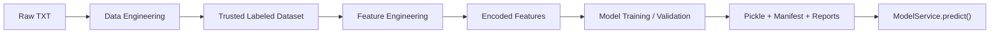
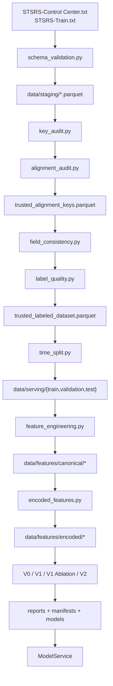

# STSRS 技术手册（源码对照版）

> 版本：1.1  
> 更新日期：2026-07-29  
> 面向读者：希望从“代码实现”而不只是“概念说明”理解仓库的人  
> 目标：把数据流、模块职责、配置体系、训练与服务逻辑，以及每一部分对应的源码入口讲清楚

---

## 目录

1. [项目概览](#1-项目概览)
2. [配置驱动架构](#2-配置驱动架构)
3. [数据与标签契约](#3-数据与标签契约)
4. [数据工程流水线](#4-数据工程流水线)
5. [特征工程流水线](#5-特征工程流水线)
6. [模型训练与版本演进](#6-模型训练与版本演进)
7. [模型验证与分析](#7-模型验证与分析)
8. [Model Service 设计](#8-model-service-设计)
9. [产物、目录与运行入口](#9-产物目录与运行入口)
10. [工程设计思想与代码复用](#10-工程设计思想与代码复用)
11. [接入 AI Agent 的方式](#11-接入-ai-agent-的方式)
12. [建议阅读顺序与可扩展点](#12-建议阅读顺序与可扩展点)

---

## 1. 项目概览

### 1.1 项目在做什么

STSRS 项目要解决的是：基于列车通信数据，识别当前样本属于 `Normal`、`DoS`、`Jamming` 还是 `ReplayAttack`。  
这不是一个单纯“训练分类器”的仓库，而是一条完整的数据产品链路：

```text
原始 TXT
-> schema/staging
-> key/alignment/consistency/label audit
-> trusted labeled dataset
-> time split
-> canonical features
-> encoded features
-> V0/V1/V2 模型
-> diagnostics / shap / generalization
-> ModelService.predict()
```

**代码来源**
- `src/stsrs_data_engineering/cli.py::main`
- `src/stsrs_data_engineering/config.py::DATASET_SPECS`
- `pyproject.toml` 中的 `project.scripts`

### 1.2 这不是一个 Web 应用，而是一条可追踪的离线流水线

仓库的核心是“一组阶段化的命令”，每个阶段：

- 读取上游阶段已经落盘的 Parquet 或 manifest
- 执行一段固定的数据处理或模型逻辑
- 产出新的 Parquet、Markdown 报告、CSV 指标、JSON manifest

这意味着它更像：

- 数据工程 pipeline
- 实验管理仓库
- 模型产物生成器

而不是：

- 带数据库和 HTTP API 的在线系统
- 带前后端页面的业务平台

`ModelService` 也不是 Web Server，它只是一个 Python 里的服务对象。

**代码来源**
- `src/stsrs_data_engineering/cli.py::build_parser`
- `src/stsrs_data_engineering/model_service.py::ModelService`
- `configs/serving/model_service.yaml`

### 1.3 四层结构

整个项目可以拆成四层：

1. 数据工程层：把两份原始文本变成可信样本
2. 特征工程层：把可信样本变成可训练输入
3. 模型训练与验证层：产出 V0/V1/V2 模型和分析报告
4. 服务层：把模型、特征构造、版本管理和日志封装成 `predict()`



**代码来源**
- 数据工程：`schema_validation.py`、`key_audit.py`、`alignment_audit.py`、`field_consistency.py`、`label_quality.py`、`time_split.py`
- 特征工程：`feature_engineering.py`、`encoded_features.py`
- 模型训练：`baseline_training.py`、`v1_tree_baseline.py`、`v1_ablation.py`、`v2_compact_tree.py`
- 验证分析：`v1_diagnostics.py`、`v2_diagnostics.py`、`v2_explainability.py`、`v2_generalization.py`
- 服务：`model_service.py`

### 1.4 命令入口长什么样

统一入口命令是：

```bash
uv run stsrs-data <subcommand>
```

`cli.py` 把每个 stage 注册成 subcommand，例如：

- `schema-to-staging`
- `key-audit`
- `alignment-audit`
- `field-consistency-audit`
- `label-quality-audit`
- `time-split`
- `feature-engineering`
- `encoded-features`
- `baseline-train`
- `v1-tree-baseline`
- `v1-diagnostics`
- `v1-ablation`
- `v2-compact-tree`
- `v2-diagnostics`
- `v2-explainability`
- `v2-generalization`

这部分在第一版手册里提到了“流水线”，但没有明确指出真正的命令路由器其实就是 `cli.py`。

**代码来源**
- `src/stsrs_data_engineering/cli.py::build_parser`
- `src/stsrs_data_engineering/cli.py::main`
- `pyproject.toml`

---

## 2. 配置驱动架构

### 2.1 配置入口与项目根路径

整个项目先通过 `config.py` 建立一个统一上下文：

- `PROJECT_ROOT`：项目根目录
- `DatasetSpec`：数据源描述
- `DATASET_SPECS`：两份原始文件的注册表
- `load_pipeline_config()`：统一装载多个 YAML
- `ensure_parent()` / `write_json()`：落盘辅助函数

这意味着各个模块不需要自己拼路径、自己读 YAML，而是共享一套基础设施。

**代码来源**
- `src/stsrs_data_engineering/config.py::PROJECT_ROOT`
- `src/stsrs_data_engineering/config.py::DatasetSpec`
- `src/stsrs_data_engineering/config.py::DATASET_SPECS`
- `src/stsrs_data_engineering/config.py::load_pipeline_config`
- `src/stsrs_data_engineering/config.py::ensure_parent`
- `src/stsrs_data_engineering/config.py::write_json`

### 2.2 统一加载的四类核心 YAML

`load_pipeline_config()` 默认加载四类配置：

- `configs/schema/stsrs_schema.yaml`
- `configs/labels/attack_label_mapping.yaml`
- `configs/split_policy/time_split.yaml`
- `configs/quality_thresholds/data_quality.yaml`

它们分别负责：

- 原始字段和类型契约
- 标签归一化与映射
- 时间划分策略
- 各种 audit 阶段的阈值

除了这四类以外，建模和服务还有自己的配置：

- `configs/modeling/*.yaml`
- `configs/serving/model_service.yaml`

**代码来源**
- `src/stsrs_data_engineering/config.py::load_pipeline_config`
- `configs/schema/stsrs_schema.yaml`
- `configs/labels/attack_label_mapping.yaml`
- `configs/split_policy/time_split.yaml`
- `configs/quality_thresholds/data_quality.yaml`
- `configs/modeling/*.yaml`
- `configs/serving/model_service.yaml`

### 2.3 为什么说这是“配置驱动”而不是“硬编码驱动”

这个仓库的大多数关键决策都不直接写死在算法逻辑里，而是写在配置中：

- 候选 key 来自 schema 配置
- 标签映射来自 labels 配置
- 时间切分比例和 purge gap 来自 split policy
- null / duplicate / alignment / label 等质量门槛来自 quality thresholds
- 模型超参数、采样规模、对照实验关系来自 modeling 配置
- 服务默认版本和模型注册表来自 serving 配置

这使得改行为时，大多只要改 YAML，不用改 Python。

**代码来源**
- `configs/schema/stsrs_schema.yaml`
- `configs/labels/attack_label_mapping.yaml`
- `configs/split_policy/time_split.yaml`
- `configs/quality_thresholds/data_quality.yaml`
- `configs/modeling/baseline_sgd.yaml`
- `configs/modeling/v1_hist_gradient_boosting.yaml`
- `configs/modeling/v1_ablation_hist_gradient_boosting.yaml`
- `configs/modeling/v2_compact_top3_hist_gradient_boosting.yaml`
- `configs/modeling/v2_explainability.yaml`
- `configs/modeling/v2_generalization_validation.yaml`
- `configs/serving/model_service.yaml`

### 2.4 脚本包装层

仓库里还有一层很轻的脚本包装：

- `scripts/run_schema_validation.py`
- `scripts/run_key_audit.py`
- `scripts/run_alignment_audit.py`
- `scripts/run_field_consistency_audit.py`
- `scripts/run_label_quality_audit.py`
- `scripts/run_time_split.py`
- `scripts/run_feature_engineering.py`
- `scripts/run_encoded_features.py`
- `scripts/run_baseline_training.py`
- `scripts/run_v1_tree_baseline.py`
- `scripts/run_v1_diagnostics.py`
- `scripts/run_v1_ablation.py`
- `scripts/run_v2_compact_tree.py`
- `scripts/run_v2_diagnostics.py`
- `scripts/run_v2_explainability.py`
- `scripts/run_v2_generalization.py`

它们的职责通常不是放业务逻辑，而是提供一个方便的运行入口。

另外还有：

- `scripts/bootstrap_env.ps1`：环境初始化
- `scripts/run_model_service_smoke_test.py`：服务冒烟测试

这两项在第一版手册中基本没有展开。

**代码来源**
- `scripts/*.py`
- `scripts/bootstrap_env.ps1`
- `scripts/run_model_service_smoke_test.py`

---

## 3. 数据与标签契约

### 3.1 数据源

原始输入只有两份大文本：

- `STSRS-Control Center.txt`
- `STSRS-Train.txt`

它们在配置层中被定义为两个 `DatasetSpec`，分别带有：

- `name`
- `source_name`
- `raw_path`
- `staging_path`

后续所有数据工程逻辑都围绕这两个数据源展开。

**代码来源**
- `src/stsrs_data_engineering/config.py::DatasetSpec`
- `src/stsrs_data_engineering/config.py::DATASET_SPECS`

### 3.2 Schema 契约

schema 配置不仅定义“有哪些字段”，还定义了：

- 字段名
- 逻辑类型，如 `timestamp`、`numeric`、`categorical`
- 物理类型
- 可空性
- 是否属于特征列
- 允许值集合
- 时间解析格式
- key definition

在仓库实现里，schema 不是文档意义上的说明，而是会被真正执行的校验规则。

**代码来源**
- `configs/schema/stsrs_schema.yaml`
- `src/stsrs_data_engineering/schema_validation.py`
- `src/stsrs_data_engineering/feature_engineering.py`
- `src/stsrs_data_engineering/encoded_features.py`
- `src/stsrs_data_engineering/model_service.py::FeatureBuilder`

### 3.3 候选 key 契约

仓库将候选 key 定义在 schema 的 `key_definition.columns` 中。  
后面的 key audit、alignment audit、field consistency 都依赖同一套 key 配置。

也就是说，key 不是在多个脚本里各自定义一遍，而是从统一配置读取。

**代码来源**
- `configs/schema/stsrs_schema.yaml`
- `src/stsrs_data_engineering/key_audit.py::run_key_audit`
- `src/stsrs_data_engineering/alignment_audit.py::run_alignment_audit`
- `src/stsrs_data_engineering/field_consistency.py::run_field_consistency_audit`

### 3.4 标签契约

标签配置负责把原始标签文本变成模型训练用的目标标签。这里涉及：

- `source_column`
- `raw_backup_column`
- `target_column`
- `allowed_targets`
- normalization 策略
- 文本到目标类别的映射
- unknown label policy

标签在项目里不是“直接拿原始字段训练”，而是经过一层显式、可审计的清洗映射。

**代码来源**
- `configs/labels/attack_label_mapping.yaml`
- `src/stsrs_data_engineering/label_quality.py::_build_normalized_label_source_expr`
- `src/stsrs_data_engineering/label_quality.py::_build_label_case_expr`
- `src/stsrs_data_engineering/label_quality.py::run_label_quality_audit`

### 3.5 质量阈值契约

项目中大量“通过 / 不通过”的判断来自 `data_quality.yaml`，例如：

- schema parse success rate
- key null / duplicate 上限
- alignment ratio 门槛
- field consistency 匹配率门槛
- unknown label ratio 上限
- feature null ratio 上限

这意味着 audit 并不只是“出一份报告”，而是一个有阈值的 gate。

**代码来源**
- `configs/quality_thresholds/data_quality.yaml`
- `schema_validation.py::_evaluate_schema_result`
- `key_audit.py::_evaluate_key_result`
- `alignment_audit.py::_evaluate_alignment_result`
- `field_consistency.py::_evaluate_field_consistency`
- `label_quality.py::_evaluate_label_quality`
- `feature_engineering.py::_evaluate_feature_quality`

---

## 4. 数据工程流水线

### 4.1 Stage 1: Schema Validation

这一阶段把原始 TXT 变成 `data/staging/*.parquet`。

主要工作：

- 读取 TXT 表头
- 校验表头是否与 schema 完全一致
- 对每个字段做 parse success 统计
- 对枚举字段做 allowed values 校验
- 把通过校验的数据按 schema 类型写成 Parquet
- 生成 report 和 manifest

实现上大量使用 DuckDB SQL 拼接，包括：

- `read_csv_auto(...)`
- `try_strptime(...)`
- `try_cast(...)`
- `COPY (...) TO parquet`

**代码来源**
- `src/stsrs_data_engineering/schema_validation.py::run_schema_to_staging`
- `src/stsrs_data_engineering/schema_validation.py::_dataset_relation_sql`
- `src/stsrs_data_engineering/schema_validation.py::_build_metric_query`
- `src/stsrs_data_engineering/schema_validation.py::_write_staging_parquet`
- `configs/schema/stsrs_schema.yaml`
- `reports/data_validation/schema_report.md`
- `metadata/manifests/schema_validation_manifest.json`

### 4.2 Stage 2: Key Audit

Key Audit 的目标是回答：候选 key 到底能不能站得住。

它会统计：

- 总行数
- 含任一 null key 分量的行数
- 每个 key 列自己的 null 行数
- distinct key 数
- distinct non-null key 数
- duplicate key group 数
- duplicate key row 数
- 单个重复 key 的最大出现次数

同时还会把问题样本落盘：

- `*_null_key_samples.parquet`
- `*_duplicate_key_samples.parquet`

**代码来源**
- `src/stsrs_data_engineering/key_audit.py::run_key_audit`
- `src/stsrs_data_engineering/key_audit.py::_build_metric_query`
- `src/stsrs_data_engineering/key_audit.py::_write_null_key_sample`
- `src/stsrs_data_engineering/key_audit.py::_write_duplicate_key_sample`
- `reports/data_validation/key_audit_report.md`
- `metadata/manifests/key_audit_manifest.json`

### 4.3 Stage 3: Alignment Audit

Alignment Audit 解决的是：两张表按同一组 key 能不能形成可信的 1:1 对齐。

实现中，它先分别聚合左右两张表的 key 计数，再做 full outer join，然后区分：

- overlapping keys
- trusted 1:1 keys
- left-only keys
- right-only keys
- ambiguous keys

其中“trusted”的定义并不是写死的，而是来自阈值配置：

- `trusted_key_requires_left_count`
- `trusted_key_requires_right_count`

最关键的输出是：

- `data/validated/alignment/trusted_alignment_keys.parquet`

这是后续字段一致性和标签清洗的基础。

**代码来源**
- `src/stsrs_data_engineering/alignment_audit.py::run_alignment_audit`
- `src/stsrs_data_engineering/alignment_audit.py::_build_joined_key_counts_sql`
- `src/stsrs_data_engineering/alignment_audit.py::_build_metric_query`
- `src/stsrs_data_engineering/alignment_audit.py::_write_trusted_keys_output`
- `reports/data_validation/alignment_audit_report.md`
- `metadata/manifests/alignment_audit_manifest.json`

### 4.4 Stage 4: Field Consistency Audit

通过 trusted keys 找到 1:1 匹配后，还要回答一个更细的问题：

同一 key 对应的左右两行，在非 key 字段上是不是一致？

这里实现了两种比较逻辑：

- 数值列：允许绝对 / 相对误差容忍
- 非数值列：使用 `IS NOT DISTINCT FROM` 做严格比较

输出包括：

- 每个字段的 match count / mismatch count / match rate
- 冲突样本 `field_conflict_samples.parquet`

这一步是第一版手册容易忽略的重点，因为它实际上在为“后续 merge 是否可信”背书。

**代码来源**
- `src/stsrs_data_engineering/field_consistency.py::run_field_consistency_audit`
- `src/stsrs_data_engineering/field_consistency.py::_build_match_predicate`
- `src/stsrs_data_engineering/field_consistency.py::_build_metric_query`
- `src/stsrs_data_engineering/field_consistency.py::_write_conflict_sample`
- `reports/data_validation/field_consistency_report.md`
- `metadata/manifests/field_consistency_manifest.json`

### 4.5 Stage 5: Label Quality 与 Trusted Dataset

这一阶段把“可信 key 对齐”变成“可信带标签训练集”。

核心逻辑：

1. 用 trusted keys 将左右两张 staging 数据 inner join
2. 从 control center 侧取原始标签列
3. 先保留一个 `raw_backup_column`
4. 再做文本归一化
5. 再映射到 `target_column`
6. 将未知标签样本单独落盘
7. 仅保留已成功映射标签的样本写入最终训练母表

关键产物：

- `data/validated/merged/trusted_labeled_dataset.parquet`
- `data/validated/labels/unknown_label_rows.parquet`

**代码来源**
- `src/stsrs_data_engineering/label_quality.py::run_label_quality_audit`
- `src/stsrs_data_engineering/label_quality.py::_build_trusted_base_sql`
- `src/stsrs_data_engineering/label_quality.py::_build_normalized_label_source_expr`
- `src/stsrs_data_engineering/label_quality.py::_build_label_case_expr`
- `reports/data_validation/label_quality_report.md`
- `reports/data_validation/unknown_label_report.md`
- `metadata/manifests/label_quality_manifest.json`

### 4.6 Stage 6: Time Split

Time Split 将 trusted labeled dataset 切成：

- train
- validation
- test

它不是随机划分，而是时间顺序划分。  
而且支持 `purge_gap`，避免时间边界附近的样本导致泄漏。

代码里有两种路径：

- 开启 purge gap：通过时间边界前后留空
- 关闭 purge gap：直接按 row number 切分

这一步的输出进入 `data/serving/*`。

**代码来源**
- `src/stsrs_data_engineering/time_split.py::run_time_split`
- `src/stsrs_data_engineering/time_split.py::_build_order_clause`
- `src/stsrs_data_engineering/time_split.py::_write_split_dataset`
- `configs/split_policy/time_split.yaml`
- `reports/data_validation/time_split_report.md`
- `metadata/manifests/time_split_manifest.json`

### 4.7 这一层为什么特别重要

项目的大部分代码量都花在数据工程上，不是偶然，而是因为这里建立了训练可信性：

- schema 是否可靠
- key 是否可靠
- 左右数据是否能对齐
- 字段值是否一致
- 标签是否可信
- 时间切分是否防泄漏

如果这些问题没做好，后面的高分模型可能只是“高分错误系统”。

**代码来源**
- 第四章涉及的全部模块
- `configs/quality_thresholds/data_quality.yaml`

---

## 5. 特征工程流水线

### 5.1 Canonical Features

`feature_engineering.py` 的职责是从 `data/serving/*.parquet` 中提取训练所需字段，生成“规范特征表”。

它会根据 schema 中字段的 `role` 选择特征列，并排除：

- target 列
- 原始标签备份列
- 不应直接训练的中间列
- `SplitName`
- 某些只用于对齐或审计的字段

它同时还会统计：

- 每个 split 的 target null count
- 每个特征的 null count / null ratio
- target 分布

**代码来源**
- `src/stsrs_data_engineering/feature_engineering.py::run_feature_engineering`
- `src/stsrs_data_engineering/feature_engineering.py::_select_feature_columns`
- `src/stsrs_data_engineering/feature_engineering.py::_write_canonical_dataset`
- `src/stsrs_data_engineering/feature_engineering.py::_build_feature_metric_query`
- `reports/data_validation/feature_quality_report.md`
- `metadata/manifests/feature_manifest.json`

### 5.2 Encoded Features

`encoded_features.py` 把 canonical features 进一步变成模型输入。

规则是：

- 数值特征原样保留
- 类别特征按 `allowed_values` 展开成 one-hot 风格列
- 标签列映射成 `target_id`

输出是：

- `data/features/encoded/train.parquet`
- `data/features/encoded/validation.parquet`
- `data/features/encoded/test.parquet`

这里很关键的一点是：**one-hot 列名本身就形成了线上推理契约**，例如：

- `SignalStatus__is_Green`
- `OverlapStatus__is_Clear`

**代码来源**
- `src/stsrs_data_engineering/encoded_features.py::run_encoded_feature_generation`
- `src/stsrs_data_engineering/encoded_features.py::_build_encoded_projection`
- `src/stsrs_data_engineering/encoded_features.py::_build_target_id_case_expr`
- `reports/data_validation/encoded_feature_report.md`
- `metadata/manifests/encoded_feature_manifest.json`

### 5.3 第一版没展开的关键点：manifest 在特征层的作用

这层最重要的两个 manifest 是：

- `feature_manifest.json`
- `encoded_feature_manifest.json`

它们不仅记录“结果怎么样”，还为下游训练和服务提供：

- 最终特征列列表
- 目标列名
- 目标 ID 列名
- 标签映射

后面的训练和服务几乎都依赖它们来建立契约。

**代码来源**
- `metadata/manifests/feature_manifest.json`
- `metadata/manifests/encoded_feature_manifest.json`
- `baseline_training.py::run_baseline_training`
- `v1_tree_baseline.py::run_v1_tree_baseline`
- `model_service.py::ModelService.__init__`

### 5.4 为什么线上和线下必须一致

训练时的特征变换如果和服务时的特征变换不一致，会直接导致：

- 列缺失
- 列顺序错误
- 类别值不匹配
- 预测概率失真

因此项目没有把线上特征构造另写一套，而是让 `FeatureBuilder` 从 schema 和 encoded manifest 中推导所需 raw fields 与编码方式。

**代码来源**
- `src/stsrs_data_engineering/model_service.py::FeatureBuilder`
- `src/stsrs_data_engineering/model_service.py::FeatureBuilder.required_raw_fields_for_model`
- `src/stsrs_data_engineering/model_service.py::FeatureBuilder.build_features`

---

## 6. 模型训练与版本演进

### 6.1 共享训练基础设施

多个训练模块之间并不是完全独立重写，而是有明显的代码复用：

- `baseline_training.py` 提供批量迭代、指标计算、混淆矩阵写出等通用能力
- `v1_tree_baseline.py` 复用了 `baseline_training.py` 的一些辅助函数
- `v2_compact_tree.py` 复用了 `v1_ablation.py` 里的树模型构建和评估逻辑

这也是为什么阅读仓库时，不能只看某一个训练脚本，要顺着复用链看。

**代码来源**
- `src/stsrs_data_engineering/baseline_training.py::_iterate_batches`
- `src/stsrs_data_engineering/baseline_training.py::_compute_metrics_from_confusion_matrix`
- `src/stsrs_data_engineering/baseline_training.py::_write_confusion_matrix_csv`
- `src/stsrs_data_engineering/v1_tree_baseline.py`
- `src/stsrs_data_engineering/v1_ablation.py`
- `src/stsrs_data_engineering/v2_compact_tree.py`

### 6.2 V0：SGD Logistic Baseline

V0 是最简单的线性基线，目的是给后续更强模型提供参照。

它的训练特点：

- 使用 `SGDClassifier`
- 支持 `StandardScaler`
- 用分 batch 的方式训练
- 支持 balanced class weight
- 对 train / validation / test 全部评估

这是整个项目最“传统 ML pipeline”味道的一层。

**代码来源**
- `src/stsrs_data_engineering/baseline_training.py::run_baseline_training`
- `src/stsrs_data_engineering/baseline_training.py::_build_classifier`
- `src/stsrs_data_engineering/baseline_training.py::_build_scaler`
- `configs/modeling/baseline_sgd.yaml`
- `reports/model_training/baseline_training_report.md`
- `metadata/manifests/baseline_training_manifest.json`

### 6.3 V1：12 特征 HistGradientBoosting

V1 使用 `HistGradientBoostingClassifier`，目标是替代线性模型。

关键设计：

- 从 encoded feature manifest 直接读取全部编码特征
- 训练样本不是全量，而是“按类均衡采样”
- 采样不是随机 shuffle，而是使用 `hash(...)` 的稳定排序

这里有一个非常重要但第一版手册没细讲的点：  
**V1 的“可复现性”来自 hash 排序采样，而不是只靠 random seed。**

**代码来源**
- `src/stsrs_data_engineering/v1_tree_baseline.py::run_v1_tree_baseline`
- `src/stsrs_data_engineering/v1_tree_baseline.py::_build_sample_query`
- `src/stsrs_data_engineering/v1_tree_baseline.py::_load_balanced_training_sample`
- `configs/modeling/v1_hist_gradient_boosting.yaml`
- `reports/model_training/v1_tree_baseline_report.md`
- `metadata/manifests/v1_tree_baseline_manifest.json`

### 6.4 V1 Ablation：特征消融研究

V1 Ablation 的职责不是再训练一个版本，而是系统比较不同特征子集。

它的配置中定义了多个 variant，例如：

- `full_reference`
- `drop_distance`
- `drop_packetloss`
- `drop_latency`
- `top3_only`
- `top2_distance_packetloss`

这一步为 V2 的特征压缩提供了依据。

**代码来源**
- `src/stsrs_data_engineering/v1_ablation.py::run_v1_ablation`
- `configs/modeling/v1_ablation_hist_gradient_boosting.yaml`
- `reports/model_training/v1_ablation_report.md`
- `metadata/manifests/v1_ablation_manifest.json`

### 6.5 V2：Compact Top-3 HistGradientBoosting

V2 的核心不是换模型家族，而是压缩特征集。  
它从 V1 Ablation 的 `top3_only` 变体中提升而来，保留三个特征：

- `Distance`
- `PacketLoss`
- `Latency`

实现上，它会读取：

- V1 正式模型 manifest
- V1 ablation manifest

然后计算：

- 特征数量减少多少
- 模型体积变化
- 相对 V1 的 validation / test macro F1 delta

**代码来源**
- `src/stsrs_data_engineering/v2_compact_tree.py::run_v2_compact_tree`
- `configs/modeling/v2_compact_top3_hist_gradient_boosting.yaml`
- `metadata/manifests/v1_tree_baseline_manifest.json`
- `metadata/manifests/v1_ablation_manifest.json`
- `reports/model_training/v2_compact_tree_report.md`
- `metadata/manifests/v2_compact_tree_manifest.json`

### 6.6 模型文件里实际存了什么

这个仓库的 `.pkl` 不只是一个 sklearn 模型对象，还会打包：

- `generated_at`
- `model_name`
- `feature_columns`
- `target_column`
- `target_id_column`
- `target_mapping`
- `config`
- `classifier`
- 有些版本还有 `scaler`
- V2 系列还会有 `sample_hash_columns`

这也是为什么后面的服务层能直接从模型产物恢复训练契约。

**代码来源**
- `baseline_training.py` 中写 pickle 的部分
- `v1_tree_baseline.py` 中写 pickle 的部分
- `v2_compact_tree.py` 中写 pickle 的部分

---

## 7. 模型验证与分析

### 7.1 V1 Diagnostics：排列重要性 + 泄漏检查

V1 diagnostics 做两类事：

1. 在 validation 稳定采样子集上跑 permutation importance
2. 检查 split 间是否存在泄漏

泄漏检查不是简单比较文件名，而是比较：

- exact row overlap
- feature-only overlap
- conflicting feature overlap

这部分是模型评分解释和数据安全的关键补充。

**代码来源**
- `src/stsrs_data_engineering/v1_diagnostics.py::run_v1_diagnostics`
- `src/stsrs_data_engineering/v1_diagnostics.py::_read_validation_sample`
- `src/stsrs_data_engineering/v1_diagnostics.py::_compute_leakage_pair_metric`
- `reports/model_training/v1_diagnostics_report.md`
- `reports/model_training/v1_permutation_importance.csv`
- `reports/model_training/v1_split_leakage_checks.csv`
- `metadata/manifests/v1_diagnostics_manifest.json`

### 7.2 V2 Diagnostics：对照 V1 看退化或收益

V2 diagnostics 除了做 permutation importance 和 leakage check，还会输出：

- `v2_vs_v1_class_metric_deltas.csv`

也就是逐类别、逐 split 比较：

- precision delta
- recall delta
- f1 delta

这让 V2 不只是“总体分数几乎没掉”，而是能细粒度回答“哪些类别受影响最大”。

**代码来源**
- `src/stsrs_data_engineering/v2_diagnostics.py::run_v2_diagnostics`
- `src/stsrs_data_engineering/v2_diagnostics.py::_build_class_metric_deltas`
- `reports/model_training/v2_diagnostics_report.md`
- `reports/model_training/v2_permutation_importance.csv`
- `reports/model_training/v2_split_leakage_checks.csv`
- `reports/model_training/v2_vs_v1_class_metric_deltas.csv`
- `metadata/manifests/v2_diagnostics_manifest.json`

### 7.3 SHAP Explainability

V2 explainability 用 `shap.TreeExplainer` 做解释分析，并输出四类 CSV：

- 全局重要性
- 按类别的重要性
- base values
- 本地样本贡献

一个很值得注意的实现细节是：  
代码专门写了 `_coerce_shap_values()`，用来处理不同 SHAP 输出形状，避免版本差异带来的维度问题。

这是第一版手册没有讲到的“工程化细节”。

**代码来源**
- `src/stsrs_data_engineering/v2_explainability.py::run_v2_explainability`
- `src/stsrs_data_engineering/v2_explainability.py::_coerce_shap_values`
- `src/stsrs_data_engineering/v2_explainability.py::_write_global_importance_csv`
- `src/stsrs_data_engineering/v2_explainability.py::_write_local_contribution_csv`
- `configs/modeling/v2_explainability.yaml`
- `reports/model_training/v2_explainability_report.md`
- `reports/model_training/v2_shap_global_importance.csv`
- `reports/model_training/v2_shap_per_class_importance.csv`
- `reports/model_training/v2_shap_base_values.csv`
- `reports/model_training/v2_shap_local_contributions.csv`
- `metadata/manifests/v2_explainability_manifest.json`

### 7.4 Generalization Validation

V2 generalization 分成两块：

1. 时间稳定性：把 validation / test 再细分成多个时间 bucket 看性能是否漂移
2. 种子稳定性：改变模型随机种子和采样 salt 重新训练，看指标波动范围

这里最值得补充的点有两个：

- 时间稳定性不是在 encoded features 上做，而是在 `data/serving/*` 上做，这样还能保留时间和原始 target 信息
- 种子稳定性不只改 `random_seed`，还改 `sample_salt`，因此同时测了“训练随机性”和“样本抽样随机性”

**代码来源**
- `src/stsrs_data_engineering/v2_generalization.py::run_v2_generalization`
- `src/stsrs_data_engineering/v2_generalization.py::_compute_temporal_bucket_metrics`
- `src/stsrs_data_engineering/v2_generalization.py::_build_salted_sample_query`
- `src/stsrs_data_engineering/v2_generalization.py::_summarize_seed_metrics`
- `configs/modeling/v2_generalization_validation.yaml`
- `reports/model_training/v2_generalization_validation_report.md`
- `reports/model_training/v2_temporal_bucket_metrics.csv`
- `reports/model_training/v2_seed_stability.csv`
- `metadata/manifests/v2_generalization_manifest.json`

### 7.5 为什么这些验证不只是“锦上添花”

它们分别回答不同问题：

- permutation importance：模型主要依赖哪些特征
- class deltas：压缩模型后，哪些类别被伤到
- SHAP：模型为什么在单个样本上这么判断
- leakage check：高分是不是因为数据污染
- temporal buckets：未来时间窗口还稳不稳
- seed stability：结论是否只在某个随机种子下成立

这几部分组合起来，才让 V2 成为“可解释、可复查、可讲故事”的正式模型版本。

**代码来源**
- 第七章涉及全部模块与报告

---

## 8. Model Service 设计

### 8.1 ModelService 不是 HTTP 服务，而是一个进程内推理对象

当前仓库并没有提供 FastAPI / Flask / gRPC 服务器。  
它提供的是：

- `ModelService`
- `build_model_service()`
- `PredictionResult`

所以它更像一个“可嵌入的推理 SDK”。

**代码来源**
- `src/stsrs_data_engineering/model_service.py::ModelService`
- `src/stsrs_data_engineering/model_service.py::build_model_service`
- `src/stsrs_data_engineering/model_service.py::PredictionResult`

### 8.2 模型注册与默认版本

服务启动时会读：

- `configs/serving/model_service.yaml`

其中定义了：

- `default_model_version`
- `model_registry`
- 日志策略

当前注册表示例包括：

- `V0`
- `V1`
- `V2`

默认版本是 `V2`。

**代码来源**
- `configs/serving/model_service.yaml`
- `src/stsrs_data_engineering/model_service.py::_build_registry`
- `src/stsrs_data_engineering/model_service.py::default_version`
- `src/stsrs_data_engineering/model_service.py::list_versions`

### 8.3 load_model() 在做什么

`load_model()` 不是直接开 pickle 就完了，它会：

1. 根据版本号从 registry 找 manifest
2. 读取 manifest 找到真正的模型路径
3. 读取 pickle
4. 重建 `LoadedModelArtifact`
5. 缓存到 `_model_cache`

因此服务依赖链是：

```text
model_version
-> serving yaml
-> training manifest
-> pickle payload
-> loaded artifact
```

**代码来源**
- `src/stsrs_data_engineering/model_service.py::LoadedModelArtifact`
- `src/stsrs_data_engineering/model_service.py::ModelService.load_model`

### 8.4 FeatureBuilder：线上特征构造器

`FeatureBuilder` 的职责是把在线原始输入转换成训练时同构的特征向量。

它会：

- 根据模型需要推导 required raw fields
- 对数值列做类型和有限值校验
- 对类别列做 allowed values 校验
- 生成 one-hot 风格编码列

这意味着服务层不会相信调用方传进来的数据已经“自然合法”。

**代码来源**
- `src/stsrs_data_engineering/model_service.py::FeatureBuilder`
- `src/stsrs_data_engineering/model_service.py::FeatureBuilder.required_raw_fields_for_model`
- `src/stsrs_data_engineering/model_service.py::FeatureBuilder._coerce_numeric`
- `src/stsrs_data_engineering/model_service.py::FeatureBuilder._coerce_categorical`

### 8.5 predict() 的完整流程

`predict()` 的流程可以概括为：

1. 校验 `raw_input` 是否为 mapping
2. `load_model()`
3. 用 `FeatureBuilder` 构建编码特征
4. 组装 numpy 数组
5. 如有 scaler 先做 transform
6. 调 `predict_proba()` 或 `decision_function()`
7. 做 softmax 或概率检查
8. 生成 `PredictionResult`
9. 记录成功日志
10. 如有异常则记录失败日志并重新抛出

一个第一版没明确说到的细节是：

- 如果模型没有 `predict_proba`，服务会回退到 `decision_function + softmax`
- 预测结果还会再次检查“概率和是否为 1、每项是否在 [0,1]”

**代码来源**
- `src/stsrs_data_engineering/model_service.py::ModelService.predict`
- `src/stsrs_data_engineering/model_service.py::_predict_probabilities`
- `src/stsrs_data_engineering/model_service.py::_validate_probabilities`
- `src/stsrs_data_engineering/model_service.py::_softmax`

### 8.6 日志与失败处理

服务日志写入：

- `logs/inference/model_service.jsonl`

成功日志可包含：

- request_id
- model_version
- predicted label
- confidence
- probabilities
- required raw fields
- metadata
- 可选的 raw input
- 可选的 encoded features

失败日志会记录：

- request_id
- model_version
- error_message
- metadata
- 可选的 raw input

这让服务天然适合作为可审计组件被外部系统调用。

**代码来源**
- `src/stsrs_data_engineering/model_service.py::_log_inference`
- `src/stsrs_data_engineering/model_service.py::_log_failure`
- `src/stsrs_data_engineering/model_service.py::_append_log`
- `configs/serving/model_service.yaml` 中 `logging`

### 8.7 冒烟测试

`run_model_service_smoke_test.py` 会：

1. 从 validation parquet 取一行样本
2. 构造 raw_input
3. 对 `service.list_versions()` 返回的所有模型版本逐一预测
4. 打印 JSON 结果

这个脚本很适合验证：

- 模型文件是否可加载
- registry 是否正确
- 线上特征构造是否与离线产物兼容

**代码来源**
- `scripts/run_model_service_smoke_test.py`
- `src/stsrs_data_engineering/model_service.py::prediction_result_to_dict`

---

## 9. 产物、目录与运行入口

### 9.1 数据流与产物流



**代码来源**
- 第四至第八章涉及全部模块

### 9.2 重要目录职责

| 目录 | 职责 |
| --- | --- |
| `configs/` | 所有运行配置 |
| `data/staging/` | schema 校验后的结构化数据 |
| `data/validated/` | audit 样本与 trusted 数据 |
| `data/serving/` | time split 结果 |
| `data/features/canonical/` | 规范特征 |
| `data/features/encoded/` | 训练输入特征 |
| `models/baseline/` | pickle 模型产物 |
| `reports/data_validation/` | 数据工程报告 |
| `reports/model_training/` | 训练与验证报告、CSV 指标 |
| `metadata/manifests/` | 机器可消费的阶段元数据 |
| `logs/inference/` | 线上推理日志 |
| `src/stsrs_data_engineering/` | 主业务代码 |
| `scripts/` | 运行入口与辅助脚本 |
| `docs/` | 文档与历史说明 |

**代码来源**
- 仓库目录本身
- `src/stsrs_data_engineering/config.py`

### 9.3 Manifest、Report、CSV、Log 各自是什么角色

这个仓库有四类非常重要的产物：

1. Parquet：面向下游阶段的数据交付
2. Markdown report：面向人阅读的总结
3. CSV：面向图表或分析的结构化指标
4. JSON manifest：面向程序消费的元数据契约
5. JSONL log：面向线上审计的推理记录

第一版手册讲了 manifest 的重要性，但没有把它和 report / CSV / log 的职责边界讲得这么明确。

**代码来源**
- `config.py::write_json`
- 各 `*_report.md`
- 各 `*.csv`
- `logs/inference/model_service.jsonl`

### 9.4 运行方式总结

推荐的运行方式有三种：

1. 统一 CLI：`uv run stsrs-data <command>`
2. 脚本入口：`uv run python scripts/run_xxx.py`
3. PowerShell 初始化：`powershell -ExecutionPolicy Bypass -File .\scripts\bootstrap_env.ps1`

**代码来源**
- `pyproject.toml`
- `src/stsrs_data_engineering/cli.py`
- `scripts/*.py`
- `scripts/bootstrap_env.ps1`

---

## 10. 工程设计思想与代码复用

### 10.1 Audit first, trust later

项目的基本哲学不是“默认数据可信”，而是：

```text
先审计
-> 再隔离问题样本
-> 再得到 trusted 数据
-> 再进入训练
```

这套思想贯穿：

- schema validation
- key audit
- alignment audit
- field consistency
- label quality

**代码来源**
- 第四章全部模块
- `configs/quality_thresholds/data_quality.yaml`

### 10.2 配置驱动优先于代码分支

大量行为不是通过 `if hardcoded_value` 控制，而是通过 YAML 控制。  
这带来两个好处：

- 业务阈值和实验参数可改
- 核心代码更稳定

**代码来源**
- 第二章全部配置文件
- `config.py::load_pipeline_config`

### 10.3 可复现性不只靠随机种子

这个项目的可复现性设计比“设一个 seed”更认真：

- 采样用 `hash(...)` 稳定排序
- V2/泛化验证进一步引入 `sample_salt`
- manifests 记录模型路径、配置路径、特征列、目标映射
- `uv.lock` 锁定依赖版本

**代码来源**
- `v1_tree_baseline.py::_build_sample_query`
- `v2_generalization.py::_build_salted_sample_query`
- `metadata/manifests/*.json`
- `uv.lock`

### 10.4 代码复用链

几个重要的复用关系：

- `baseline_training.py` 提供指标与批量读取基础设施
- `v1_tree_baseline.py` 复用 baseline 的 batch / metric / confusion matrix 能力
- `v1_diagnostics.py` 的泄漏检查能力被 `v2_diagnostics.py` 复用
- `v1_ablation.py` 的模型构建和 split 评估被 `v2_compact_tree.py` 和 `v2_generalization.py` 复用

如果以后继续演进 V3，这条复用链大概率还会继续延展。

**代码来源**
- `baseline_training.py`
- `v1_tree_baseline.py`
- `v1_diagnostics.py`
- `v2_diagnostics.py`
- `v1_ablation.py`
- `v2_compact_tree.py`
- `v2_generalization.py`

### 10.5 第一版没明确写出的一个现实边界

当前仓库已经有完整的“离线训练 + 进程内推理服务”，但还没有：

- 真正的 HTTP API 层
- 在线特征存储
- 监控告警后端
- 自动化调度编排
- CI/CD 训练流水线

所以它已经很像可部署系统的内核，但还不是完整的平台化产品。

**代码来源**
- 仓库目录结构本身
- `model_service.py`
- `scripts/`

---

## 11. 接入 AI Agent 的方式

### 11.1 最自然的接入点

如果要让 AI Agent 使用本仓库，最自然的接入点不是训练脚本，而是：

- `ModelService.predict()`

因为它已经封装了：

- 模型版本切换
- 输入校验
- 特征构造
- 预测
- 日志记录

**代码来源**
- `src/stsrs_data_engineering/model_service.py::ModelService.predict`
- `configs/serving/model_service.yaml`

### 11.2 一种典型的 Agent 工作流

```text
Agent 获取实时通信样本
-> 调用 ModelService.predict()
-> 根据 predicted_label / confidence 做决策
-> 生成事件记录或触发人工确认
-> 将 metadata 写入审计链
```

如果以后接 HTTP API，也大概率是把这一层包在外面，而不是重写推理逻辑。

**代码来源**
- `model_service.py`
- `scripts/run_model_service_smoke_test.py`

### 11.3 接入时应注意什么

建议外部 Agent 至少遵守以下约束：

- 始终显式指定 `model_version` 或接受默认 `V2`
- 传入 `metadata`，便于审计
- 对异常分支做兜底，因为 `predict()` 会在失败时抛异常
- 对 `confidence` 设置自己的自动化阈值

**代码来源**
- `model_service.py::ModelService.predict`
- `model_service.py::_log_failure`
- `configs/serving/model_service.yaml`

---

## 12. 建议阅读顺序与可扩展点

### 12.1 如果你第一次读仓库，建议顺序

建议按这个顺序看：

1. `pyproject.toml`
2. `src/stsrs_data_engineering/config.py`
3. `src/stsrs_data_engineering/cli.py`
4. 数据工程六个 stage
5. `feature_engineering.py` / `encoded_features.py`
6. `baseline_training.py`
7. `v1_tree_baseline.py` / `v1_ablation.py` / `v2_compact_tree.py`
8. `v1_diagnostics.py` / `v2_diagnostics.py` / `v2_explainability.py` / `v2_generalization.py`
9. `model_service.py`
10. `scripts/run_model_service_smoke_test.py`

这样最容易先建立主干，再理解复用关系。

### 12.2 后续扩展最值得做的方向

从当前代码看，最自然的下一步扩展包括：

- 增加真正的 HTTP API
- 加入调度器，把各 stage 串成自动化 pipeline
- 增加 drift monitoring
- 增加在线特征存储
- 支持模型 A/B 或 shadow inference
- 将 `ModelService` 包装成更稳定的 SDK / service interface

### 12.3 这份手册相对第一版补充了什么

这版重点补了四类内容：

1. 给每个核心部分都补了具体源码来源
2. 把 `cli.py`、`config.py`、`scripts/`、`bootstrap_env.ps1`、smoke test 纳入主叙事
3. 把 manifest / report / csv / jsonl 的职责边界讲清楚
4. 补充了第一版没有展开的工程细节：
   - 稳定 hash 采样
   - `sample_salt`
   - SHAP 输出维度兼容
   - V2 对 V1 的逐类别 delta 比较
   - `ModelService` 的概率校验与失败日志

---

> 如果你要继续维护这份手册，最稳妥的方式不是只看报告文件，而是始终以 `src/stsrs_data_engineering/` 下的实现和 `configs/` 下的 YAML 为准，再用 `reports/` 与 `metadata/manifests/` 验证当前仓库产物是否与文档一致。
